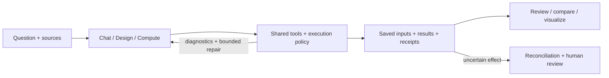

<div align="center">

# Proto Workbench

### Local AI. Scientific workspaces. Inspectable evidence.

Explore a question, work with scientific data, and keep the sources, calculations and review decisions together.

[](docs/source-showcase-2026-09.md) [](docs/getting-started.md#desktop) [](docs/chat-unified-workflow.md) [](LICENSE)

**[Explore the current source](docs/source-showcase-2026-09.md)** · **[Build and run](docs/getting-started.md#development)** · **[Documentation](docs/README.md)** · **[Historical Windows preview](https://github.com/albertzhzhou-droid/proto-agent-workbench/releases/tag/v0.2.0-rc.1)**

**Open-source CLIs:** [Proto CLI](src/proto_agent/) · **[Chem CLI source and development guide](CHEM_CLI.md)**

[Source map: all operators, Skills and Harness](docs/source-layout.md)

The September 24 unreleased [managed Study increment](docs/NEXT_ARCHITECTURE_IMPLEMENTATION_2026-09-24.md)
adds frozen source-bound plans, project objects and retained evidence inspection.
Its [capability ledger](docs/NEXT_ARCHITECTURE_CAPABILITIES.md) distinguishes this
implementation from the remaining next-architecture roadmap.

</div>

<a href="docs/assets/workbench-2026-09/compute.jpg"></a>

<p align="center"><sub>Actual source-browser capture · current method catalog · bundled open-source typography · no model inference performed for this screenshot</sub></p>

> **Source and download versions differ.** This page describes the September 2026 source update. The published `v0.2.0-rc.1` Portable and Setup files are the earlier preview; they do not contain all the features below. Build from source for the current workspaces. [Version and evidence guide →](docs/source-showcase-2026-09.md)

## Chat, Design, Compute

| Chat | Design | Compute |
|---|---|---|
| Work with a local model, PDF/DOCX/XLSX documents, scientific tools, source quotations and reviewable claims. Retain conversations and working context across sessions. | Inspect DNA maps, edit source-bound occurrences and explore authentic protein coordinates with sequence mappings. Check and compile before reviewing the evidence. | Choose a method, inspect its inputs and assumptions, and save results with provenance. Reopen named research studies, compare recorded runs and compose figures. |
| [Research conversations →](docs/chat-unified-workflow.md) | [DNA editing →](docs/dna-source-editing.md) · [Protein structures →](docs/protein-structures.md) | [Scientific computing →](docs/biomni-compute.md) · [Saved studies →](docs/research-projects.md) |

<table>
<tr>
<td width="50%"><a href="docs/assets/workbench-2026-09/chat.jpg"></a></td>
<td width="50%"><a href="docs/assets/workbench-2026-09/chem-reaction.jpg"></a></td>
</tr>
<tr>
<td><strong>A place to think.</strong> An empty, isolated Chat session. The selected model is not connected; no generated conversation is presented as evidence.</td>
<td><strong>A calculation you can inspect.</strong> A local illustrative reaction model. The population scene follows calculated samples; it is not an atomistic trajectory.</td>
</tr>
<tr>
<td><a href="docs/assets/workbench-2026-09/research-project.jpg"></a></td>
<td><a href="docs/assets/workbench-2026-09/protein-study.jpg"></a></td>
</tr>
<tr>
<td><strong>Keep the study.</strong> A saved synthetic research project from the September 22 browser acceptance run.</td>
<td><strong>Return to the evidence.</strong> A reopened supplied-alignment protein study from the same source-browser run.</td>
</tr>
</table>

These are actual application captures, with each capture's date, input scope and
SHA-256 recorded in the [gallery manifest](docs/assets/workbench-2026-09/README.md).
Browser views, fixture data and local calculations are identified separately from
native packaged acceptance. [Earlier native DNA, protein and Harness captures →](docs/upgrade-verification.md#actual-native-demo-captures)

## One research workflow, shared scientific tools

- **Move between Proto and Chem.** Both editions use Chat / Design / Compute. Chemistry adds structure inspection, analysis, chemical data and reaction networks, interfaces, reactors and kinetic studies through the shared tool registry. The current chemistry catalog contains 56 operators; availability and scientific scope remain operator-specific. [Chem workspace →](docs/chem-workbench-upgrade.md)
- **Keep data attached to its meaning.** Saved studies retain input hashes, units, sample identities, method assumptions and result bindings. Protein comparison, RNA-seq studies and existing structure-prediction result import have their own explicit contracts. [Data contracts →](docs/scientific-data-contracts.md)
- **Build on recorded work.** Reusable research workflows, claim review and figure panels refer to saved artifacts. Existing ColabFold result import reads supplied files; it does not launch a prediction job. [Workflows →](docs/research-workflows.md) · [Figures →](docs/research-figures.md)
- **Make recovery inspectable.** Harness Slice B retains typed diagnostics, repair budgets, verdicts and negative memory. Unsupported work can end in abstention or human review. The shared execution journal preserves uncertain write effects for reconciliation. [Harness implementation →](docs/HARNESS_ITERATION_IMPLEMENTATION_2026-09-23.md)



## Start where you work

| I want to… | Start here |
|---|---|
| Run the current workspaces | [Source development setup](docs/getting-started.md#development) |
| Try the earlier Windows preview | [Historical download](https://github.com/albertzhzhou-droid/proto-agent-workbench/releases/tag/v0.2.0-rc.1) · [Desktop setup](docs/getting-started.md#desktop) |
| Use the deterministic CLI | [CLI installation and toy example](docs/getting-started.md#cli) |
| Connect an AI host | [MCP configuration and tools](docs/mcp_usage.md) |
| Reproduce a scoped check | [Current source evidence](docs/source-showcase-2026-09.md) · [CI profiles](docs/ci-validation.md) |

LM Studio is an external application. Optional Python scientific packages,
Psi4, XDL, WSL engines and OCI execution environments have separate setup and
availability checks. A catalog entry or bundled UI does not establish an installed
runtime. Public builds bundle Newsreader, Hanken Grotesk and Commit Mono; local
self-use builds retain the supplied Anthropic families. Their font bytes stay
Git-ignored. [Typography profiles and licenses →](docs/typography.md)

### Try the CLI

From a source checkout, using Python 3.10 or later:

```powershell
python -m venv .venv
.\.venv\Scripts\Activate.ps1
python -m pip install -e .
proto-agent check designs\toggle_switch.proto --json
proto-agent workflow run designs\toggle_switch.proto
proto-agent review run designs\toggle_switch.proto
```

This example uses a bundled **toy development fixture**. Outputs go under
`build/`. Source-backed biological designs start with an eligible material search
and a materialized selection. [Full workflow guide →](docs/cli-guide.md)

## What the evidence supports

| Recorded check | Result | Boundary |
|---|---|---|
| Workbench offline suite | **1,405 passed · 1 skipped** | Local pre-publication source run; the skip retains its containment limitation |
| Python base suite | **355 passed · 4 skipped** | Separate local architecture run; Windows symlink skips remain explicit |
| Publishable source checkout | **11 focused tests passed**; TypeScript and desktop compilation passed | Exported staged files without local font bytes; reused installed Node dependencies |
| Frozen paired software campaign | Possible tasks: **24/24 direct · 23/24 Harness**; correct abstention: **5/6 · 6/6** | 30 frozen tasks per arm; every attempt retained; software fixtures, not scientific-answer validation |
| Earlier Windows preview | Native Portable and extracted Setup-payload checks **8/8 each** | Historical `0.2.0-rc.1` only; installation/upgrade/uninstallation untested |
| Typography follow-up | **14 focused tests passed**; local and public desktop source builds passed | Full offline run: **1,413 passed, 1 failed, 1 skipped**; scan-suite recheck **6/6**; both results retained |

The paired campaign does **not** establish a completion or token-cost improvement.
Its measured source predates the separately tested terminal-notification fix.
Local checks do not establish a passing hosted CI run or clean-machine runtime
acceptance. The hosted run at `a3ff460` includes failures, recorded separately in
the evidence guide. [Current evidence and limitations](docs/source-showcase-2026-09.md) · [Machine-readable source summary](docs/release-evidence/source-2026-09-23.json) · [Hosted CI](https://github.com/albertzhzhou-droid/proto-agent-workbench/actions/workflows/ci.yml)

## Biological materials, with provenance

| Public collection | Included | Boundary |
|---|---:|---|
| iGEM DNA parts | **1,046** | Reviewed source records, sequence digests and per-record rights |
| UniProt proteins | **20** | Reviewed sequence records with source and license evidence |
| Quarantine metadata | **1,795** | Separate index; no sequence objects; activation denied; never model-visible |

The checked-in distribution contains audited catalogs, licensed sequence objects,
provenance and checksum inventories. The live external catalog and crawl caches
remain local. Installing a public catalog does not activate it.

[Public bundles](materials/bundles/README.md) · [Data licenses](materials/DATA_LICENSES.md) · [Material workflow](docs/materials_library.md)

## Explore, build, contribute

[Documentation hub](docs/README.md) · [Architecture upgrade](docs/ARCHITECTURE_UPGRADE_2026-09-23.md) · [Research programme and open work](docs/research-upgrade-plan.md) · [Changelog](CHANGELOG.md) · [Contributing](CONTRIBUTING.md) · [Security](SECURITY.md) · [Issues](https://github.com/albertzhzhou-droid/proto-agent-workbench/issues)

**Experimental research software.** Workbench and CLI versions are independent.
Software checks and policy eligibility do not establish experimental readiness;
scientific interpretation requires human review. This project does not provide
wet-lab execution instructions.

Software: [MIT](LICENSE). Biological data and bundled third-party code retain
their own license terms. [Third-party notices](apps/proto-workbench/THIRD_PARTY_NOTICES.md).
