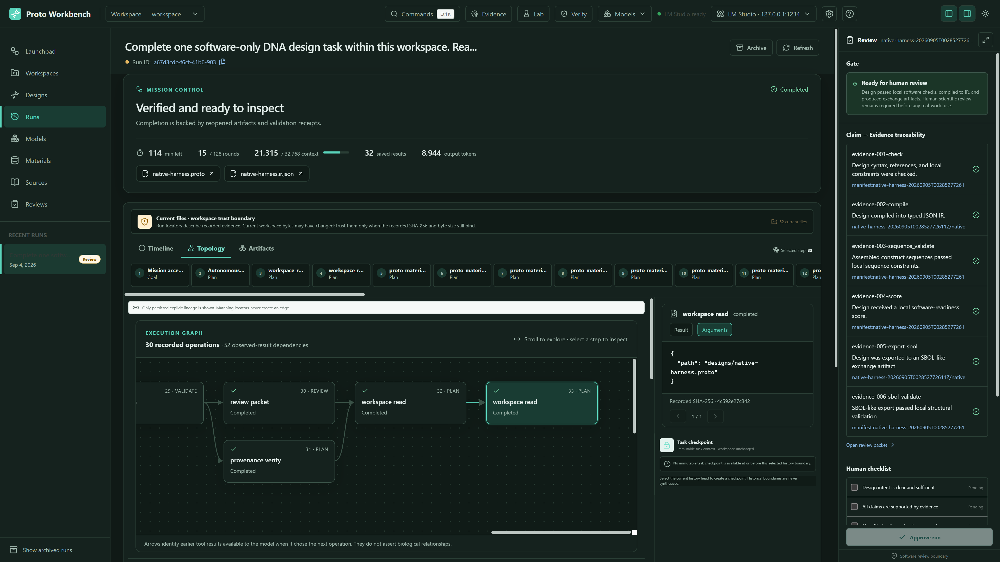
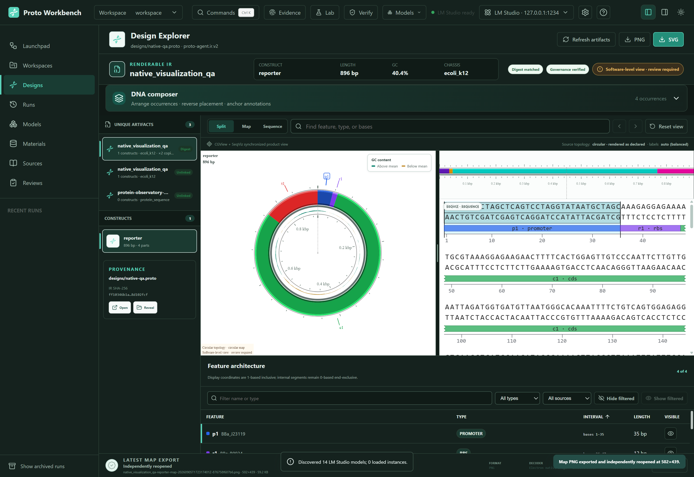
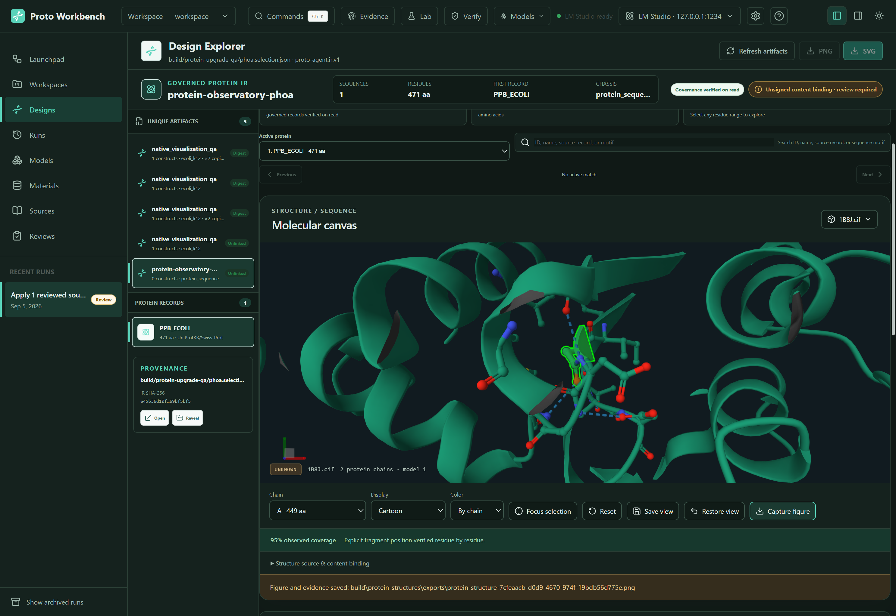
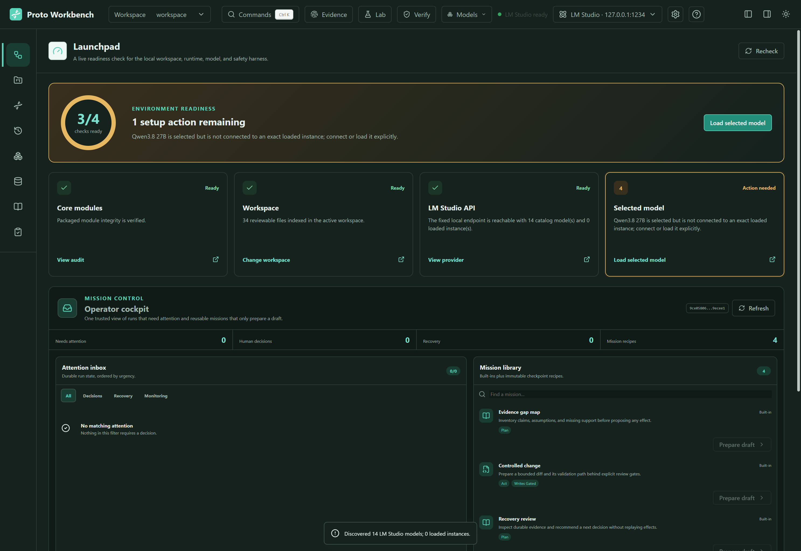

# Proto Workbench

> Experimental software. The Python CLI (`0.1.0`) and Windows
> Workbench (`0.2.0-rc.1`) are versioned independently. The legacy parts library is
> a development fixture; the public materials bundles retain upstream
> provenance and per-record rights. Every scientific result remains
> human-review-required.

An auditable local AI workbench for source-based DNA design, protein sequences,
and real molecular structures. The autonomous Harness carries material identity,
tool results and validation evidence through a mission, with durable checkpoints
and explicit incomplete states when delivery cannot be verified.

## Upgrade demo: real native application captures

These are unchanged screenshots from actual Windows Electron validation, not
mockups or preview fixtures. [Evidence and scope](docs/upgrade-verification.md)
identify the captured builds, source reports and screenshot SHA-256 values.

**Harness: inspect the execution graph, tool arguments and review evidence.**
This is a real completed local-model mission reopened in native development
Electron. It is separate from the fifteen-task debug campaign and final package
checks; the visible 15/128 counter describes rounds within that one mission.



**DNA: connected circular map, sequence and feature selection.** The final
Portable used a governed 896 bp QA construct; its source edits, compiler checks,
undo/redo and SVG/PNG exports were exercised in the native application.



**Protein: real coordinates, explicit residue mapping and linked selection.**
The final installer payload imported retained PDB 1B8J mmCIF bytes through the
native file dialog, mapped 449 observed residues and independently reopened a
1920 x 1080 structure export. Local import remains classified as source unknown;
the validation record separately binds its bytes to the prior official download.



<details>
<summary>Live Launchpad readiness and dark-theme workbench</summary>



</details>

The September 5 debug campaign completed **15/15 task samples: 7 direct and
8 after bounded retry or repair**, with zero host recovery, incomplete results
or false completion. It used `qwen3.8-27b@q4_k_m` with an actual **32,768-token**
context and covered file synthesis, paginated materials and governed DNA.
The model was unloaded after sample fifteen. This is not the full sixty-task
acceptance matrix or evidence for every planned task family.

Source checks passed **809 JavaScript tests**, **242 Python tests** (four Windows
platform skips) and TypeScript. The actual Portable and exact extracted installer
payload each passed eight native checks. Candidates are unsigned; installation,
upgrade and uninstallation were not tested in a disposable Windows environment.
Generated installers, raw sessions and local databases stay outside Git.

See the [upgrade evidence](docs/upgrade-verification.md),
[publication boundaries](docs/repository-publication.md), and
[`CHANGELOG.md`](CHANGELOG.md) for precise validation and release scope.

The CLI and MCP layer make Proto-like design files usable by AI hosts through a strict tool loop:

1. Edit `.proto` design files.
2. Run `proto-agent check`.
3. Compile to typed JSON IR.
4. Export exchange artifacts.
5. Run a local-first workflow that writes an audit manifest.
6. Build evidence cards and a review packet for human/AI handoff.
7. Let Codex read structured diagnostics and iterate.

The current implementation is intentionally conservative: it uses a tiny Proto-like DSL, a JSON parts library, JSON diagnostics, and toy exporters. It is a development scaffold, not a wet-lab protocol generator.

## Biological Materials Catalogue

The repository keeps the six-record `parts/ecoli_k12_library.json` toy fixture unchanged. A separate materials catalogue defaults to the project sibling `..\Proto CLI Materials` and can be overridden with `PROTO_AGENT_MATERIALS_ROOT`. Large synchronized snapshots and local state stay outside Git, but `materials/bundles/` contains a deterministic public distribution: 1,046 reviewed iGEM DNA parts (230 promoters, 265 RBSs, 287 CDSs, 264 terminators; 26 hand-reviewed classics plus a 1,020-part 2026-09 expansion crawled from published, openly licensed registry records dated no later than the 2025 season) and 20 reviewed UniProt protein records (5 seed references plus 15 curated 2026-09 additions: luciferases, aequorin, Cre/Flp recombinases, and transcription regulators), plus a physically separate metadata-only quarantine index. The 1,795 quarantine rows retain public source, license, original length/hash, and isolation reasons, while all quarantine sequence objects and personal or machine-local fields are omitted.

Verify both profiles before use. Installing the public catalog does not activate it; activation remains a separate human decision. The quarantine profile has `activation_policy: DENY`, is not accepted by the public installer, and is never enumerated by model-facing MCP tools.

```powershell
proto-agent materials bundle-verify --profile PUBLIC_CATALOG
proto-agent materials bundle-verify --profile PUBLIC_QUARANTINE
proto-agent materials bundle-install-public
# Optional explicit human action after reviewing the installed snapshot:
proto-agent materials bundle-install-public --activate `
  --operator "<self-declared operator label>" `
  --approval-reference "<review or change-record reference>"
```

For an `EXPLICIT_HUMAN_ONLY` snapshot, both values are mandatory, bounded,
single-line evidence. The operator label is recorded as self-declared and is
not treated as authenticated identity. Activation and rollback atomically
replace `active.json` with the action, evidence, UTC time, and exact manifest
SHA-256; the checked-in public bundle remains inactive.

Source synchronization still creates inactive staging snapshots, and the active external catalogue still uses SQLite/FTS, content-addressed sequence objects, manual activation/rollback, and a separate admin-only quarantine. See [`docs/materials_library.md`](docs/materials_library.md) and [`materials/bundles/README.md`](materials/bundles/README.md) for schema, provenance, rights, sanitization, and regeneration details.

The workbench layer is inspired by public descriptions of Claude Science-style scientific workflows: consolidate fragmented tools, keep execution local, declare connectors explicitly, and preserve an auditable run ledger. See `docs/claude_science_patterns.md`.

## Local Setup

Use Python 3.10+.

```powershell
python -m venv .venv
.\.venv\Scripts\Activate.ps1
python -m pip install -e .
python -B -m unittest discover -s tests -p "test_*.py"
```

Python must be available on `PATH`, or supplied explicitly by the local host that runs the toolchain.

## Quick Start

```powershell
proto-agent parts search promoter --chassis ecoli_k12
proto-agent check designs\toggle_switch.proto --json
proto-agent compile designs\toggle_switch.proto --out build\toggle_switch.ir.json
proto-agent connectors check
proto-agent skills audit
proto-agent workflow run designs\toggle_switch.proto
proto-agent review run designs\toggle_switch.proto
proto-agent mcp --once-file examples\mcp\tools_list.request.json
```

The fixture-only path above is local and deterministic. Materials snapshots,
live literature connectors, LM Studio inference, and code-execution adapters have
separate configuration and approval boundaries; see the linked documentation
before enabling them. Unsafe host execution is intentionally not part of the
quick start.

Without installing:

```powershell
$env:PYTHONPATH="src"
python -m proto_agent.cli check designs\toggle_switch.proto --json
```

## Proto-like DSL

```proto
design toggle_switch_v1 chassis ecoli_k12

construct repressor_a_unit:
  promoter pLac
  rbs B0034
  cds tetR
  terminator B0015

constraint avoid_restriction_site enzyme=BsaI
constraint gc_content min=0.35 max=0.65
```

Each construct may declare exactly one `topology linear` or `topology circular`
line inside its block. If the line is omitted, the AST and compiled IR retain
`topology: "unknown"`; `unknown` is not an explicit DSL value. Unsupported,
malformed, duplicate, or out-of-block topology declarations fail closed with
structured diagnostics.

## Future Hardening

- Replace the tiny Proto-like parser with the real Proto grammar when available.
- Validate SBOL exports with `pySBOL3` / `SBOL-utilities` before making interoperability claims.
- Replace reviewable sequence optimization suggestions with a full DNA Chisel-backed optimizer when that dependency is available and reviewed.
- Add benchmark tasks for Codex/GPT design iteration quality.

## Workbench Layer

The local workbench has three parts:

- `connectors/proto_workbench.json` declares available integrations such as the Proto DSL, local parts library, PubMed, Jupyter-lite, optional R runtime, SBOL, and DNA Chisel-style sequence optimization.
- `.codex/skills/` contains seven project-scoped AcademicForge adaptations. `proto-agent skills list|resolve|audit` and the read-only `proto_skills_list|resolve` MCP tools parse their bounded vendor-neutral manifests, resolve only declared CLI/MCP/HTTP interfaces, and never execute Skill content. See [`docs/academicforge_skill_adaptation.md`](docs/academicforge_skill_adaptation.md).
- Workflow manifests bind the exact Skill catalogue digest and resolved policy operations. Review packets distinguish resolution from application and attach provenance/evidence/checklist paths whenever a review Skill is marked applied.
- Proto Workbench obtains every model catalogue, lifecycle action, and chat completion from LM Studio at `http://127.0.0.1:1234`; it no longer scans a model directory or starts a bundled model runtime.
- `literature/seed_sources.json` stores local source notes for auditable design rationale.
- `proto-agent literature pubmed` searches PubMed through NCBI E-utilities and caches metadata under `build/cache/pubmed`.
- `certifi` is used for TLS verification when available. A custom CA must be passed as a bounded workspace-relative `--cafile <cert.pem>` on the direct CLI; MCP requests cannot select CA or cache paths.
- `workflows/design_review.json` defines the current local-first review loop.
- `proto-agent workflow run <design.proto>` executes check, compile, score, export, and writes a manifest under `build/runs/`.
- Every workflow run also writes a SHA-256 provenance statement. Paths in public results are workspace-relative rather than host-absolute.
- `proto-agent review run <design.proto>` verifies the workflow provenance before consuming it, then builds evidence cards, a Markdown packet, a checklist, and a second provenance statement under `build/reviews/`.
- `proto-agent provenance create|verify|compare` exposes the bounded provenance ledger to people and automation; `proto_provenance_verify` exposes read-only verification through MCP.
- `proto-agent security stress` runs only the pinned offline parser/path/schema corpus. A source checkout defaults to `tests/security_corpus`; installed or packaged callers must pass `--corpus-dir` for an explicitly reviewed copy because the corpus is not bundled. The harness starts no child process, opens no socket, restores the caller environment, and writes an optional bounded report only under `build/`.
- `proto-agent sequence validate <design.proto>` checks assembled constructs against local sequence constraints before export.
- `proto-agent sequence optimize <design.proto>` generates reviewable sequence optimization suggestions and detects a DNA Chisel backend when installed.
- `proto-agent sbol validate <design.ttl>` checks local minimal SBOL3 Turtle structure.
- Python, notebook, and R execution is denied by default. Configure Docker/Podman with a digest-pinned image for the isolated path; direct CLI users may explicitly choose `--unsafe-host-execution` for a trusted fixture, which is recorded as non-sandboxed and is never available through MCP/Desktop.
- `proto-agent analysis run <script.py> ...` writes a bounded manifest under `build/analysis/` only when an allowed execution mode is active.
- `proto-agent notebook run <notebook.ipynb>` validates notebook and cell limits before using the same broker under `build/notebooks/`.
- `proto-agent r status` reports host discovery separately from sandbox readiness; R execution uses `--vanilla`.
- `proto-agent mcp` exposes the same capabilities to MCP-compatible hosts. See `docs/mcp_usage.md`.
- MCP scientific connectors default to offline/cache-only access. A live desktop
  call requires an exact per-call approval and a short-lived, argument-bound,
  one-time capability issued by the trusted main process; there is no
  sidecar-wide network-enable switch.

### Workbench development

Proto Workbench targets Windows and is currently verified with Node.js 24 and
pnpm 11.19.0.

```powershell
Set-Location apps\proto-workbench
pnpm install --frozen-lockfile
node scripts\verify-offline.mjs
pnpm dev:desktop
```

The offline verifier applies Node-level DNS/socket guards and deterministic
fixtures; it is not an operating-system network-isolation claim. Packaging,
real-model inference, and live connector checks are separate release gates.

Example:

```powershell
proto-agent workflow run designs\toggle_switch.proto
proto-agent review run designs\toggle_switch.proto
```

The output includes workspace-relative `manifest_path` and `provenance_path` fields. The manifest records inputs, steps, diagnostics, artifacts, score, metrics, and `review_status: human_review_required`.
The review packet adds `evidence.cards.json`, `review_packet.md`, and `human_review_checklist.md` so a human reviewer or AI host can see which claims are supported, failed, or still need review.

See `docs/security_architecture.md` for the trust boundaries and `docs/security_stress.md` for the deliberately limited stress model.

## Safety Boundary

This repository can validate software structure and produce development artifacts. It does not certify wet-lab readiness, orderability, biosafety, or regulatory compliance. Legacy `parts/` sequences are toy fixtures; source-derived records in the public materials bundle are included for auditable software use and are not experimental-readiness claims.

## Contributing

See [`CONTRIBUTING.md`](CONTRIBUTING.md) for the required validation loop,
generated-file policy, and safety boundaries.

## License

Project software is open source under the [MIT License](LICENSE). Third-party
materials data retains the per-record CC BY 4.0 or CC0 1.0 terms recorded in
each bundle; MIT does not relicense that data.
