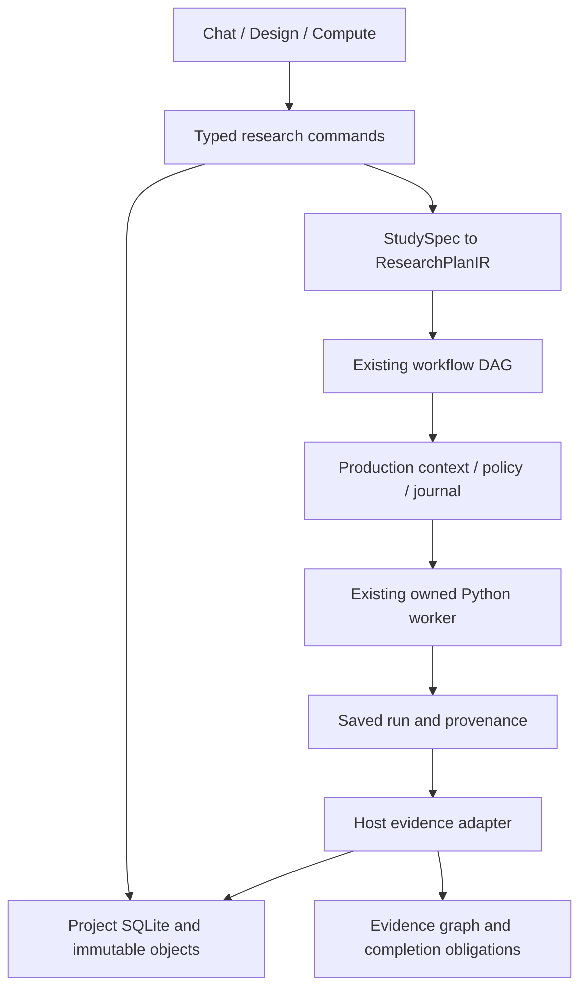

# Managed research architecture increment — 2026-09-24

This unreleased source increment implements a runnable Study-to-evidence path
from the supplied next-architecture proposal. It does **not** complete its M0–M5
roadmap. The [P01–P14 capability ledger](NEXT_ARCHITECTURE_CAPABILITIES.md) records
implemented boundaries and remaining work separately from test outcomes.

## Input and baseline

- User-supplied `Proto_Workbench_Next_Architecture_Plan.md`, reviewed 2026-09-24.
  Preserved input SHA-256:
  `1f8a93249f55540985d01a315a624095355e829899430fb2232350f783aec831`.
- Local checkout at implementation start: `cd5e4e5`. The proposal reviewed
  `bacc19c6917d3a7dfdae2dcbec65bfee01226c6f`; these are different baselines.
- The proposal's failed hosted CI run was not refreshed or reproduced on its
  original runner. Current local checks cannot establish that hosted failure was
  fixed. CI changes retain raw TAP and environment records on failure.
- No source publishing, installer release, model loading or GPU work is included.

## Resulting behavior

The existing Chat / Design / Compute navigation remains. **Study desk** opens a
shared research workspace from the top bar. It creates a named question, retains
Study selection, prepares an unsent Chat review draft, and opens the same Study in
the Compute notebook. The plan editor uses existing catalog examples with an
explicit development label and requires source, unit, entity, reference and
assumption declarations before freezing.

The host reads contained source bytes, obtains current method detail and runtime
fingerprints, checks the specification and creates an immutable plan. Its dry run
uses the existing workflow preview and reviewed preview hash. Unknown resource
estimates remain unknown. Disabled computations and stale source/runtime identity
block execution. A host-issued production KernelContext is required for managed
tool dispatch; serialized renderer decisions cannot become authority.

After execution, the evidence adapter reopens saved receipts. Study/workflow/step
identity, resolved request, retained result binding, runtime identity and source
hashes must agree. Intact evidence is copied into project objects and linked into
the existing notebook. Run Center, evidence inspection, graph navigation and
completion blockers are derived from those host records. Earlier unknown effects
remain blockers, including optional attempts. Successful computation never
manufactures scientific approval or human review.

Frozen plans and executions can be reopened for inspection even if live sources
change. Scientific Diff reports recorded changes in inputs, sample inclusion,
units, parameters, references, method/runtime, seed and claims; it does not infer
causal explanations. Full version capsules include attached source snapshots and
retained result evidence. Export reads the file back and verifies its SHA-256;
import to another store verifies bytes while retaining imported-unverified status.

## Architecture and compatibility



[ADR 0006](adr/0006-managed-study-plan-and-project-objects.md) documents the logical
boundaries. The implementation does not move all code into new packages.
[Research model contracts](research-model-contracts.md) describe validation and
evidence semantics. `.proto/` is project state and is Git-ignored. Generated test,
run and capsule artifacts remain under `build/`.

The store provides immutable versions, optimistic head checks, attached-object
integrity, bounded paging/range reads, additive legacy import and version capsules.
Store migration from v1 to v2 adds references without rewriting historical version
bytes. Legacy import is an inventory snapshot with byte-parity checks; closed
SQLite sources are required. It does not migrate every historical writer or
transfer policy grants.

## Try the source implementation

Use the existing source setup in [getting started](getting-started.md#development).
Enable **Biomni scientific computing** in Settings for the local Compute methods.
Open Study desk, create a question, select a catalog example, and replace its
development data. Declare a contained project source file in `datasets` and link
its ID from `stepSemantics.datasetIds`. For literal-input methods the source JSON
must exactly equal the submitted argument object. File-input methods must bind
all their actual file paths to declared sources.

Select **Compile and freeze plan**, inspect the dry run, then **Run reviewed
plan**. Reopen a plan version to inspect retained results. **Refresh execution
preview** rechecks whether it may run now. Open Compute to view linked result
contents in the existing notebook; Discuss in Chat prepares a draft for review.

The synthetic source-runtime acceptance test is reproducible without a model:

```powershell
Set-Location apps/proto-workbench
node --experimental-strip-types --test tests/managed-research-cpu.test.mjs
```

It requires the already installed project Python and scientific dependencies.
Its synthetic observations are software reference data, not biological evidence.
It retains an isolated workspace and `acceptance.json` under
`build/next-architecture-20260924/managed-cpu-*` at the repository root.

## Current limits

| Area | Remaining work |
|---|---|
| Storage authority | Full legacy inventory, semantic parity, old-writer cutover and migration recovery across all entrypoints |
| Execution | New durable job outbox, resource reservation, staging publication, fencing and external/GPU reconciliation |
| Research semantics | Complete method output schemas, end-to-end Quantity bindings, estimands, axes/residue mappings and independent scientific review |
| Plan editing | Managed freezing currently supports literal-input steps; unresolved binding-dependent steps remain in the existing workflow editor |
| Data scale | Managed source reads are bounded to 16 MiB/file and 32 MiB/plan; no new chunked array/table backend or scale acceptance |
| Capsules | Local version capsules (24 MiB bound), not a full runtime distribution, complete original artifact bundle or RO-Crate conformance claim; import is currently a store API, without a desktop import workflow |
| Product routes | Dedicated Protein Studio, managed prediction, Chem inverse inference and RNA robustness extensions remain unimplemented |
| Agent workflow | Shared selection and unsent Chat context are present; model generation/editing of managed plans through a new canonical command tool is not implemented |
| Delivery | Hosted CI, independent science tasks, paired model evaluation, clean-machine installer and GPU acceptance remain outstanding |

## Validation

Validation receipts and retained failures are recorded under
`build/next-architecture-20260924`. These local files are Git-ignored. Results below
overlap and must not be added into an independent coverage total.

| Check | Actual result | Evidence / scope |
|---|---|---|
| Broad serial regression | 1,470 tests: 1,468 passed, one failure, one skip | `node-regression-audit.tap`; 205 files selected at run start, excluding stress and the separately owned boundary test |
| Corrected kernel/readers/Harness | 79/79 passed, no skips | `kernel-reader-rerun.tap`; resolves the broad run's missing-schema-registration failure and adds queued-input mutation/cancellation regression |
| Managed source boundaries | 6/6 passed, no skips | `tests/managed-research-boundaries.test.mjs`; traversal, control sources, linked source ancestors, snapshot tampering, source matching, shared run identity |
| Real managed CPU reference | 1/1 passed, no skips, 66.7 seconds | `managed-cpu-MJY0BR/acceptance.json`; actual mean 3, 18 production journal operations, one computation, source drift rejection, reopen and capsule import |
| Real protein method/file references | 1/1 passed, no skips, 97.1 seconds | `managed-protein-cpu-yNfLR9/acceptance.json`; two independent development fixtures, actual sequence and PDB computations, branch freshness and capsule reopening |
| TypeScript / generated contracts | Passed | Final `--noEmit`; 43 canonical tool contracts, Python-derived units, 14-entry architecture ledger parity |
| Python artifact readers | 2/2 passed | Version-field registration and compatible readers |
| Desktop source build | Passed; final rebuild and identity recheck passed | `desktop-offline-audit-results.json` and `final-desktop-build-results.json`; first sandbox path denial and earlier successful build preserved; final 17 modules, existing local typography |
| Offline compiler boundary | Passed | Reverified TypeScript 5.9.3 compiler tree and `--noEmit` under the existing JavaScript network guard; not OS network isolation or the complete offline gate |
| Browser workflow | Passed for the observed path | `browser-observations.json`; invalid unit and disabled module rejected, real run completed, evidence reopened, result linked into Compute, unsent Chat draft and export hash verified |
| Browser layout | No horizontal overflow | DOM dimensions and screenshots checked at 1280×720 and 390×844; temporary viewport reset |

The broad run's original failure and skip are preserved. The failure was missing
registration of nine new schema identifiers and was corrected with reader tests.
The skip was the existing owned-process mutation check because host containment
also terminated descendants after the deliberately incomplete kill. It is not a
passing negative test. The original queued Harness input-mutation reproduction
is retained separately from its fixed rerun.

The desktop build was reopened and bound to content ID
`7623e7d5930cf9994fdc5db04d111afdcc0e7399e1af754a3595c3a1db587c63`.
This identifies recorded working-tree inputs and output bytes; it is not a
signature, installed-dependency audit, native runtime test or installer release.
The complete offline entrypoint selects stress tests and concurrency four, so it
was not run under this checkout's nonstress/single-concurrency restriction.

Browser validation used the synthetic observations `[1,2,3,4,5]`. It reopened mean
3 and N=5 through the existing result viewer, with verified integrity/current
sources and unreviewed science. It exported 25,066 bytes and independently matched
SHA-256 `d967b4d02ffccd892593ca078c032f2961ec2e104f1985fc07bbc4e6e1ae7896`.
The UI exposed two integration defects during development (summary catalog
metadata and MCP presentation blocks in fingerprints); both were corrected
before successful execution. Development reloads reset the preview's in-memory
module settings, so execution was verified after editing stabilized.

The protein reference used two independent existing development examples, not a
biological study: three aligned sequences across 12 columns (gap-column
conservation 2/3), and two physical copies of the PDB fixture (three CA residues,
self-comparison RMSD 0). Both actual file-input claims matched their source SHA.
Changing one PDB header made the structural branch stale while the independent
alignment stayed current; saved integrity remained verified. The earlier attempt
that declared the same physical PDB file twice was rejected by the existing
provenance guard and remains failed in `managed-protein-cpu-lltlKL/acceptance.json`.
The corrected attempt uses separate input files and retains five imported capsule
versions without execution authority.

The browser also froze a second synthetic plan and compared it with the first.
The diff reported the changed dataset version and reference declaration with
descriptive-only attribution; no second computation was launched. CI now selects
the managed contracts, source boundary, evidence and two actual CPU tests in a
serial step and preserves TAP plus acceptance receipts even on failure. This is
a configured future check, not a newly observed hosted pass.

The final renderer correction clears comparison and evidence-object selections
when opening another plan or compiling a new one. Browser verification confirmed
that Scientific Diff is disabled until a comparison version is selected again.
The final TypeScript check and desktop rebuild include this change; earlier build
receipts remain unchanged. Final source SHA-256 is
`e61be17ad0ae758d0a7f319d71e73a5bbbfa092ac6c8d73dd995c9027568c2f8` and output
SHA-256 is `cb06f85f0af755f0d41f8333387825687580f8a549e6b2b7ccdbae5ad7fc934c`.

Source-runtime CPU evidence, browser development preview, model quality,
scientific acceptance and packaged release remain distinct scopes. No claim is
made for a current hosted CI pass, complete model benchmark, GPU prediction,
native installer, clean-machine run or the full scientific roadmap.
