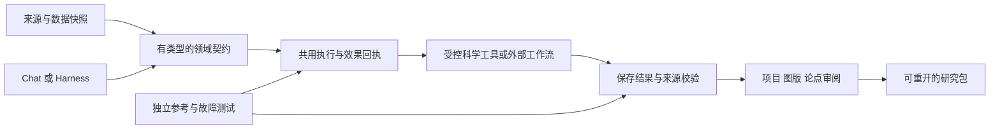

# Proto：开源生信、化学与 AI Harness 改进总案

研究日期：**2026-09-22，America/Toronto**。部分来源回执使用 UTC，时间已跨到 9 月 23 日。本文将本轮结束位置、生态扫描、源码观察、产品脑暴和可验收的改进队列放在一个文件中。上游观察与本项目建议分别表述，所有尚未实施的提案均保持候选状态。

**最值得投入的方向：把 Proto 做成能组织真实研究、解释差异、保留证据并可靠恢复的本地工作台。** 开源生态已经提供许多优秀引擎，Proto 的主要价值在于连接这些引擎的数据身份、运行记录、科学解释和可审阅界面。新工具数量不适合作为主要成果指标。

实施已经按用户要求暂停：本轮 **F4 可编辑工作流、版本保存、选择性重跑及显式恢复**完成受限的本地验收，原实施目标状态为 `paused`。后续没有开展新功能实现、上游软件安装、数据库部署、模型加载或 GPU 运行。本文件是研究成果及下一阶段候选池。

阅读顺序：先看[当前边界](#baseline)、[统一改进队列](#backlog)和[六个产品方向](#products)；需要具体工具时进入[生信](#bio)、[化学](#chem)、[Harness 源码](#harness)、[通用基础设施](#infra)及[补充领域](#supplement)。Kimi Code 与 ZCode 的逐机制分析、固定提交和文件链接在 Harness 部分。

## 1. 研究方法与覆盖边界

研究使用项目官方仓库、官方文档、规范和选定源码，按领域分工并交叉整理。重点对新版 **MoonshotAI/kimi-code** 与官方 **zai-org/ZCode** 深读；其余项目按用途、接口、运行约束、许可证线索及 Proto 的具体缺口筛选。软件引擎、格式规范、工作流平台、SDK、完整应用和数据管理工具分别标注。

主体目录包含 **59 个生信项目/规范、50 个化学工具、25 个 Harness 仓库快照、12 个通用基础设施条目**；补充扫描单列，最终核对计数见文末。跨领域重复保留以便比较，例如 MDAnalysis、OpenMM、OpenMS 和质谱工具；这些数字不能相加宣称同等数量的独立引擎，更不代表都已适配。

“扫描所有”被落实为广泛覆盖主要研究链与代表性开源实现。开源生态持续变化，本轮不能证明穷尽所有仓库、插件、分支、数据库和新发布项目。尚未逐项核查的领域在文末列出，未用记忆中的功能或搜索摘要填补证据。本文不提供新的运行效果、性能排名、准确率或科学有效性结论。

证据分三层：**上游资料已读**仅说明公开资料包含所述机制；**Proto 当前运行证据**只来自现有本地验收；**拟议验收**是后续工作要达到的条件。资料中的许可证是工程筛选线索，具体复制、依赖、数据、权重和发行包需分别固定来源。网页默认分支与开发版文档不等于最新稳定发行版。

## 2. 本轮结束位置与原有 17 项改进

以下以当前仓库账本为准。F4 新完成的范围不应覆盖其他未完成项，也不应把功能运行成功扩展为一般科学可靠性。

| ID | 当前状态 | 后续仍需解决的具体问题 |
| --- | --- | --- |
| A1 蛋白对应与结构身份 | 部分实现 | 多链、插入码、缺失残基、重编号和原子对应的独立参考与完整结构视图验收 |
| A2 数值、单位、实体与来源绑定 | 部分实现 | 从已有选定方法扩展到共同 Quantity/Entity 契约；一般文字仍不能自动获得核验状态 |
| A3 科学成熟度与适用范围 | 目录标记已实现；领域评估未完 | 逐方法区分演示、数值参考、真实运行、适用域与解释审阅 |
| A4 统计推断与研究设计 | 部分实现 | 独立参考、效应量/区间、重复测量、批次、噪声模型与假设诊断的系统覆盖 |
| A5 论点—来源持久审阅 | 受限本地验收通过 | PDF 精确定位、抽取误差和语义支持程度；已有手动审阅不等于自动蕴含验证 |
| A6 独立科学及模型基准 | 未完成 | 冻结数据、任务族、多次重复、基线/消融、错误与中断分母 |
| E1 Chat/Harness 共用可靠执行 | 未完成 | 在工具产生实际效果的边界保存意图与回执，防止恢复时重复写入或误报成功 |
| E2 持久状态、分页与迁移 | 部分实现 | 会话摘要分页已验收；完整消息正规化、转录分页、恢复通知分页仍需完成 |
| E3 依赖齐全的 CI 配置 | 配置已实现 | 托管 CI、重型依赖与完整 WSL 运行矩阵须分别执行并留下结果 |
| E4 构建身份及干净机器交付 | 部分实现 | 已有开发构建身份；原生打包运行、安装/升级/卸载、缺依赖和干净机器路径仍需验收 |
| E5 领域服务与证据看板 | 未完成 | 统一小接口、减少入口重复逻辑、逐工件显示证据状态及时间 |
| F1 蛋白比较工作区 | 部分实现 | 已有给定比对与保存结果；真实 MSA/模型化树、结构联动及更完整独立验收仍待扩展 |
| F2 本地预测结果与作业 | 结果导入部分已实现 | 已能导入结构/置信度/PAE；owned queue、输入/权重/运行时绑定、取消恢复及推理尚未完成 |
| F3 RNA-seq 工作区 | 受限本地运行、参考与 UI 验收通过 | FASTQ 上游、参考管理、扩展设计及新数据集属于新增范围；既有 DESeq2 运行不证明普遍统计适用性 |
| F4 工作流与选择性重跑 | **本轮受限本地验收通过** | 16 步以内 typed DAG、版本与缓存、失败/取消恢复已验收；外部引擎、并行调度及 E1 副作用协议未交付 |
| F5 贝叶斯校准与全局敏感性 | 未完成 | 联合后验、采样诊断、预测检验、可辨识性与 Sobol/Morris 独立参考 |
| F6 数据绑定图版与方法报告 | 本地图件/UI 验收通过 | 真正浏览器下载、原生交付及更完整报告链仍有独立验收要求 |

F4 的收尾证据包括：实际 Python MCP 分支运行、参数/文件变化失效、保留失败、取消后强制重跑恢复、实际宿主重启、3 个 UI 版本与 5 次执行重新打开。独立检查核对了 SQLite、4 个运行包及 28 个相关文件。较宽回归的 131 个 Node 测试与 TypeScript 通过；首次 Python 命令因报告参数错误未执行测试，失败回执保留，修正命令后选定 50 个 Python 测试通过。最终恢复修正另有 16 个服务测试和真实 UI 路径，计数相互重叠，不相加为独立总数。

当前功能目录有 **127 项方法**，并不等于 127 个完整上游软件已集成。当前连接器记录也不能替代本机实际可用性。完整验收索引与原账本的本地链接在文末保留。

## 3. 统一改进队列：先解决什么，后扩展什么

以下是本次综合判断，不是来源项目的客观排名。**P0** 为跨领域基础或已存在的关键缺口；**P1** 为直接延长现有研究链；**P2** 为新增领域或高成本计算。工作量 **S/M/L/XL** 表示相对涉及范围，不承诺日历工期；外部引擎的数据、权重、参考库和硬件准备可能超过代码工作量。

下表把详细提案归并成可排期的工作单元。BIO、CHEM、H、CROSS、SUP 编号对应后文的验收细节。各领域原始优先级是领域内判断，跨领域排期以本表为准。

| ID / 优先级 | 可交付改进及用户价值 | 来源提案 | 代价与前置条件 | 首次交付的关键验收 |
| --- | --- | --- | --- | --- |
| U01 / P0 | 数据集、参考库、实体与单位共同契约；提前发现错样本、错坐标和错单位 | BIO-01、CROSS-03、CHEM-02/06 | M；先限定已有 RNA/结构/化学对象 | 参考/索引变化触发失效；NULL 与 0、绝对温度与温差、不同坐标不能混淆 |
| U02 / P0 | Chat、Harness、Compute 共用执行意图/效果回执，恢复时不重复写入 | H01–H03、H07 | L；逐工具声明副作用、所有权及幂等规则 | 每个效果边界注入中断；未知效果保持未知，不能自动重放 |
| U03 / P0 | 长研究会话分页、可靠压缩与精确回读 | H04–H06 | M；迁移与协议兼容 | 原始消息不丢；摘要保留证据位置；乱序/重复事件和超限可恢复 |
| U04 / P0 | 大表/数组的分页与分块读取，模型只取必要数据 | CROSS-04、H13 | M；U01，宿主读取服务 | 不全量加载；ID/NULL/精度不变；缺块、坏块、未读范围明确 |
| U05 / P0 | 方法适用域与结果证据等级；回答中每个关键数值可定位 | A3、H11、CROSS-03 | M；先扩展实际已有方法 | 错单位/实体负例被拒；未覆盖的解释保持未核验 |
| U06 / P0 | 独立科学/模型评价台与真实 provider 能力探针 | H09–H10、CHEM-05、BIO-04 | M–L；冻结任务和参考数据 | 工具选择、实际运行、科学答案分开计分；失败/中断保留分母 |
| U07 / P1 | 小领域服务、生成客户端与可审扩展契约 | H02、H08、H18 | M；U02，逐步约束新服务 | 多入口同一事件得到同一状态；扩展改字节即失效；关键门禁不依赖可选 hook |
| U08 / P0 | 干净环境、可选运行时与安装产物的完整交付矩阵 | E3/E4、H19 | L；当前构建身份为起点 | 安装产物绑定当前源码；缺 R/WSL/GPU 清楚报告；原生实际运行留证 |
| U09 / P1 | 工作流重跑预览与研究分支比较 | H16–H17 | M；当前 F4 已有基础 | 运行前显示变化及依赖闭包；切分支保留旧结果；强制后代规则一致 |
| U10 / P1 | 受控 Nextflow/Snakemake/CWL 外部作业桥 | BIO-15 | L；U01/U02，先一个固定模板 | 外部 run/resume 身份可追溯；依赖缺失不算通过；导出包异目录重开 |
| U11 / P1 | RNA 多样本 QC 与 reads→定量→已有 F3 的完整链 | BIO-02–04 | L；U01/U10，明确参考和设计 | TPM 不冒充 raw counts；quant/length/mapping 有专门合约；样本顺序和缺失语义保留 |
| U12 / P1 | 真正的 MSA、域命中与模型化系统发育 | BIO-08–09 | M；U01，固定 MAFFT/IQ-TREE | 插入/缺口/重命名不丢坐标；NJ/ML 与支持度类型明确 |
| U13 / P1 | 私有 A3M 预测作业和多引擎结构比较 | BIO-10–11 | L；U01/U02，F2 结果合约 | 断网本地输入、owned cancel/recovery、链/PAE 索引及权重身份通过 |
| U14 / P1 | 化学结构标准化审阅与信息损失报告 | CHEM-01 | M；U01 | 原始/标准化并列；盐、电荷、立体和片段变化可追溯 |
| U15 / P1 | QM 输出导入、收敛诊断与固定量化任务 | CHEM-02/03/05 | M；先导入，后接实际引擎 | 成功、截断、SCF/几何不收敛分别显示；同条件独立数值参照 |
| U16 / P1 | 光谱与质谱研究项目：处理链、峰、候选解释和图版 | CHEM-13、BIO-14 | L；先 mzML/已有谱图结果，U01/U04 | 处理前后峰与单位可回看；候选命中不自动成为鉴定结论 |
| U17 / P1 | 不确定性、参数可辨识性与全局敏感性工作区 | CHEM-15、F5 | L；先固定小维度模型，U06 | 合成参数恢复、相关参数、诊断失败、解析 Sobol 与预测检验 |
| U18 / P1 | 机理/平衡/电化学模型诊断与校准 | CHEM-11/12/14 | L；U01/U17，来源固定的模型 | 守恒/量纲/残差、数据库/标准态与不可辨识性可见 |
| U19 / P1 | 拓扑绑定的轨迹分析与结构—曲线联动 | CHEM-08、BIO-12 | M；U01/U04 | 错拓扑拒绝；PBC/对齐/单位处理可回溯；刚体变换独立参照 |
| U20 / P2 | 构象集合、约束与采样预算比较 | CHEM-04 | L；U14/U15/U02 | 原子置换、重复构象、采样中断保留；不宣称有限集合穷尽 |
| U21 / P2 | 力场覆盖、体系定义及受控模拟任务 | CHEM-09 | L；U19/U02，真实运行时 | 缺参数不静默补全；精度平台、力场、电荷和能量分项有记录 |
| U22 / P2 | 单细胞 QC、概率整合与参考映射 | BIO-05–06 | XL；U01/U04/U06 | counts/layers 正确；以 donor/样本划分；未知类别与低置信度可见 |
| U23 / P2 | 空间组学、图像 ROI 与定量成像联动 | BIO-07/13 | XL；U01/U04/U06 | 坐标变换独立验收；分割与人工修订分开；坏成像域保留 |
| U24 / P2 | 周期结构与材料收敛研究 | CHEM-06/07 | XL；U01/U02/U15，固定外部后端 | 晶胞/PBC/占位和赝势身份；收敛失败点及资源预算留痕 |
| U25 / P2 | 自由能网络与采样质量检查 | CHEM-10 | XL；U19/U21/U17 | 重叠、相关性、缺边及环闭合分开报告；采样不足不填零 |
| U26 / P1 | 从论点点击到 PDF 区域及相反证据 | CROSS-01、H11 | M；已有 A5，固定解析器 | 多栏/脚注错配独立核对；源变更令旧定位失效；抽取不等于支持 |
| U27 / P1 | 可重新打开的论文图版、方法与研究包 | CROSS-02、BIO-15、H20 | M；已有 F6，U01 | 不暗中重算；实际导出文件重开，核数值/引用/hash；来源范围清楚 |
| U28 / P1 | 数据/参考/模型与基准快照管理 | CROSS-06 | M；DVC 或 DataLad 先选一个试点 | 内容未取得与数据不存在不同；异目录还原；禁止同名异字节误命中 |
| U29 / P1 | 血缘、时序、实验指标关联及无进展检测 | CROSS-05、H12 | M；U02/U06 | telemetry 丢失不改变运行事实；合法轮询与重复失败区分 |
| U30 / P1 | 按需工具 schema、受限研究助手与多代理对照 | H14–H15 | M；U02/U06 | 明确工具召回率；worker 不扩权；同题单代理基线证明收益 |
| U31 / P2 | 微生物组组成/QC 研究与参考数据库记录 | SUP-01 | L；U01/U04/U06 | 分类器/库/分母固定；相对丰度与绝对数量区分；阴性/缺失语义保留 |
| U32 / P2 | 带参考基因组身份的变异结果审阅 | SUP-02 | L；U01；研究数据导入优先 | assembly、contig、坐标、多等位与过滤状态可核对；不生成临床决定 |
| U33 / P2 | 分子机器学习、数据泄漏检查与适用域 | SUP-03 | L；U14/U06/U28 | scaffold/时间划分、重复母体、标签来源及外推不确定性有独立评估 |

建议未来启动时一次选择一条主线：先做 **U01 + U02 + U06** 的最小闭环，再从 **U12/U13（蛋白）**、**U11（RNA）**或 **U14/U15/U16（化学分析）**选一个用户任务。U08 的交付检查应跟随每条主线。U22–U25 和 U31–U33 保留为后续领域扩展，避免同时引入多个大型依赖和数据系统。

## 4. 六个具有辨识度的产品方向

下面是将目录变成可使用产品的综合提案。它们复用上面的队列，不新增另一套科学引擎，也不计作额外独立改进项。

| 产品方向 | 用户看到的具体体验 | 成功条件 | 主要依赖 |
| --- | --- | --- | --- |
| **研究差异解释器** | 选中两次分析，显示数据、参考、方法、默认参数、单位、软件版本与结果的差异；回答哪些结果可直接比较 | 每条解释回指真实差异；不兼容对比明确拒绝；不把版本变化自动说成差异的因果原因 | U01/U05/U09，已有结果比较 |
| **重跑前影响预览** | 改一个阈值、参考库或文件后，先看到哪些步骤必须重跑、哪些可复用、依据是什么、预计资源是否已知 | 预览依赖闭包与实际执行一致；未知成本明确未知；提交时再次核对源身份 | U02/U09/U10，已有 F4 |
| **证据阅读与争议面板** | 从结论跳到论文原页、计算值、假设和相反证据；区分作者陈述、工具输出与模型推断 | 错引/错单位负例不能升级为已核验；重抽取保留旧审阅；每个数字可追溯 | U05/U26，已有 A5 |
| **适用范围与不确定性视图** | 在拟合、预测、结构比较或分子模型旁展示未辨识参数、低覆盖区域、低置信度和失败点 | 缺证据不能显示绿灯；诊断采用方法相关标准；与独立参考/留出数据一致 | U06/U17/U33 |
| **数据到图版的可回溯操作** | 点击图中的点/峰/残基，能打开原始行、谱段、结构坐标、处理步骤和保存的运行 | 坐标/单位与数据身份一致；导出重开仍能核对；图注不会自动新增没有依据的结论 | U04/U16/U19/U27，已有 F6 |
| **本地研究复现包** | 导出所选数据范围、方法、运行、图版和来源，另一目录打开即可看缺什么、哪些能重现 | 实際文件重开并核 hash；没有内容的引用明确缺失；查看报告与重新计算分别启动 | U08/U10/U27/U28 |

这些方向能形成公开展示时更可信的成果：展示一个具体研究问题如何从输入到结论，展示失败和分歧如何处理，并给出可重新核对的工件。

## 5. 集成架构与 Harness 采用策略

科学引擎接入建议收敛为小接口：`capabilities / validate-input / plan / run / status / cancel / collect`。这是 Proto 的候选内部合约，不声称上游工具已经原生支持。输入、参考库、参数、实现/依赖、随机性和结果工件各有身份；宿主负责执行和文件权威，界面负责有界展示。

| 引入方式 | 适用对象 | 首选边界 |
| --- | --- | --- |
| **借鉴机制并在现有代码实现** | Kimi 的证据回指/协议能力，ZCode 的 ToolContract/迁移/reducer，MiniMax 的进展判断 | 当前最优先；保留上游出处、固定源码路径，按 Proto 的研究与恢复语义重新验收 |
| **通过 MCP 暴露既有科学工具** | 支持该协议的外部 Harness | 同一 canonical tool；能力、参数和权限由 Proto 宿主控制；协议支持不代表兼容性已通过 |
| **ACP 或版本化事件协议适配** | 希望接入的 CLI/前端 | 能力握手、加载与恢复语义先核对；不因支持 ACP 自动开放文件/终端的反向能力 |
| **选用 SDK 的独立组件** | Pydantic Evals、DSPy 等评价/优化模块及生成客户端 | 优先评价与契约复用；避免引入与当前会话、F4 同时拥有任务状态的另一套 runtime |
| **外部工作流节点** | Nextflow、Snakemake、AiiDA 等 | 一个已固定模板、一个外部任务身份、一个取消/收集边界；逐步扩展，不解析任意脚本并猜测副作用 |
| **先导入，再执行** | QM、MD、空间组学、谱图及重型材料引擎 | 先把独立已有结果变成可审阅研究工件，确认领域语义，再部署和运行引擎 |

Kimi Code 首先值得借鉴的是**能回到原始日志位置的上下文压缩、工具 schema 记录及明确协议能力**。官方 ZCode 首先值得借鉴的是**工具输入/输出/副作用/预算/取消统一契约、迁移校验及纯状态归并**。具体固定源码证据、适用边界与不宜照搬的实现都在第 8 节逐项列出；这是机制选择，不是对两个产品作整体可靠性排名。

评价应至少分四条独立轴：输入与领域语义、真实执行与恢复、数值/统计参考、研究解释与来源。模型能正确调用工具只能贡献其中一部分；同一算法通过两个封装得到相同数字，也只证明封装一致性。

## 6. 生物信息学：59 项主体目录与 15 项提案

调研日期：2026-09-22。范围：59 个项目、框架或格式规范；这是一份有选择的生态扫描，不代表穷尽所有项目。逐项读取了下表所链接的官方仓库或官方文档；没有安装、下载数据集、执行这些引擎或修改产品代码。这里的“可集成”均是设计建议，不能当作已经实现或通过科学验证。

### 与当前 Proto 的关系

当前项目的基础是已有 Compute 执行与保存结果、Research Project、来源绑定、研究图表及 F4 工作流增量。127 项 Compute 目录包含大量轻量改编，不能解释为下列完整引擎已经集成。F3 已有受限设计的真实 DESeq2 路径；F1 已能处理用户提供的比对；F2 的结构结果导入不等于预测作业管理完成。F4 应当承接受控工具调用与真实运行记录；大型外部工作流宜作为一个有自身运行身份的节点接入。

账本依据：[当前研究升级计划](</C:/Users/pc/Documents/Proto CLI/docs/research-upgrade-plan.md>)。下面是候选扩展与已有 A/E/F 项目的映射，不改变账本状态，也不重新解释原有验收。F4 本轮已通过受限本地验收，具体范围见前文与文末的验收索引；生态资料不替代实际运行记录。

表中证据状态 **R** = 本次读取官方资料，未执行。许可证栏是读取到的页面声明或仓库标识，未做完整依赖、二进制分发、模型权重及数据集法律审计；“未核实”表示不能从本次阅读推断许可证。运行栏中的“建议 WSL”“需限制”等是针对 Proto/Windows 的工程判断，不是本机已验证的兼容性声明。

### 1. 基因组、测序质控与 bulk RNA-seq

| ID / 项目与主要来源 | 独特能力（官方资料） | 具体 Proto 用法或启发（提案） | 接口、运行或数据约束 | 许可证线索 | 证据 |
| --- | --- | --- | --- | --- | --- |
| B01 [fastp](https://github.com/OpenGene/fastp) | FASTQ 质控、接头处理与过滤，输出 JSON/HTML | 在 F3 上游增加过滤前后 QC 卡；保留每一过滤原因及读数分母 | CLI；建议 WSL；保存成对输入、过滤参数和输出哈希；本页优先定位短读长 | MIT | R |
| B02 [FastQC](https://github.com/s-andrews/FastQC) | 对 FASTQ/BAM 运行多种质量诊断，支持 GUI/批处理 | 导入模块结果与原报告；“警告”保留为数据特征提示，不自动判实验失败 | 官方提供 Windows/macOS/Linux 包；大文件在宿主处理 | 仓库标出 GPL-3.0 与 Apache-2.0 组件，分发前细查 | R |
| B03 [MultiQC](https://github.com/MultiQC/MultiQC) | 汇总多工具、多样本日志为交互报告，支持自定义内容 | 项目级 QC 总览；按样本 ID 绑定各阶段指标及缺失状态 | Python/CLI；只扫描所选受控运行目录，避免混入旧结果；HTML 作为受限工件 | GPL-3.0 | R |
| B04 [minimap2](https://github.com/lh3/minimap2) | 基因组、长读长、剪接及组装间比对；SAM/PAF 输出 | 新增长读长或参考比对节点；为不同 read 类型提供明确预设 | CLI；建议 WSL；索引、参考 FASTA、预设共同进入缓存身份 | 未核实 | R |
| B05 [SAMtools](https://github.com/samtools/samtools) | SAM/BAM/CRAM 处理与统计；与 HTSlib 协同 | 受控 sort/index/stats 适配器和比对文件摘要 | CLI；建议 WSL；CRAM 参考、排序状态、索引身份必须声明 | 未核实 | R |
| B06 [BCFtools](https://github.com/samtools/bcftools) | VCF/BCF 查询、合并、统计及变异处理 | 先做已给定变异表的规范化/样本 QC 研究面板 | CLI；建议 WSL；保留 assembly、contig 命名、多等位及缺失语义 | 未核实 | R |
| B07 [BEDTools](https://github.com/arq5x/bedtools2) | 区间相交、合并、计数等 genome arithmetic | 给 Design/Compute 提供可审阅的注释覆盖与区域交集 | CLI；建议 WSL；BED 与 GFF/VCF 坐标约定不能隐式混用；排序影响资源消耗 | MIT | R |
| B08 [STAR](https://github.com/alexdobin/STAR) | RNA-seq 剪接比对 | 连接 FASTQ→参考比对→计数的真实上游节点 | Linux/macOS x86-64；Windows 建议 WSL；官方称哺乳动物参考通常需至少 16GB、理想 32GB RAM | MIT | R |
| B09 [Salmon](https://github.com/COMBINE-lab/salmon) | 转录本水平 RNA 定量，产生 quant.sf | 增加转录本定量导入；参数中显式记录 library type 与 reference | CLI；Linux/macOS 发布路径，Windows 建议 WSL；本次页面已描述大版本索引变化，必须固定版本并绑定索引 | BSD-3-Clause（本次所读默认分支）；旧版本需另核 | R |
| B10 [DESeq2](https://bioconductor.org/packages/release/bioc/html/DESeq2.html) | 对测序计数使用负二项模型进行差异分析 | 延展已有 F3：可审阅的对比设计、模型诊断和独立参考对照 | R/Bioconductor；原始整数计数与设计矩阵；不能把 TPM 当原始计数 | LGPL ≥3 | R |
| B11 [PyDESeq2](https://github.com/scverse/PyDESeq2) | Python 重实现 bulk RNA 差异分析 | 作为独立可选后端及交叉核对工具，不静默替换已有 R 引擎 | Python/AnnData；官方明确结果/功能可能有差异；版本、过滤及默认项必须可比较 | MIT | R |
| B12 [tximport](https://github.com/thelovelab/tximport) | 从转录本 abundance、estimated counts、length 汇总到基因分析矩阵 | 为 Salmon 等建立专用导入通道，保留 transcript→gene 映射与 length correction | R；估计计数/offset 必须走受支持的统计路径，不能简单取整塞入当前 raw-count CSV 合约 | 未核实 | R |

### 2. 单细胞、多模态与空间组学

| ID / 项目与主要来源 | 独特能力（官方资料） | 具体 Proto 用法或启发（提案） | 接口、运行或数据约束 | 许可证线索 | 证据 |
| --- | --- | --- | --- | --- | --- |
| B13 [Scanpy](https://github.com/scverse/scanpy) | 单细胞预处理、降维、聚类、轨迹及差异分析 | 建立保存完整参数和 cell/gene mask 的单细胞研究视图 | Python；AnnData/稀疏矩阵；支持范围依方法而异，不能把 README 的规模描述当整条流程内存保证 | BSD-3-Clause | R |
| B14 [Seurat](https://github.com/satijalab/seurat) | R 单细胞、空间及多模态分析 | 导入已算 Seurat 结果或提供隔离的 R 适配器；与 Scanpy 并列显示方法身份 | R；官方列 Windows/macOS/Linux；跨格式导出必须核对细胞名、assay/layer 与变换 | MIT 标识及额外 LICENSE 文件，需核分发组合 | R |
| B15 [scvi-tools](https://github.com/scverse/scvi-tools) | 基于概率模型的整合、注释、空间去卷积等 | 增加可保存模型的批次整合与参考映射，展示不确定性而非只给标签 | Python/PyTorch/AnnData；GPU 可加速；显式记录 batch/covariate、seed、权重和训练数据身份 | BSD-3-Clause | R |
| B16 [AnnData](https://github.com/scverse/anndata) | 内存/磁盘的注释矩阵、稀疏及惰性操作 | 作为单细胞输入规范与宿主侧分页数据接口；renderer 不加载整矩阵 | Python；h5ad/相关存储接口需固定版本；显式区分 counts、normalized、raw 与 layers | BSD-3-Clause | R |
| B17 [MuData](https://github.com/scverse/mudata) | 多 modality 的 AnnData 容器及 h5mu 存储 | RNA/ATAC/蛋白等跨模态关联；保留每种 modality 的细胞集合 | Python/HDF5；不能假定所有 modality 的行数或 cell 顺序相同 | BSD-3-Clause | R |
| B18 [scVelo](https://github.com/theislab/scvelo) | RNA velocity 与动态/潜在时间模型 | 探索型轨迹面板，展示输入层、拟合诊断与模型假设 | Python；方法需要相应 splicing/labeled 信息；推断方向不能写成已观测谱系事实 | BSD-3-Clause | R |
| B19 [CellRank](https://github.com/scverse/cellrank) | 基于 Markov 状态模型的细胞命运概率 | 将初末状态、转移核和命运概率作为可比较保存对象 | Python；上游 velocity/时间/其他先验需明确来源；提供敏感性比较 | BSD-3-Clause | R |
| B20 [Squidpy](https://github.com/scverse/squidpy) | 空间邻域图、共现、Moran's I 与图像特征 | 空间 QC、邻域富集和组织图层联动 | Python；官方建议 Linux/macOS，Windows 通过 WSL；旧 napari 插件已由 napari-spatialdata 替代 | BSD-3-Clause | R |
| B21 [SpatialData](https://github.com/scverse/spatialdata) | 空间数据 schema、坐标变换及序列化框架 | 统一组织图像、点、形状与表；所有区域统计绑定坐标系统 | Python/R/JS 生态；基于 OME-NGFF；格式/API仍需版本绑定，不能只存缩略图 | BSD-3-Clause | R |

### 3. 序列、结构搜索与系统发育

| ID / 项目与主要来源 | 独特能力（官方资料） | 具体 Proto 用法或启发（提案） | 接口、运行或数据约束 | 许可证线索 | 证据 |
| --- | --- | --- | --- | --- | --- |
| B22 [MAFFT](https://mafft.cbrc.jp/alignment/software/) | 多种蛋白/核酸多序列比对策略 | 补齐 F1 的实际 MSA 计算；在保存结果中展示算法和序列坐标映射 | CLI/FASTA；选择明确 preset、线程和规模；固定算法后验收缺口/重排/重复 ID | 无扩展源包 BSD；Windows 包 GPL；扩展另有条款 | R |
| B23 [HMMER](https://github.com/EddyRivasLab/hmmer) | profile HMM 同源与家族搜索 | 在序列视图叠加有坐标和阈值的域命中；低覆盖结果保持未确定 | CLI；建议 WSL；profile 数据库版本/许可、domain 与 sequence 阈值分开保存 | [LICENSE](https://github.com/EddyRivasLab/hmmer/blob/master/LICENSE) 包含 BSD 三条款及组件说明，完整组合需核 | R |
| B24 [MMseqs2](https://github.com/soedinglab/MMseqs2) | 大规模序列搜索与聚类，含 CPU/GPU 路径 | 本地同源检索、去冗余与私有 MSA 前处理 | CLI；固定数据库与索引哈希；GPU build 对驱动/硬件有要求；数据库可能远大于程序 | MIT（当前页面） | R |
| B25 [DIAMOND](https://github.com/bbuchfink/diamond) | 蛋白及翻译核酸搜索、frameshift、表格/XML 输出 | 对已提供序列做功能候选注释；保留 hit 与 coverage，不自动赋予确定功能 | CLI；建议 WSL；数据库及 genetic-code/preset 身份纳入运行；输出可非常大 | GPL-3.0 | R |
| B26 [IQ-TREE 2](https://github.com/iqtree/iqtree2) | 最大似然系统发育、模型选择、支持度与 checkpoint | 为 F1 增加实用 ML 树；与现有邻接树清楚区分方法与支持指标 | CLI；alignment→Newick/report；线程、seed、模型和重采样方法均需固定 | GPL-2.0 | R |
| B27 [Biopython](https://github.com/biopython/biopython) | 序列、结构与生物数据库的通用 Python 工具 | 采用成熟解析器替代新增手写格式解析；输入/输出仍由 Proto 合约约束 | Python；官方有 Windows/Linux/macOS wheels；网络数据库请求单独声明，默认本地输入 | 本次仅确认有 LICENSE，具体条款未核实 | R |
| B28 [Biotite](https://github.com/biotite-dev/biotite) | 基于数组的序列/结构 IO、分析及外部工具接口 | 实现一致的 residue/atom 选择与格式转换；适合作为 A1 独立对照 | Python/NumPy；下载功能与本地计算分离；转换需保留 model/chain/insertion identity | BSD-3-Clause | R |
| B29 [scikit-bio](https://github.com/scikit-bio/scikit-bio) | 生物信息学数据结构和算法；被多种生态工具复用 | 为距离矩阵、群落数据与树分析引入独立参考实现 | Python；每类矩阵需声明单位、归一化及距离定义；不把不同距离混算 | BSD-3-Clause；随附组件另核 | R |

### 4. 蛋白结构预测、浏览与分子动力学

| ID / 项目与主要来源 | 独特能力（官方资料） | 具体 Proto 用法或启发（提案） | 接口、运行或数据约束 | 许可证线索 | 证据 |
| --- | --- | --- | --- | --- | --- |
| B30 [ColabFold](https://github.com/sokrypton/ColabFold) | 批量折叠及 MSA 辅助；可接本地输入与运行时 | 延续 F2：input/A3M/runtime→owned job→scores/结构导入，保留每一预测身份 | Python CLI/GPU 常见；FASTA/CSV 路径会自动查询公共 MSA；默认私有 A3M，本地数据库与在线服务分开配置 | 代码 MIT；各模型权重/数据库独立核查 | R |
| B31 [OpenFold](https://github.com/aqlaboratory/openfold) | 可训练的 PyTorch AlphaFold2 重实现 | 作为可选引擎及研究级复现参照，不新增另一套 UI 状态机 | Python/GPU；MSA/模板/权重等依赖须有身份；训练资源远高于导入显示 | 代码 Apache-2.0；页面声明 DeepMind 参数 CC BY 4.0 | R |
| B32 [Boltz](https://github.com/jwohlwend/boltz) | 生物分子复合物结构及 affinity 预测 | 多实体结果导入、模型比较和带适用范围的预测卡 | CLI/YAML；可 GPU/CPU，CPU 较慢；MSA server 是独立网络选择；亲和力不同输出不能混作同一量 | 官方声明代码及权重 MIT | R |
| B33 [Chai-1](https://github.com/chaidiscovery/chai-lab) | 多种分子实体的结构预测，支持 MSA/模板条件 | 扩展 F2 的通用 PredictionResult 合约，展示模型、采样及置信度 | Python/CLI；官方要求 Linux、CUDA/bfloat16 GPU；大体系显存需求高；在线 MSA/模板需显式 | 官方 README 声明代码与权重 Apache-2.0 | R |
| B34 [ESM / ESMFold](https://github.com/facebookresearch/esm) | 蛋白语言模型、embedding、单序列结构预测 | 受限的序列表征与现有序列比较；单序列预测与 MSA 条件预测分开评估 | Python/PyTorch；旧官方仓库明确已于 2024-08-01 归档；需要锁定运行时和权重 | 仓库 MIT；所选权重需逐项核查 | R |
| B35 [Foldseek](https://github.com/steineggerlab/foldseek) | 结构相似性搜索、聚类及多聚体搜索 | 本地结构候选检索；把 coverage、alignment 和来源连到 F1/F2 | CLI；CPU/GPU 路径；数据库身份和链配对规则影响结果；结构相似不等于相同功能 | GPL-3.0 | R |
| B36 [Mol*](https://github.com/molstar/molstar) | Web 分子结构解析、显示、选择与大型结构呈现 | 作为现有结构视图增强候选；链/残基选中与序列/PAE 双向联动 | JS/TS/WebGL；本地文件及受控资源；不能把可视化成功当预测科学验证 | MIT | R |
| B37 [MDAnalysis](https://github.com/MDAnalysis/mdanalysis) | 多种 topology/trajectory 的统一分析 | 先做轨迹导入、原子选择、RMSD/RMSF/接触图，再考虑模拟提交 | Python；大轨迹流式处理；拓扑配对、周期边界、时间/长度单位需绑定 | LGPLv3+；部分代码 LGPLv2.1+，页面明确区分 | R |
| B38 [MDTraj](https://github.com/mdtraj/mdtraj) | 轨迹读写、RMSD、SASA、氢键等分析 | 作为轻量分析适配器及 MDAnalysis 的独立数值对照 | Python；多种轨迹格式；原子顺序、selection、单位不可隐式转换 | LGPL-2.1-or-later；部分组件另有条款 | R |
| B39 [OpenMM](https://github.com/openmm/openmm) | 可定制 force/integrator 的分子模拟库 | 后续提供受限、版本化的模拟任务；复用 F4 作业与工件记录 | Python/C++；CPU/GPU平台需实际验收；force field、precision、seed、积分步长共同进入身份 | MIT/LGPL 等分组件，不能概括为单一许可 | R |
| B40 [GROMACS](https://github.com/gromacs/gromacs) | 分子模拟引擎；强调准确版本及可复现性 | 以外部完整运行任务接入，保存输入、checkpoint、日志及轨迹 | CLI；建议 WSL/Linux；CPU/GPU/MPI构建分别验收；GitHub是官方备份，开发在GitLab | LGPL-2.1 | R |

### 5. 成像、蛋白组与代谢组

| ID / 项目与主要来源 | 独特能力（官方资料） | 具体 Proto 用法或启发（提案） | 接口、运行或数据约束 | 许可证线索 | 证据 |
| --- | --- | --- | --- | --- | --- |
| B41 [napari](https://github.com/napari/napari) | Python 多维图像浏览、注释和插件生态 | 与 Proto 交换有来源绑定的 ROI/标签工件；先采用外部查看器，不嵌套完整 Qt 桌面 | Python/Qt/Vispy；GPU用于显示；图像轴、单位和通道标签要保留 | BSD-3-Clause | R |
| B42 [CellProfiler](https://github.com/CellProfiler/CellProfiler) | 可复用图像 pipeline 与大批量定量表型测量 | 保存 pipeline 文件/输入/测量表，提供图像→对象→统计的可审阅链接 | 桌面及流水线生态；官方Windows/macOS稳定包；具体无界面接口需下一阶段验证 | 未核实 | R |
| B43 [Cellpose](https://github.com/MouseLand/cellpose) | 细胞/细胞核分割与人工纠正流程 | 生成版本化 masks；人工修订与自动分割分开保留 | Python/GUI；GPU可加速；图像通道/尺度/模型权重绑定；每个新成像域需独立评估 | 代码 BSD-3-Clause；README提示训练数据及注释数据集 CC-BY-NC；权重分发需另核 | R |
| B44 [QuPath](https://github.com/qupath/qupath) | 全切片/显微图像、对象分类、批处理脚本 | 大图的 ROI 与检测表导入；链接区域缩略图及来源，不把全图送模型上下文 | 桌面/脚本；大图需金字塔与分页；研究用途结果不直接写诊断结论 | GPL-3.0 | R |
| B45 [OpenMS / pyOpenMS](https://github.com/OpenMS/OpenMS) | LC-MS、蛋白组/代谢组工具及统一参数描述 CTD | 封装选定 TOPP tools；借鉴 CTD 构建可验证工具 schema，而非手写全套引擎 | C++工具/Python API；Windows/macOS/Linux；mzML等PSI格式；保留方法与搜索数据库 | BSD-3-Clause，附带组件另核 | R |
| B46 [Pyteomics](https://github.com/levitsky/pyteomics) | 肽质量/修饰、MS数据和搜索输出处理 | 受控 mzML/MGF/搜索结果读入与修饰身份检查；作为特定数值独立参照 | Python；同位素、修饰名称、单位及峰注释应保留 | Apache-2.0 | R |
| B47 [ProteoWizard / msconvert](https://github.com/ProteoWizard/pwiz) | 厂商格式访问与标准MS格式转换 | 增加独立转换运行，保存原始文件与转换参数，不覆盖输入 | C++/CLI；许多vendor RAW reader依赖Windows；厂商组件可能不能同Linux引擎一起分发 | 核心Apache-2.0；vendor库各自条款 | R |
| B48 [matchms](https://github.com/matchms/matchms) | 光谱清洗、元数据统一及MS/MS相似度比较 | 质谱镜像图、命中解释与谱库搜索；保留过滤前后峰和分数定义 | Python；mzML/MGF/MSP等；大规模配对需稀疏结果/候选预筛；谱库许可另核 | Apache-2.0 | R |
| B49 [MZmine](https://github.com/mzmine/mzmine) | LC/GC/IMS/MS imaging等质谱处理与可视化 | 借鉴交互式feature table；导入已保存项目/结果与批处理参数 | Java桌面/CLI；官方含JVM的多平台发行；账号、发行方式与CLI版本需另验 | 当前源代码MIT（README声明） | R |
| B50 [XCMS](https://github.com/sneumann/xcms) | LC-MS/GC-MS/LC-MS/MS预处理及Bioconductor数据容器 | 为代谢组建立峰检测/对齐/feature QC路径，区分peak与compound annotation | R/Bioconductor；版本对应容器类型；批次、blank/QC样本及缺失值需明确 | 未核实 | R |

### 6. 科学工作流、格式与可复现交换

| ID / 项目与主要来源 | 独特能力（官方资料） | 具体 Proto 用法或启发（提案） | 接口、运行或数据约束 | 许可证线索 | 证据 |
| --- | --- | --- | --- | --- | --- |
| B51 [Snakemake](https://github.com/snakemake/snakemake) | Python风格规则、依赖及跨环境运行 | F4增加外部工作流节点或导出器；不在renderer复制调度系统 | CLI/Python；建议WSL；工作流源码/依赖环境是可执行工件，必须审阅固定 | MIT | R |
| B52 [Nextflow](https://github.com/nextflow-io/nextflow) | 数据流、容器及local/HPC/cloud执行平台 | 承接较大测序pipeline；保存run identity、trace、参数和外部resume状态 | CLI/JVM生态；建议WSL/Linux；首次依赖下载与运行网络分开，容器按digest固定 | Apache-2.0 | R |
| B53 [nf-core/rnaseq](https://github.com/nf-core/rnaseq) | samplesheet→FASTQ/BAM QC→定量矩阵和报告的完整pipeline | 作为F3上游标准模板和参考验收，不把模板完成等同差异分析完成 | Nextflow；参考基因组/GTF、依赖与资源较重；必须固定pipeline版本 | pipeline MIT；每个外部工具另有许可 | R |
| B54 [Galaxy](https://github.com/galaxyproject/galaxy) | 浏览器科学工作流、工具封装及平台生态 | 借鉴历史、参数表单、数据类型与分享；可研究结果互导，避免再造第二桌面 | Python服务；工具依赖不随基础平台自动齐备；本地服务与公共server数据边界不同 | 未核实 | R |
| B55 [CWL / cwltool](https://github.com/common-workflow-language/cwltool) | 工具/工作流标准及参考验证执行器 | 研究F4到CWL的受限导出，让类型、输入文件与容器定义可交换 | Python/CLI；官方Windows路径使用WSL2与Docker；导入需拒绝未支持表达式/需求 | Apache-2.0（cwltool；规范许可另核） | R |
| B56 [Toil](https://github.com/DataBiosphere/toil) | 执行CWL/WDL与Python流程，本地/HPC/cloud | 作为未来远程/HPC executor候选，复用已有标准描述 | Python；官方列Linux/macOS；Windows建议WSL；远程凭据/费用不属于本次授权 | Apache-2.0 | R |
| B57 [ro-crate-py](https://github.com/ResearchObject/ro-crate-py) | 创建/读取RO-Crate研究对象元数据 | 导出Research Project：输入、运行、图表、方法、引用及许可的可移动包 | Python/JSON-LD；规范版本固定；crate元数据不会自动证明内部结果真实性 | Apache-2.0 | R |
| B58 [HTS specifications](https://github.com/samtools/hts-specs) | SAM/BAM/CRAM、索引等格式的规范来源 | 增加格式/参考/坐标验证器及跨格式round-trip语义测试 | 规范文档；不是分析引擎；引用明确规范版本，不自行发明标准 | 文档许可未核实 | R |
| B59 [OME-Zarr / ome-zarr-py](https://github.com/ome/ome-zarr-py) | 按OME-NGFF组织多分辨率图像的工具 | 空间/成像宿主数据层；renderer按需要读取图块和ROI | Python/Zarr；轴、尺度、chunk和多尺度层级必需；远端存储访问单独授权 | README声明BSD，具体版本/组件待核 | R |

### 15 个具体升级建议及可验收边界

全部为未实施提案。优先级 P0=跨领域基础，P1=贴近当前研究面板，P2=新领域且成本较高。验收中的阈值应在测试前固定并保留失败；不能见结果后再调整阈值宣布通过。

| 编号 / 优先级 | 具体产品增量与候选工具 | 对应账本 | 首次可接受的范围与明确验收 |
| --- | --- | --- | --- |
| BIO-01 / P0 数据集与参考登记 | 统一DatasetManifest：文件角色、schema、物种/assembly、样本/特征ID、单位、坐标、压缩/索引、hash；参考库登记与代码分开。借鉴AnnData、HTS specs、SpatialData | A1、A2、A3、E2、E5 | 选RNA计数、BAM+index、结构、图像四种真实格式；拒绝错参考/错轴/重复ID；重启后保留身份；只改参考/索引也必须使依赖缓存失效 |
| BIO-02 / P1 多样本QC工作台 | FastQC/fastp/MultiQC结果转成统一但保留原语义的QC卡，连接F3/F6 | F3、F6、A3、A6 | 固定一组公开小数据与原始官方输出；逐字段核对分母/单位；缺失或跳过模块不是0；FastQC warning不自动变“实验失败” |
| BIO-03 / P1 从原始reads到F3 | 首个模板选nf-core/rnaseq或固定STAR/Salmon路径；专用tximport通道，保留length与mapping | F3、F4、A4、E3 | 一个公开研究从reads到保存矩阵再到DE结果；gene/sample顺序不丢失；拒绝把TPM或简单取整estimated counts冒充raw counts；映射/参考变更触发重算 |
| BIO-04 / P1 统计引擎对照 | 已有R DESeq2为明确后端；PyDESeq2作为可选对照，报告差异 | A4、A6、F3 | 相同过滤/对比/设计/版本下比较estimate、p、padj及NA；预先规定容差与差异说明；不能只比top hits或声称两引擎天然等价 |
| BIO-05 / P1 单细胞研究面板 | AnnData+Scanpy；按样本展示细胞QC、过滤、降维和聚类；可选Seurat导入 | A4、A6、E2、F6 | 小型公开数据与独立脚本对照；每步保留mask和seed；层语义错误被拒；统计按生物重复定义，不能把同一受试者大量细胞伪作独立重复 |
| BIO-06 / P2 概率整合与参考映射 | scvi-tools模型保存、参考映射与不确定标签；scVelo/CellRank作为独立探索模块 | A3、A4、A6；F5仅共享校准思想，不视为完成其要求 | 按donor/批次划分训练测试；未知类型有拒答/低置信度；保存权重与训练身份；velocity/命运结果标注模型推断，并检查对先验和参数的敏感性 |
| BIO-07 / P2 空间组学与成像联动 | SpatialData+Squidpy+OME-Zarr；图像、细胞、ROI、基因信号联动 | A1、A2、E5、F6 | 已知仿射变换/轴互换的独立图例；spot/ROI落点准确；邻域统计绑定图构造；更换缩放或坐标必须使结果失效；大图只按块读取 |
| BIO-08 / P1 真正的MSA任务 | MAFFT受控计算+HMMER域命中+现有F1坐标视图 | F1、A1、A3、A6 | 有插入、缺口、重命名和重复ID的案例；往返FASTA保持身份；保存原始输出；对齐算法变化不能静默覆盖现有比对 |
| BIO-09 / P1 系统发育升级 | IQ-TREE模型选择/ML树/支持度与原有树并列；保留alignment筛选 | F1、A3、A6 | 公开参考alignment，保存模型/seed/重复策略；所有tip与输入一一对应；支持度类型清楚；树拓扑不被写成确定进化史；不把NJ输出冒充ML |
| BIO-10 / P1 私有MSA与预测作业 | MMseqs2/ColabFold受控作业；统一F2 owned job，输入/A3M/模板/权重/运行时完整绑定 | F2、E1、E3、E4 | 完全断网的本地A3M路径成功；在线MSA另需显式选择；队列/取消/重启仅作用于拥有的进程；本地推理通过不等于本地数据库搜索通过 |
| BIO-11 / P1 多引擎结构证据 | Foldseek候选+Mol*联动；Boltz/Chai/OpenFold输出适配共同schema | F1、F2、A1、A3、A6 | 独立多链/insertion/缺失残基案例；坐标、序列及PAE索引一致；pLDDT、PAE、pTM及不同affinity输出分别表示；跨模型对照保留原值与适用范围 |
| BIO-12 / P2 轨迹分析优先 | MDAnalysis/MDTraj导入轨迹；随后再考虑OpenMM/GROMACS作业 | A1、A2、A4、F4、F6 | 一条公开带topology的短轨迹；独立核对单位、PBC、原子选择、RMSD；禁止错拓扑；明确采样区间及相关性；短轨迹运行成功不声称收敛/稳定性结论 |
| BIO-13 / P2 定量成像项目 | CellProfiler/Cellpose/QuPath结果导入；napari外部人工审阅 | A2、A3、A6、F4、F6 | 冻结图像和人工标注测试集；保留对象匹配指标、坏域和人工修订；未审模型不能被称“自动准确”；像素尺度变化应改变面积/体积单位 |
| BIO-14 / P2 MS证据工作台 | ProteoWizard转换→OpenMS/Pyteomics/XCMS→matchms；先做mzML与已有搜索输出导入 | A2、A3、A4、A6、F4、F6 | 固定小公开mzML与独立输出；保留precursor、charge、修饰、RT、容差、库版本；feature/候选命中与已鉴定分子分级；搜索空间和FDR分母不丢失 |
| BIO-15 / P0 可交换的运行与研究包 | F4封装Nextflow/Snakemake任务；受限CWL导出；RO-Crate研究包 | E1、E2、E3、E4、E5、F4、F6 | 仅实现一条双向可解释路径；外部resume/cache状态不伪造为Proto自身执行；删改输入/容器digest使缓存失效；导出包在另一目录独立重开并核hash，离线缺依赖清楚失败 |

### 选择与架构判断

最值得先做的是 BIO-01、BIO-02、BIO-08、BIO-10 与 BIO-15：它们延长当前真实研究链，并为后续领域减少重复的数据身份、运行和来源问题。BIO-03/04 紧贴已有 F3，也容易定义独立参考。单细胞、空间和MS等新面板应以数据导入与可审阅结果为起点，再增加重计算。

建议每个外部引擎都提供同一种小接口：`capabilities / validate-input / plan / run / status / cancel / collect`。这是本次架构提案，不是这些工具已经实现的API。结果包含真实engine run ID、精确版本、输入与参考哈希、数据形状/单位、日志、结果工件和适用性声明。宿主负责路径、进程所有权、取消与hash；renderer只取有界摘要与分页数据；模型只调用注册的有类型工具。

F4不宜试图导入任意Nextflow/Snakemake源码并自动理解所有副作用。先固定一个受审模板/版本，将其作为一个外部任务。CWL也是需要运行器的规范，并非把JSON保存下来就获得可复现执行。RO-Crate只补充可交换元数据，不能替代Proto现有的实际字节校验与证据状态。

数据库、模型权重和样本数据往往比代码更决定可复现性与部署成本。参考基因组/GTF、转录本映射、MSA库、结构库、谱库、图像权重都应在安装器之外单独登记；不默认批量下载，也不把“运行在本机”误说成“全过程无外发”。

### 需要保留的已核实差异

- [PyDESeq2](https://github.com/scverse/PyDESeq2) 明确说明它是重实现，数值和功能可能与R DESeq2不同；这正适合做独立对照，但不适合无提示替换。
- [MAFFT](https://mafft.cbrc.jp/alignment/software/) 不同发行包有不同许可证；不能只从一个镜像的LICENSE推断全部Windows发行。
- [ColabFold](https://github.com/sokrypton/ColabFold) 的FASTA/CSV批处理可能自动查询公共MSA服务；私有A3M、本地数据库搜索和在线MSA是三条不同路径。
- [ESM旧官方仓库](https://github.com/facebookresearch/esm) 已归档；新接入应先评估可维护版本及固定环境，不能用模型知名度替代维护性判断。
- [Cellpose](https://github.com/MouseLand/cellpose) 页面区分代码和训练/注释数据许可；数据CC-BY-NC并不能在本文中直接推导所有权重的法律结论，发行前仍需单独核查。
- [ProteoWizard](https://github.com/ProteoWizard/pwiz) 的核心与厂商库分许可，而且许多原始格式读取依赖Windows；“开源CLI”不等于所有格式都能在WSL独立运行。
- [OpenFold](https://github.com/aqlaboratory/openfold)、[Boltz](https://github.com/jwohlwend/boltz)、[Chai-1](https://github.com/chaidiscovery/chai-lab) 对代码/权重的公开许可说明不同；应逐引擎记录，且不把宣传中的性能比较当本项目测得的准确度。

本次结论只支持候选筛选和实施设计。下一阶段若获授权，应从每个领域的一条有限真实数据路径开始，分别保留：环境可用、运行成功、输出完整、数值参照、科学适用性及UI可审阅六类证据。不能把它们合并为一个“已验证”标签。

## 7. 化学：50 项目录与 15 项提案

研究日期：2026-09-22。范围：50 个经过官方项目网站、官方文档或官方仓库核对的候选项目；这是有选择的生态扫描，不是全部开源化学软件的穷尽清单。

**结论：近期最有价值的增量是结构标准化审阅、外部计算结果导入、谱图处理链、模型诊断与不确定性工作区。** 大型 QM、周期体系、MD、自由能和流程模拟引擎可形成第二层能力，但应以独立适配器、明确适用域和独立数值基准逐项接入。

本文把三种证据分开：表格的“官方能力”来自上游来源；“产品接入建议”是本次设计推论；“验收标准”是未来工作的要求。本次仅进行了网页研究、少量当前仓库源码/台账只读检查和研究笔记写入，**没有安装软件、运行化学引擎、开展 GPU 计算或执行实验操作**。以下项目在本机是否可运行，均未在本次研究中验证。开源软件可用、运行成功和科学结果可信不能互相替代。

### 当前代码的接入位置

当前仓库已经存在可扩展的化学入口，因此值得扩充现有结果契约与界面，而不必为每个库建立独立应用。这里只确认入口存在，没有据此宣称其科学验证已经完成。

| 当前文件 / 入口 | 可承接的增量 |
| --- | --- |
| [apps/proto-workbench/runtime/chem-integration/chem_data.py:135](</C:/Users/pc/Documents/Proto CLI/apps/proto-workbench/runtime/chem-integration/chem_data.py:135>)：数据集整理；`:162`：子结构检索；`:195`：分子聚类 | 标准化规则审阅、结构身份映射、描述符缺失原因、模型适用域 |
| [apps/proto-workbench/runtime/chem-integration/chem_data.py:311](</C:/Users/pc/Documents/Proto CLI/apps/proto-workbench/runtime/chem-integration/chem_data.py:311>)：分子式；`:344`：方程配平；`:436`：溶液计算 | 量纲、物种身份、守恒诊断、活度/浓度模型边界 |
| [apps/proto-workbench/runtime/chem-integration/chem_analysis.py:111](</C:/Users/pc/Documents/Proto CLI/apps/proto-workbench/runtime/chem-integration/chem_analysis.py:111>)：重复测量；`:142`：组间比较；`:194`：校准；`:259`：谱图；`:320`：PCA | 处理历史、误差模型、峰表、校准诊断、训练/测试隔离 |
| [apps/proto-workbench/runtime/chem-integration/chem_science.py:165](</C:/Users/pc/Documents/Proto CLI/apps/proto-workbench/runtime/chem-integration/chem_science.py:165>)、`:177`：分子分析/比较；`:381`、`:432`、`:453`：反应网络、温度扫描、速率拟合 | QM 结果导入、固定机理比较、参数辨识、全局敏感性 |
| [apps/proto-workbench/runtime/chem-integration/chem_science.py:581](</C:/Users/pc/Documents/Proto CLI/apps/proto-workbench/runtime/chem-integration/chem_science.py:581>)：XYZ 轨迹读取 | 带拓扑、时间、单位和周期边界的完整轨迹契约 |

已参照 `connectors/proto_workbench.json` 与 `docs/research-upgrade-plan.md`；登记的连接器或工具名称不等同于当前运行证据。A/E/F 的映射沿用现有台账：A 为科学正确性/证据/统计/独立基准，E 为执行可靠性/状态/依赖/交付/领域服务，F4 为可复用工作流，F5 为贝叶斯校准与全局敏感性，F6 为数据绑定图表与方法报告。

### 50 个候选项目

许可证栏只记录本次访问来源中明确看到的信息；“未核对”不是“没有许可证”。代码、文档、参数库、训练数据、第三方引擎与发行包可能分别适用不同条款。表中运行约束是集成时需要验证的事项，并非本机测试结果。

#### 结构、标准化与描述符（6）

| # | 项目 / 官方来源 | 官方能力 | 产品接入建议 | 约束 / 已核对许可证 |
| --- | --- | --- | --- | --- |
| C01 | [RDKit](https://www.rdkit.org/docs/Overview.html) | 分子 2D/3D 操作、描述符及多语言接口 | 在分子表中增加原始/标准化结构对照、原子映射、描述符和相似性联动 | 芳香性、立体化学与标准化策略需要固定；官方说明 BSD，具体变体未在该页核对 |
| C02 | [Open Babel](https://openbabel.org/docs/) | 多格式转换、子结构/指纹、坐标生成和分子力场 | “转换预览”显示键级、立体信息、坐标和字段损失，保存转换报告 | 格式互转不保证无损；不可把补氢、生成 3D 或改变键级隐藏为读取动作；许可证未核对 |
| C03 | [CDK](https://cdk.github.io/) | Java 化学结构、文件格式、SMARTS、指纹、QSAR 与绘图 | 为少量明确任务提供第二实现交叉检查，如解析、指纹和结构图，而不是宣称所有算法等价 | Java 运行环境；算法与芳香性定义可不同；LGPL-2.1-or-later，依赖条款另查 |
| C04 | [ChEMBL Structure Pipeline](https://github.com/chembl/ChEMBL_Structure_Pipeline) | 结构检查、标准化和母体提取，输出问题严重度 | 盐/母体/电荷变化审阅面板，逐条显示变换与保留片段 | 数据库标准化策略不是任意研究的正确化学身份定义；保留原始记录；MIT |
| C05 | [Datamol](https://docs.datamol.io/stable/) | RDKit 上层分子操作、描述符、骨架、聚类、构象及 I/O | 将常用数据集准备步骤组合成可保存配方，并显示每一步排除的行 | 包装层默认值必须显式冻结；远程 I/O 不应自动获得主机网络权限；许可证未核对 |
| C06 | [Mordred](https://github.com/mordred-descriptor/mordred) | 大规模 2D/3D 分子描述符计算与描述符版本选择 | 描述符字典、单位/定义、缺失原因与训练集覆盖率检查 | 3D 描述符依赖构象，错误或未定义值不能填成零；BSD-3-Clause |

#### 量子化学、结果契约与构象（10）

| # | 项目 / 官方来源 | 官方能力 | 产品接入建议 | 约束 / 已核对许可证 |
| --- | --- | --- | --- | --- |
| C07 | [Psi4](https://github.com/psi4/psi4) | Python 驱动的从头算电子结构与分子性质 | 固定方法/基组的能量、优化与振动任务卡；显示收敛轨迹和方法说明 | 不能由退出码推断 SCF、几何和频率判据全部通过；核心 LGPL-3.0，第三方另查 |
| C08 | [PySCF](https://pyscf.org/) | 分子与周期体系的模块化电子结构计算 | 与 Psi4 建立小型、同条件的独立单点/性质参考矩阵 | 方法、积分、阈值、相位及轨道约定必须对齐，不能盲目比较所有字段；Apache-2.0 |
| C09 | [QCEngine](https://molssi.github.io/QCEngine/dev/) | 用统一输入输出执行多个量化程序并记录来源信息 | 受控 ComputeAdapter 将固定任务映射为 QCSchema，归一化错误与资源配置 | 上游支持某 harness 不等于本机安装了引擎；仍需自身进程所有权与取消；许可证未核对 |
| C10 | [QCArchive](https://docs.qcarchive.molssi.org/) | QCFractal/QCPortal 管理、查询及执行大量量化计算 | 查询/导入已有计算及其任务参数、状态和原始结果，建立基准数据集 | 服务部署、访问权限与本地运行分开；远端记录 ID 不能代替下载内容哈希；许可证未核对 |
| C11 | [xTB](https://xtb-docs.readthedocs.io/en/latest/) | GFN 系列半经验计算、几何优化、频率、热化学与溶剂模型 | 快速几何筛查和构象相对能量；显式电荷、自旋、溶剂与方法版本 | 模型适用域需要逐类验证；低成本方法不能自动升级为高精度证据；许可证未核对 |
| C12 | [CREST](https://crest-lab.github.io/crest-docs/) | 构象/旋转异构体集合采样及相关热化学工作流 | 构象集合浏览器：能量、聚类、重复项、采样覆盖和已完成预算 | 随机性、终止条件和外部引擎应记录；发现若干构象不代表穷尽集合；官方页标 LGPL，版本未核对 |
| C13 | [cclib](https://cclib.github.io/) | 将多个量化程序输出解析为一致的坐标、轨道、振动和激发态等数据 | 拖入计算输出文件，生成收敛诊断、能量/轨道/振动图及来源行定位 | 程序/版本的字段覆盖不同；截断输出、缺少属性和失败收敛应保留；BSD-3-Clause |
| C14 | [geomeTRIC](https://geometric.readthedocs.io/en/latest/) | 内坐标几何优化、约束优化及多种路径/驻点任务 | 首期只开放固定约束优化，提供约束残差、步长、梯度与能量曲线 | 依赖真实能量/梯度后端；高级驻点搜索需独立验证和预算，不能泛化承诺；许可证未核对 |
| C15 | [QCElemental](https://molssi.github.io/QCElemental/dev/) | 物理常数、周期表、单位转换、分子处理和 QCSchema | 对几何单位、电荷、多重度、碎片和返回性质建立共享科学数据契约 | 固定常数与模型版本；其可选在线查找不能默认为离线输入解析的一部分；许可证未核对 |
| C16 | [Basis Set Exchange](https://molssi-bse.github.io/basis_set_exchange/) | 基组数据查询、版本、引用、操作及程序格式转换 | 基组选择器展示元素覆盖、来源、版本和下载内容哈希，导出方法报告 | 程序支持的角动量/表示约定和基组数据条款另查；代码 BSD-3-Clause |

#### 周期材料与计算工作流（6）

| # | 项目 / 官方来源 | 官方能力 | 产品接入建议 | 约束 / 已核对许可证 |
| --- | --- | --- | --- | --- |
| C17 | [ASE](https://ase-lib.org/) | 原子体系构建、操作、模拟和分析的 Python 工具与计算器接口 | 原子/晶胞工作区及统一 calculator 输入输出；保存每帧晶胞、PBC、单位和原子身份 | 有 calculator 接口不代表后端可用；离散分子与周期体系契约分开；许可证未核对 |
| C18 | [CP2K](https://www.cp2k.org/) | GPW/GAPW 等电子结构方法，分子/凝聚态、MD、振动及混合模型 | 固定小体系的周期计算与收敛研究，展示基组、势函数和数值阈值 | 资源、外部数据及方法适用域较复杂；官方标 GPL，版本未核对 |
| C19 | [Quantum ESPRESSO](https://www.quantum-espresso.org/) | 平面波/赝势的周期电子结构和材料模拟工具集 | 截断能、k 点与赝势的收敛表及能带/DOS 结果导入 | 必须记录赝势哈希、单胞、能量零点和采样规则；不能仅凭“DFT”判定可比较；许可证未核对 |
| C20 | [pymatgen](https://pymatgen.org/) | 分子/周期结构、格式处理、相图、Pourbaix 图和多种材料分析 | CIF/结构检查、晶胞对照、相图与电子结构结果浏览 | 部分数据服务和外部程序另有条件；不完整占位/无序不能静默变成单一有序计算结构；MIT |
| C21 | [AiiDA](https://aiida.net/) | 计算与数据的来源图、工作流、插件和远程调度 | 导入/导出来源图与受控作业桥，链接 F4 节点到已知外部任务 | 应是可选桥接，不要求重写本地 F4 或立即部署服务器；调度器所有权和恢复契约需接通；MIT |
| C22 | [atomate2](https://materialsproject.github.io/atomate2/) | 自动化第一性原理材料工作流 | 将成熟工作流结构转化为可审阅模板或外部任务引用 | 引擎、参数库、修复/重试策略要逐项核查，不能默认复用所有自动修复；许可证未核对 |

#### 分子动力学、力场与自由能（9）

| # | 项目 / 官方来源 | 官方能力 | 产品接入建议 | 约束 / 已核对许可证 |
| --- | --- | --- | --- | --- |
| C23 | [OpenMM](https://docs.openmm.org/latest/userguide/introduction.html) | 可嵌入的分子模拟库与应用层 | 受限 CPU/可选 GPU 模拟任务，显示体系定义、积分器、平台和诊断 | 体系/力场覆盖、约束、步长及平台精度需验证；库可导入不是实际模拟通过；许可证未核对 |
| C24 | [GROMACS](https://www.gromacs.org/) | 高性能分子动力学与轨迹分析 | 优先导入已有拓扑/轨迹和日志，再考虑受控外部作业 | 拓扑、坐标、周期边界与组选择必须一致；资源和 MPI/GPU 路径单独验收；许可证未核对 |
| C25 | [LAMMPS](https://www.lammps.org/) | 经典材料、软物质、粗粒化与介观模拟 | 允许列出的模型/势函数模板及轨迹属性浏览 | 单位风格和势函数适用域差异很大；不接受无限制脚本作为一般数据输入；GPL-2.0 |
| C26 | [MDAnalysis](https://www.mdanalysis.org/) | 多格式轨迹、拓扑、原子选择与轨迹变换 | RMSD/RMSF、接触、距离与轨迹帧联动；公开选择集合和映射覆盖 | PBC、对齐和缺失原子的处理会改变结果，应保存处理链；许可证未核对 |
| C27 | [MDTraj](https://mdtraj.readthedocs.io/en/latest/) | 轨迹 I/O、RMSD、几何量、氢键、二级结构及部分实验可观测量 | 用独立实现交叉验证少量轨迹指标，并建立可观测量结果卡 | 先统一拓扑、长度/时间单位及定义，不能把不同氢键规则差异视为错误；LGPL-2.1-or-later |
| C28 | [PLUMED](https://www.plumed.org/) | 集体变量、增强采样、自由能，以及对已有轨迹的独立分析 | 首期导入或重算固定集体变量，展示偏置、重加权与采样覆盖 | 有偏分布不能直接解释为无偏概率；其脚本能力应收敛为固定契约；官方标 LGPL，版本未核对 |
| C29 | [OpenFE](https://docs.openfree.energy/en/stable/) | 规划、执行与分析炼金自由能计算 | 自由能网络工作区：映射、边、重复、误差、环闭合及问题边 | 原子映射质量、相空间重叠与采样收敛决定解释范围；输出不是已验证结合亲和力；许可证未核对 |
| C30 | [OpenFF Toolkit](https://docs.openforcefield.org/projects/toolkit/en/stable/) | 分子/拓扑对象、SMIRNOFF 力场参数化及互操作 | 原子/键参数覆盖与缺失面板，绑定参数文件、部分电荷方法及版本 | “成功赋参”不代表参数适用于全部化学环境；可选工具包条款另查；许可证未核对 |
| C31 | [pymbar](https://pymbar.readthedocs.io/en/stable/) | MBAR 自由能、期望值、不确定性及时间序列去相关 | 重叠矩阵、有效样本量、平衡区间和自由能不确定性诊断 | 独立性、重叠和采样不足应直接显示；不能把未采样状态填零；许可证未核对 |

#### 动力学、热力学、平衡与电化学（8）

| # | 项目 / 官方来源 | 官方能力 | 产品接入建议 | 约束 / 已核对许可证 |
| --- | --- | --- | --- | --- |
| C32 | [Cantera](https://cantera.org/) | 反应动力学、热力学、输运和相模型 | 固定、来源明确的机理仿真；物种/反应表、守恒与求解诊断 | 数据库、状态方程、机理范围和速率单位都属于科学输入；许可证未核对 |
| C33 | [RMG-Py / Arkane](https://reactionmechanismgenerator.github.io/RMG-Py/) | 机理生成；Arkane 的统计热力学、过渡态及主方程分析 | 首期读取和审阅已有机理/热化学来源、估计层级和不确定参数 | 自动机理展开成本与覆盖不可控；不同估计层级应显式标记，不当作同等级实测数据；许可证未核对 |
| C34 | [ChemPy](https://bjodah.github.io/chempy/latest/) | 速率方程、ODE、平衡、Arrhenius/Eyring 和单位工具 | 扩展现有速率拟合和网络仿真，加入量纲与解析极限检查 | 活度近似、刚性求解和参数可辨识性要单独报告；许可证未核对 |
| C35 | [thermo](https://thermo.readthedocs.io/) | 物性、状态方程、活度系数、闪蒸与相平衡 | 物性来源卡及模型对照：适用温压范围、单位、相态和缺失数据 | 经验关联外推、二元参数与标准态不能隐藏；许可证未核对 |
| C36 | [DWSIM](https://dwsim.org/) | 稳态/动态流程模拟、物性包、单元操作与互操作接口 | 导入已有流程模型的结果/守恒报告，后续接入固定计算任务 | 标准核心 GPL-3.0；官网将部分电解质/AI/收敛能力列为 Patreon 专属，不能计为标准开源功能；发行/接口条件另查 |
| C37 | [PyBaMM](https://docs.pybamm.org/en/latest/) | 电池方程、模型与参数集合，以及仿真和结果分析 | 电池模型比较与参数校准面板，显示电压曲线、残差和适用范围 | 参数集对应具体体系；拟合成功不等于退化机理被证实；许可证未核对 |
| C38 | [Reaktoro](https://reaktoro.org/) | 多相化学平衡/动力学、水溶液物种、矿物与活度模型 | 物种分布、相出现/消失及守恒误差可视化 | 热力学数据库、标准态、活动度模型和缺失物种要冻结；许可证未核对 |
| C39 | [PHREEQC](https://www.usgs.gov/software/phreeqc-version-3) | 水溶液地球化学、Pitzer/SIT、表面络合及反应输运 | 与 Reaktoro/解析基准形成受限模型交叉检查；展示数据库来源 | 数据库和物种命名可能不一致；网页图片的 public-domain 标记不能当作软件许可证；软件许可证未核对 |

#### 光谱、质谱与分析数据（7）

| # | 项目 / 官方来源 | 官方能力 | 产品接入建议 | 约束 / 已核对许可证 |
| --- | --- | --- | --- | --- |
| C40 | [nmrglue](https://nmrglue.readthedocs.io/en/latest/) | NMR 格式读写、处理、坐标单位、峰与积分工具 | NMR 数据导入、轴校准、处理步骤、峰表和原始/处理后叠图 | 采集元数据、相位、参考和处理参数决定峰位置与面积；格式读取与结构确认分开；许可证未核对 |
| C41 | [pyOpenMS](https://pyopenms.readthedocs.io/en/latest/) | OpenMS 的 Python 接口，MS 格式、峰处理、RT 校正、特征/FDR/定量 | mzML/峰表工作区、保留时间对齐、特征链接和证据分层 | 供应商原始格式转换可能依赖另行授权工具；置信度定义和处理版本保留；许可证未核对 |
| C42 | [MZmine](https://github.com/mzmine/mzmine) | LC/GC/离子迁移/成像质谱的数据处理工作流 | 导入批处理配方与特征表，提供样品—特征—谱图联动 | 当前官方仓库声明源代码 MIT；桌面发行、账户与供应商桥接另查，不能沿用历史许可印象 |
| C43 | [matchms](https://matchms.readthedocs.io/en/latest/) | MS/MS 导入、清理、处理及谱图相似性 | 谱库候选排序、匹配峰、分数定义与过滤步骤解释 | 相似性不等于结构鉴定；谱库许可、仪器条件与候选空间需要记录；许可证未核对 |
| C44 | [pybaselines](https://pybaselines.readthedocs.io/en/latest/) | 多类一维/二维基线校正算法 | 基线算法对比、参数扫描和对峰面积影响的敏感性报告 | 算法选择会改变定量；原始数据与基线必须可回看，不自动挑选最好看的曲线；BSD-3-Clause |
| C45 | [SpectroChemPy](https://www.spectrochempy.fr/) | 光谱数据导入、预处理、PCA/PLS、MCR-ALS 与拟合 | 光谱数据集项目、预处理 DAG、交叉验证和组分模型诊断 | 数据泄漏、尺度处理、组分数和旋转不唯一性需显式说明；许可证未核对 |
| C46 | [impedance.py](https://impedancepy.readthedocs.io/en/latest/) | EIS 预处理、等效电路拟合、验证和可视化 | Nyquist/Bode、Lin-KK 检验、残差和电路参数相关性面板 | 电路表示应限制为已知语法；拟合电路不等于唯一物理机理；许可证未核对 |

#### 不确定性与模型诊断（4）

| # | 项目 / 官方来源 | 官方能力 | 产品接入建议 | 约束 / 已核对许可证 |
| --- | --- | --- | --- | --- |
| C47 | [SALib](https://salib.readthedocs.io/en/latest/) | Sobol、Morris、FAST 等全局敏感性方法 | 与现有动力学/校准模型连接，保存采样设计、参数范围、随机种子和失效点 | 参数分布与相关性影响结论；局部导数不能替代全局敏感性；许可证未核对 |
| C48 | [PyMC](https://www.pymc.io/projects/docs/en/stable/learn/core_notebooks/pymc_overview.html) | 概率模型、HMC/NUTS、自动微分和后验预测 | 为固定模型提供联合后验、先验/后验预测、分层校准与噪声模型 | 外部黑盒不一定可微；链诊断、先验影响、失败仿真和计算预算需保留；Apache-2.0 |
| C49 | [emcee](https://emcee.readthedocs.io/en/stable/) | 仿射不变集合 MCMC、后端存储及自相关分析 | 不可微、维度受限的外部仿真校准；支持有证据的暂停/继续 | 保存 walker/随机状态和模型身份；接受率或长链本身不能证明收敛；MIT |
| C50 | [ArviZ](https://python.arviz.org/en/stable/) | 贝叶斯诊断、可视化、模型比较及带标签的推断数据 | 统一后验诊断面板和可重新打开的结果数据契约 | 诊断必须对应采样器与链结构；不能用一个“通过”分数代替全部假设检查；许可证未核对 |

### 15 项优先功能与验收标准

以下是具体候选设计，并非已交付功能。验收以固定公开或合成参考、预先声明的指标/容差、正例与保留的负例为基础。演示曲线、成功截图、库导入成功不能代替数值和持久化验收。

| 优先级 / 功能 | 具体产品行为与推荐复用 | 最小有意义验收 | 现有台账映射 |
| --- | --- | --- | --- |
| **CHEM-01 / P0 / 1. 结构标准化审阅与身份变化记录** | RDKit + ChEMBL Pipeline；每次变换显示原结构、目标结构、盐/片段/电荷/立体差异与规则版本，可选择保留分支 | 固定包含盐、同位素、未定义立体、金属配位与无效结构的参考集；原字节可追溯；未授权的信息损失被阻断或明确记录；重开后同一身份/变换链；第二实现检查只限约定共同语义 | A2、A3、A6、E5、F4 |
| **CHEM-02 / P0 / 2. 共享量化计算输入契约** | QCElemental + Basis Set Exchange + QCEngine；几何、单位、电荷、多重度、碎片、基组和求解设置集中预检 | angstrom/bohr 等价输入经独立换算后结果在预声明容差内；错单位、非法电子数/自旋、不支持元素或缺基组有结构化错误；参数/基组/引擎身份进入 manifest；缺依赖不伪装为科学失败 | A2、A3、E3、E4、F4 |
| **CHEM-03 / P0 / 3. 外部 QM 结果导入与诊断** | cclib；将日志解析成能量、优化、振动、轨道/激发态图；绑定原始文件和字段来源 | 至少覆盖两种程序的成功、SCF 不收敛、几何未收敛、截断和不支持字段案例；缺失保持缺失；独立核对关键数值、单位与原子次序；解析成功不自动获得“科学验证”标签 | A2、A5、A6、F6 |
| **CHEM-04 / P1 / 4. 构象集合比较工作区** | RDKit/xTB/CREST/geomeTRIC；按能量、几何距离、聚类和来源筛选集合，展示约束与采样预算 | 固定输入/种子/预算的可复现软件案例；置换原子后的映射、重复构象和约束残差检查；随机重复的覆盖差异保留；中断与未完成采样显式呈现；不把有限集合宣称为全局最优 | A3、A4、A6、E1、F4、F6 |
| **CHEM-05 / P1 / 5. 双实现量化参考矩阵** | Psi4 与 PySCF 通过固定契约比较少量同条件单点/性质；独立于模型或 UI 的展示结果 | 冻结几何、方法、基组、单位、阈值和参考版本；报告逐案例绝对/相对误差与失败分母；核对相位/参考能量等约定；不同方法的物理差异不作为实现错误；性能与科学一致性分开评分 | A6、E3、E4 |
| **CHEM-06 / P1 / 6. 周期结构身份与适用域** | ASE + pymatgen；晶胞/PBC/占位/无序/原子身份编辑、结构差异和导入报告 | CIF round-trip 检查晶胞、元素、坐标和占位；测试单胞平移、原子重排、部分占位和缺字段；不完整/无序结构必须显式选择建模假设；有限分子路径不得静默接收周期结构 | A2、A3、E5、F4 |
| **CHEM-07 / P2 / 7. 材料收敛研究模板** | CP2K / Quantum ESPRESSO；有限参数网格和可选 AiiDA/atomate2 桥，输出收敛曲线与方法报告 | 固定小体系、赝势/基组哈希、晶胞、k 点规则和数值目标；预先指定收敛判据；失败点保留；实际进程取消/恢复、资源预算和结果重开通过；“网格已跑完”不等于物性验证 | A3、A6、E1、E3、E4、F4、F6 |
| **CHEM-08 / P0 / 8. 拓扑绑定的轨迹分析** | MDAnalysis + MDTraj；轨迹帧与 RMSD/RMSF/接触图联动，显示选中原子、对齐与周期处理 | 包含已知刚体变换、跨周期边界、缺原子、错拓扑与单位变化的固定轨迹；独立算例核对距离/RMSD；错误原子映射被拒绝；图中每点可回到帧/选择/处理链；重开不重新隐式变换 | A1、A2、A6、F1、F6 |
| **CHEM-09 / P1 / 9. 力场覆盖和体系审阅** | OpenFF + OpenMM，按体系展示全部赋参、未赋参、部分电荷与约束 | 已知支持与不支持化学环境的案例；缺参数停止且保留原因；力场文件和电荷后端可追溯；独立核对小体系能量分项/单位；明确模拟平台与精度；赋参完整和适用域判断分开 | A3、A6、E3、E4、F4 |
| **CHEM-10 / P2 / 10. 自由能质量工作区** | OpenFE + PLUMED + pymbar；网络、环闭合、偏置/重加权、重叠和有效样本量 | 有解析或冻结参考的受限案例；差重叠、短采样、相关样本和缺边案例不被隐藏；误差区间、重复运行和环闭合分别报告；未采样状态不填零；局部运行验收不外推成药效/亲和力验证 | A4、A6、E1、F4、F6 |
| **CHEM-11 / P0 / 11. 机理审阅与动力学诊断** | Cantera/ChemPy；从已有固定机理开始；RMG/Arkane 用于来源/估计层级导入 | 物种身份、元素/电荷守恒和速率量纲检查；一级反应等解析极限与刚性数值参考；参数拟合使用预定义噪声模型；错误单位、缺物种、非物理解和求解失败保留；不把机理拟合视为唯一机理证明 | A2、A3、A4、A6、F4、F5 |
| **CHEM-12 / P1 / 12. 平衡与物性模型比较** | thermo/Reaktoro/PHREEQC，DWSIM 先做结果桥；显示物性来源、模型范围和相态 | 冻结数据库/标准态/活度模型；检查质量、电荷和相平衡残差；解析/独立参考及相出现边界；缺二元参数和范围外预测可见；不同模型的结果不能直接平均成“真值” | A2、A3、A4、A6、F5、F6 |
| **CHEM-13 / P0 / 13. 分析谱图研究项目** | pybaselines + nmrglue / pyOpenMS / matchms / SpectroChemPy；MZmine 作为已有配方/结果导入 | 原始数据只读、处理 DAG/轴单位/峰定义固定；已知合成峰位置和面积恢复；校准/峰匹配容差预定义；基线/平滑对定量影响可查；交叉验证中预处理只在训练数据拟合；谱库命中保留候选等级而非自动确认身份 | A2、A4、A5、A6、F4、F6 |
| **CHEM-14 / P1 / 14. EIS 与电池模型校准** | impedance.py + PyBaMM；Nyquist/Bode、Lin-KK、时间曲线、参数相关和后验预测 | 固定频率/阻抗单位及虚部符号；已知电路合成恢复和不可辨识参数对；残差/验证失败案例；电池参数集/模型绑定与范围外数据；良好拟合、模型辨识与物理解释分别标记 | A3、A4、A6、F5、F6 |
| **CHEM-15 / P0 / 15. 不确定性与可辨识性工作区** | SALib + PyMC/emcee + ArviZ；先支持固定、小维度校准模型；呈现联合后验、预测与敏感性 | 合成参数恢复、相关/不可辨识参数和错误先验案例；多链/自相关/有效样本等适当诊断；Sobol 用已知解析参考，固定采样与种子；失败仿真计入分母；报告对先验/参数范围的依赖；后验区间不自动等同频率覆盖率 | A4、A6、E1、F4、F5、F6 |

### 工程集成建议

1. **先形成稳定的化学领域契约。** 明确区分化学身份、带批次/条件的物理材料、有限分子、周期结构、构象集合、轨迹、谱图及模型参数；原始字节与建模假设分别保留。结构标准化、格式转换和坐标生成都应是有来源的显式操作。
2. **按责任区分适配器。** 格式导入、数据服务、计算引擎和外部工作流桥使用不同权限和失败语义。AiiDA、QCArchive、atomate2 是可选桥接候选，不要求把已有 F4 替换为另一套平台，也不意味着现在部署服务或数据库。
3. **以既有 Compute/F4 执行契约承接任务。** 固定 schema、输入内容哈希、参数默认值、实现/环境身份、资源预算、所有权、取消与恢复收据应共享；不得把任意 Python、shell、LAMMPS/PLUMED 脚本当成普通无害数据开放。随机工具只有在已审阅的种子/环境语义下才可以缓存。
4. **图表具有可检查的数据链。** 每个点能追到保存的表格、坐标、方法、单位和来源版本。源文件变化应让派生面板过期；重开与导出后仍能核对内容哈希。F6 可以优先接收标准化差异、谱图、收敛、残差和后验结果，不必等待所有引擎部署。
5. **把验证对象细分。** 分别展示文件可解析、输入适用、依赖存在、真实运行成功、数值参考通过、统计假设检查、解释经过人工审阅。只给一个“科学通过”标签会掩盖方法适用域和不确定性。
6. **独立参考不从待测实现自我生成。** 可以用解析模型、上游固定公开参考、另一实现及人工核对字段；必须注明其独立范围。同一库通过两个包装器得到一致结果只能证明包装一致性，不能当作独立科学验证。

### 建议先后顺序

- 第一批：1 结构标准化、2 输入契约、3 结果导入、8 轨迹身份、11 机理诊断、13 谱图项目。这些功能直接补充已有入口，能够用小型固定数据完成完整 UI、持久化与负例验收。
- 第二批：15 不确定性工作区，然后是 4 构象、5 独立 QM 矩阵、6 周期结构、9 力场覆盖、12 平衡与物性、14 电化学。它们需要更明确的领域模型与适用范围，不宜仅包装一个库函数。
- 第三批：7 材料大计算与 10 自由能网络，以及可选 QCArchive/AiiDA/atomate2 桥。先证明本地受限任务及取消/恢复正确，再扩展外部资源。

这里的先后顺序是产品/工程收益判断，不是对项目科学优劣的排名，也不代表用户已经授权新的部署或实现。

### 来源核对与研究边界

- 每个项目行均链接本次访问的官方来源。访问日期统一为 2026-09-22；没有将网页标题里的版本号、旧教程输出或搜索索引日期概括为“最新已发布版本”。
- 部分入口需要换到官方替代页面：Psi4 使用官方 GitHub；MDTraj 使用 Read the Docs；AiiDA 使用项目首页；PyBaMM 使用 `latest` 文档；QCElemental 从根页面进入 `dev` 文档。这些是网页检索路径变化，不是软件运行失败。
- 某些官方文档包含旧示例或开发版页面。本文只据其确认稳定的项目职责，实际接入时仍需冻结确切版本、依赖和 API，并对所用功能查相应版本文档。
- DWSIM 的开源核心与 Patreon 专属能力、MZmine 的当前源代码许可证、PHREEQC 页面图片的版权说明被分别处理，避免把营销功能、历史许可印象或图片条款当作软件许可证据。
- 未做逐依赖法律审查、供应链审计、性能测量或科学基准；未判断上述项目在本机是否安装；没有生成实验操作建议。

## 8. AI Harness：官方快照、Kimi Code 与 ZCode 源码深读

查阅日期：2026-09-22（America/Toronto；机器回执保留 UTC）。研究范围为 **25 个仓库快照、约 23 个项目家族**：完整应用/harness、编排 SDK、科学代理分别评价。重点是官方 **MoonshotAI/kimi-code** 与 **zai-org/ZCode**，并补查 MiniMax、OpenHands 与 AutoGen 的当前代码边界。以下是研究建议，不是新功能实施或验收结果。

方法：读取官方 GitHub README、许可证、HEAD 提交及选定源码/文档，保存 SHA-256。没有安装依赖、运行第三方代码、执行其测试、调用模型、访问其私有实现或修改 Proto 产品代码。两份深读重点覆盖会话、恢复、压缩、工具、审批、子代理、Hooks、MCP/ACP、共享协议、provider、测试和打包。其余项目以官方文档为主，选取有价值的源码交叉核对。**下载文件不等于全面审计；源码中的测试不等于已通过的测试。** 这是有理由的代表性覆盖，不声称穷尽所有 harness，也不把厂商榜单当作科学优越性证据。

Proto 的已有基础按本地当前文档核对：已有 canonical science tool registry、同一 Compute/MCP 后端、固定生物信息适配器、来源绑定结果、上下文裁剪与持久会话；F4 已建设 typed DAG、版本与执行记录、Python 指纹和选择性缓存。本报告优先补 E1/E2/E5 与 A2/A6，F4 建议是下一轮候选，不能说成 F4 当前已经具备。

### 1. 先纠正项目身份与当前状态

- **Kimi Code**：新 TypeScript 仓库为 MoonshotAI/kimi-code，第一方 MIT；旧 MoonshotAI/kimi-cli 是 Python、Apache-2.0，官方 README 已声明 archived/no longer maintained；本次 API 的 archived 布尔值仍为 false，保留这个不一致，不能称平台标志已切换。旧版搜索结果仍很常见，不能拿旧版实现解释新版。
- **ZCode**：Z.ai 官方 zai-org/ZCode，与官网 [ZCode 官网](https://zcode.z.ai/cn) 相互对应；本次未采用 zerx-lab/zcode、LHXHL 同名镜像或其他 fork。官方公开树包含 desktop、web、shared UI、Agent CLI/runtime，但 NOTICE 明确列出某些产品能力未包含。
- **MiniMax Code**：官方仓库 MiniMax-AI/minimax-code。公开的是 TUI/headless/ACP 和其本地 runtime；README 明说不包含桌面应用源码。第一方默认 MIT，sandbox-runtime 保留 Apache-2.0，不能把整个发行包写成纯 MIT。
- **Pi**：本次 API 对 badlogic/pi-mono 的请求重定向到 earendil-works/pi。引用记录保留原入口和当前 canonical full_name。**Goose** 的 block/goose 同样重定向到 aaif-goose/goose。
- **OpenHands**：当前 OpenHands/OpenHands 主要是 Agent Canvas UI；执行核心另在 OpenHands/software-agent-sdk。不能用数年前 monolith 的结构说明今天的仓库。
- **AutoGen**：README 已声明 maintenance mode，并引导新用户转 Microsoft Agent Framework。GitHub 的许可证自动识别返回 CC-BY-4.0，但代码 LICENSE-CODE 是 MIT；文档与代码必须分开。
- **AG2**：当前 README 是 v1 协议驱动框架，classic 已迁至 ag2ai/ag2-classic；旧 AutoGen/AG2 用法不可直接混称。
- **Roo Code**：README 写明扩展于 May 15 关闭。可研究历史实现，不适合作为新增依赖的默认选择；这不等于推断所有 fork 都停止。

上述各项的当前固定 README、许可证与 commit 见下一节；官方产品官网只作身份交叉核对，能力判断优先源码与具体文档。

### 2. 25 个仓库快照与 Proto 价值

日期是所查默认分支 HEAD 的提交时间，并非“最新发行版”；短 SHA 的链接固定到完整 commit。许可证列是第一方代码许可，不替依赖、模型、字体、数据和托管服务授予权利。

| 项目/类型 | 固定提交、UTC 日期 | 代码许可 | 可借鉴处与取舍 |
|---|---|---|---|
| [MoonshotAI/kimi-code](https://github.com/MoonshotAI/kimi-code/blob/6451f1e056e90037bbf832f3578955cf8e55db64/README.md) 应用/harness | [6451f1e056e9](https://github.com/MoonshotAI/kimi-code/commit/6451f1e056e90037bbf832f3578955cf8e55db64) 2026-09-22 | [MIT](https://github.com/MoonshotAI/kimi-code/blob/6451f1e056e90037bbf832f3578955cf8e55db64/LICENSE) | 深读：可回指原始日志的压缩、schema trace、ACP；hooks fail-open/UI journal best-effort，不直接充当E1安全内核。 |
| [zai-org/ZCode](https://github.com/zai-org/ZCode/blob/872ad960de7ec172591f7e1952f7849229f94521/README.md) 应用/harness | [872ad960de7e](https://github.com/zai-org/ZCode/commit/872ad960de7ec172591f7e1952f7849229f94521) 2026-09-20 | [Apache-2.0](https://github.com/zai-org/ZCode/blob/872ad960de7ec172591f7e1952f7849229f94521/LICENSE) | 深读：共享协议、SQLite迁移、统一工具契约与workspace hook trust；无默认OS沙箱、部分产品能力占位。 |
| [openai/codex](https://github.com/openai/codex/blob/888e02db34bc6fe226e2131448413c051491f5b8/README.md) 应用/harness | [888e02db34bc](https://github.com/openai/codex/commit/888e02db34bc6fe226e2131448413c051491f5b8) 2026-09-22 | [Apache-2.0](https://github.com/openai/codex/blob/888e02db34bc6fe226e2131448413c051491f5b8/LICENSE) | app-server事件/审批/取消、Rust系统沙箱；不要复制不断变化的私有/实验API假定。 |
| [google-gemini/gemini-cli](https://github.com/google-gemini/gemini-cli/blob/62364cb2000795537a6895261b37ec668e4cf527/README.md) 应用/harness | [62364cb20007](https://github.com/google-gemini/gemini-cli/commit/62364cb2000795537a6895261b37ec668e4cf527) 2026-09-22 | [Apache-2.0](https://github.com/google-gemini/gemini-cli/blob/62364cb2000795537a6895261b37ec668e4cf527/LICENSE) | 策略优先级、MCP命名与headless拒绝语义；规则层仍不同于sandbox。 |
| [anomalyco/opencode](https://github.com/anomalyco/opencode/blob/2406400f0aeb07b36d0495af4e05aaca49159832/README.md) 应用/harness | [2406400f0aeb](https://github.com/anomalyco/opencode/commit/2406400f0aeb07b36d0495af4e05aaca49159832) 2026-09-22 | [MIT](https://github.com/anomalyco/opencode/blob/2406400f0aeb07b36d0495af4e05aaca49159832/LICENSE) | 会话压缩、工具输出裁剪和插件入口；科学receipt必须另外完整保留。 |
| [earendil-works/pi](https://github.com/earendil-works/pi/blob/898ab804050730e9dcefb4443875d5a932aa6a32/README.md) 小内核+应用 | [898ab8040507](https://github.com/earendil-works/pi/commit/898ab804050730e9dcefb4443875d5a932aa6a32) 2026-09-22 | [MIT](https://github.com/earendil-works/pi/blob/898ab804050730e9dcefb4443875d5a932aa6a32/LICENSE) | 当前canonical为earendil-works/pi；分支会话/扩展/多provider与可选隔离，适合机制而非全应用嵌入。 |
| [can1357/oh-my-pi](https://github.com/can1357/oh-my-pi/blob/da58b16f424273605795435a6753778f422baff3/README.md) 派生应用/harness | [da58b16f4242](https://github.com/can1357/oh-my-pi/commit/da58b16f424273605795435a6753778f422baff3) 2026-09-22 | [MIT](https://github.com/can1357/oh-my-pi/blob/da58b16f424273605795435a6753778f422baff3/LICENSE) | Pi派生，agent hub、LSP/DAP/记忆等集成更广；Proto只选研究工作相关表面。 |
| [OpenHands/OpenHands](https://github.com/OpenHands/OpenHands/blob/361126fa97f591fac3a5d77a5add080c3447da1f/README.md) Agent Canvas/UI | [361126fa97f5](https://github.com/OpenHands/OpenHands/commit/361126fa97f591fac3a5d77a5add080c3447da1f) 2026-09-22 | [MIT](https://github.com/OpenHands/OpenHands/blob/361126fa97f591fac3a5d77a5add080c3447da1f/LICENSE) | 当前前端消费独立Agent Server；共享客户端边界可借，别按旧monolith移植。 |
| [aaif-goose/goose](https://github.com/aaif-goose/goose/blob/9fd1051bb0a339eda06254991a61feff4f486781/README.md) 应用/harness | [9fd1051bb0a3](https://github.com/aaif-goose/goose/commit/9fd1051bb0a339eda06254991a61feff4f486781) 2026-09-22 | [Apache-2.0](https://github.com/aaif-goose/goose/blob/9fd1051bb0a339eda06254991a61feff4f486781/LICENSE) | 当前canonical为aaif-goose/goose；MCP/ACP/provider/custom distro；不等于科学算子验证。 |
| [cline/cline](https://github.com/cline/cline/blob/a094678c75ccabe63b0c2d3587e4c3a118f3a2f1/README.md) SDK+多入口应用 | [a094678c75cc](https://github.com/cline/cline/commit/a094678c75ccabe63b0c2d3587e4c3a118f3a2f1) 2026-09-22 | [Apache-2.0](https://github.com/cline/cline/blob/a094678c75ccabe63b0c2d3587e4c3a118f3a2f1/LICENSE) | 现有README覆盖CLI/Desktop/VSCode/JetBrains与共享SDK；checkpoint/team机制需效果边界测试。 |
| [RooCodeInc/Roo-Code](https://github.com/RooCodeInc/Roo-Code/blob/b867ec9145750d0ae1ff7f02d35406e9bf2a0b16/README.md) 历史IDE harness | [b867ec914575](https://github.com/RooCodeInc/Roo-Code/commit/b867ec9145750d0ae1ff7f02d35406e9bf2a0b16) 2026-05-15 | [Apache-2.0](https://github.com/RooCodeInc/Roo-Code/blob/b867ec9145750d0ae1ff7f02d35406e9bf2a0b16/LICENSE) | README称扩展May15关闭；研究旧机制，新增依赖降优先级。 |
| [Aider-AI/aider](https://github.com/Aider-AI/aider/blob/5dc9490bb35f9729ef2c95d00a19ccd30c26339c/README.md) coding应用 | [5dc9490bb35f](https://github.com/Aider-AI/aider/commit/5dc9490bb35f9729ef2c95d00a19ccd30c26339c) 2026-05-22 | [Apache-2.0](https://github.com/Aider-AI/aider/blob/5dc9490bb35f9729ef2c95d00a19ccd30c26339c/README.md) | repo-map、历史摘要、Git修改可审查；Git rollback不撤销所有外部效果。 |
| [langchain-ai/deepagents](https://github.com/langchain-ai/deepagents/blob/0f959156b828f9deb08438b71dbc9a65c13b1714/README.md) opinionated harness/SDK | [0f959156b828](https://github.com/langchain-ai/deepagents/commit/0f959156b828f9deb08438b71dbc9a65c13b1714) 2026-09-22 | [MIT](https://github.com/langchain-ai/deepagents/blob/0f959156b828f9deb08438b71dbc9a65c13b1714/LICENSE) | LangGraph之上的规划、subagents、filesystem/offload；避免与F4双重调度。 |
| [langchain-ai/langgraph](https://github.com/langchain-ai/langgraph/blob/1211af45b18cab9c0a7efe366ba12f51ad2a9996/README.md) graph runtime | [1211af45b18c](https://github.com/langchain-ai/langgraph/commit/1211af45b18cab9c0a7efe366ba12f51ad2a9996) 2026-09-22 | [MIT](https://github.com/langchain-ai/langgraph/blob/1211af45b18cab9c0a7efe366ba12f51ad2a9996/LICENSE) | checkpoint与跨thread store；外部副作用仍需幂等/收据，不等于通用exactly-once。 |
| [microsoft/autogen](https://github.com/microsoft/autogen/blob/027ecf0a379bcc1d09956d46d12d44a3ad9cee14/README.md) 维护模式SDK | [027ecf0a379b](https://github.com/microsoft/autogen/commit/027ecf0a379bcc1d09956d46d12d44a3ad9cee14) 2026-04-06 | [MIT代码 / CC-BY-4.0文档](https://github.com/microsoft/autogen/blob/027ecf0a379bcc1d09956d46d12d44a3ad9cee14/LICENSE-CODE) | 新开发转MAF；代码MIT，文档CC-BY-4.0，API许可自动识别不能当代码许可。 |
| [ag2ai/ag2](https://github.com/ag2ai/ag2/blob/57814c91b568e3fe76e3478ee9d0c0229cdf5a6e/README.md) 协议驱动SDK | [57814c91b568](https://github.com/ag2ai/ag2/commit/57814c91b568e3fe76e3478ee9d0c0229cdf5a6e) 2026-09-21 | [Apache-2.0](https://github.com/ag2ai/ag2/blob/57814c91b568e3fe76e3478ee9d0c0229cdf5a6e/LICENSE) | v1 Agent/channel/harness组合；classic另仓维护，避免混用版本示例。 |
| [pydantic/pydantic-ai](https://github.com/pydantic/pydantic-ai/blob/2116057a740c91314294be324bf8c4cfe458bbe1/README.md) typed SDK+eval | [2116057a740c](https://github.com/pydantic/pydantic-ai/commit/2116057a740c91314294be324bf8c4cfe458bbe1) 2026-09-22 | [MIT](https://github.com/pydantic/pydantic-ai/blob/2116057a740c91314294be324bf8c4cfe458bbe1/LICENSE) | typed输出、provider、durable集成；Evals可独立采用，不必替换agent runtime。 |
| [huggingface/smolagents](https://github.com/huggingface/smolagents/blob/30bb1161095dbae2271e6bc3cc4c219cc3897a57/README.md) code-agent SDK | [30bb1161095d](https://github.com/huggingface/smolagents/commit/30bb1161095dbae2271e6bc3cc4c219cc3897a57) 2026-08-22 | [Apache-2.0](https://github.com/huggingface/smolagents/blob/30bb1161095dbae2271e6bc3cc4c219cc3897a57/LICENSE) | 代码式action、MCP与可选Docker/云sandbox；宿主解释器限制不等价OS隔离。 |
| [MiniMax-AI/minimax-code](https://github.com/MiniMax-AI/minimax-code/blob/44b13d381e6f6494357d48e8f2473e0e65753379/README.md) CLI harness | [44b13d381e6f](https://github.com/MiniMax-AI/minimax-code/commit/44b13d381e6f6494357d48e8f2473e0e65753379) 2026-09-22 | [MIT第一方；第三方例外](https://github.com/MiniMax-AI/minimax-code/blob/44b13d381e6f6494357d48e8f2473e0e65753379/LICENSE) | TUI/exec/ACP公开、桌面源码不在范围；runaway guard、公开源清单、依赖图验证。 |
| [synthetic-sciences/openscience](https://github.com/synthetic-sciences/openscience/blob/53d4f4e8d92adfe263372a369e0a61e4a4e64ed4/README.md) 科学应用/harness | [53d4f4e8d92a](https://github.com/synthetic-sciences/openscience/commit/53d4f4e8d92adfe263372a369e0a61e4a4e64ed4) 2026-09-22 | [Apache-2.0](https://github.com/synthetic-sciences/openscience/blob/53d4f4e8d92adfe263372a369e0a61e4a4e64ed4/LICENSE) | 当前科学工具/skills/打包canary；Proto已有窄改编，避免第二科学引擎。 |
| [snap-stanford/Biomni](https://github.com/snap-stanford/Biomni/blob/400c1f366b96a35ca253e13c9b06c5076af41d65/README.md) 科学agent+工具/基准 | [400c1f366b96](https://github.com/snap-stanford/Biomni/commit/400c1f366b96a35ca253e13c9b06c5076af41d65) 2026-01-15 | [Apache-2.0](https://github.com/snap-stanford/Biomni/blob/400c1f366b96a35ca253e13c9b06c5076af41d65/LICENSE) | 固定方法和Eval1可来源化；原Agent宿主全权限，数据/组件许可另审。 |
| [deepseek-ai/deepseek-harness](https://github.com/deepseek-ai/deepseek-harness/blob/00102833dfaee1da9f48a3a8eae9d34005a75218/README.md) 插件harness+SDK | [00102833dfae](https://github.com/deepseek-ai/deepseek-harness/commit/00102833dfaee1da9f48a3a8eae9d34005a75218) 2026-09-22 | [MIT](https://github.com/deepseek-ai/deepseek-harness/blob/00102833dfaee1da9f48a3a8eae9d34005a75218/LICENSE) | 可逆插件注册和profiles；developer preview/安全未审；已有上下文改编应延续。 |
| [MoonshotAI/kimi-cli](https://github.com/MoonshotAI/kimi-cli/blob/9ab1286b8fe4e6bcd116949a27ce5e0ac3389c82/README.md) 历史Python harness | [9ab1286b8fe4](https://github.com/MoonshotAI/kimi-cli/commit/9ab1286b8fe4e6bcd116949a27ce5e0ac3389c82) 2026-09-22 | [Apache-2.0](https://github.com/MoonshotAI/kimi-cli/blob/9ab1286b8fe4e6bcd116949a27ce5e0ac3389c82/LICENSE) | README声明archived（API标志仍false）；只作迁移和历史来源，不能混称为新MIT TypeScript版本。 |
| [microsoft/agent-framework](https://github.com/microsoft/agent-framework/blob/736e838dc61628a6dd4185feaa13d781a23e0a01/README.md) SDK/编排框架 | [736e838dc616](https://github.com/microsoft/agent-framework/commit/736e838dc61628a6dd4185feaa13d781a23e0a01) 2026-09-22 | [MIT](https://github.com/microsoft/agent-framework/blob/736e838dc61628a6dd4185feaa13d781a23e0a01/LICENSE) | AutoGen官方推荐后继；Python/.NET typed workflow、OTel和human input；本次未运行。 |
| [OpenHands/software-agent-sdk](https://github.com/OpenHands/software-agent-sdk/blob/52feb4701fbe6f49ade878e48a77970455207408/README.md) 执行SDK/server | [52feb4701fbe](https://github.com/OpenHands/software-agent-sdk/commit/52feb4701fbe6f49ade878e48a77970455207408) 2026-09-22 | [MIT](https://github.com/OpenHands/software-agent-sdk/blob/52feb4701fbe6f49ade878e48a77970455207408/LICENSE) | Python/TS/REST、workspace抽象、events、typed client；已有MCP/OCI无需另建执行中心。 |

分层结论：应用层（Kimi、ZCode、Codex、Gemini、OpenCode、Pi/OMP、Goose、Cline、MiniMax、Aider）可研究完整人机交互与执行生命周期；LangGraph、Pydantic AI、MAF、AG2 等适合研究数据契约/恢复机制，不能直接当作替换 Workbench 的产品；Biomni/OpenScience 是科学工作流与工具来源，数值方法、数据许可、适用性仍须独立验证。Deep Agents 位于 SDK 与成套 harness 之间。

### 3. Kimi Code 新 TypeScript 仓库：可用机制与边界

固定快照：6451f1e056e90037bbf832f3578955cf8e55db64（2026-09-22T13:30:34Z）。仅指新版；旧 Python kimi-cli 不参与下列实现结论。

| 方面 | 实际源码/文档发现 | Proto 借鉴与边界 |
|---|---|---|
| 会话存储与事件 | 按工作目录/session/agent 分层，state.json 存元数据，wire.jsonl 保存事件、工具 schema 与请求 trace；journal 暴露 read/readRaw、branch、seq、settled。[会话文档](https://github.com/MoonshotAI/kimi-code/blob/6451f1e056e90037bbf832f3578955cf8e55db64/docs/en/guides/sessions.md) [journal契约](https://github.com/MoonshotAI/kimi-code/blob/6451f1e056e90037bbf832f3578955cf8e55db64/packages/agent-core-v2/src/wire/journal.ts) | E2 保留原始研究转录和工具声明版本，UI 与模型上下文是投影。不是让 JSONL 替换现有 SQLite，而是定义可迁移的事件语义。 |
| 损坏恢复 | repairWireJournal 先尝试保存原字节为 .bak，再将日志重写为合法前缀，记录 droppedCount、reason、outcome。[日志修复](https://github.com/MoonshotAI/kimi-code/blob/6451f1e056e90037bbf832f3578955cf8e55db64/packages/agent-core-v2/src/wire/repair.ts) | 借鉴可审计恢复记录；Proto 不应将截断后的前缀伪装为完整成功。保留损坏副本、恢复原因和不可恢复效果。 |
| 上下文压缩 | recovery pointer 给出原 journalPath 和窗口行范围；指明哪段被摘要、当前窗口从哪里开始。[上下文回指](https://github.com/MoonshotAI/kimi-code/blob/6451f1e056e90037bbf832f3578955cf8e55db64/packages/agent-core-v2/src/agent/fullCompaction/contextRecovery.ts) | A2/E2 在摘要中保存证据 ID/精确范围，使模型可回读。摘要不应覆盖原始结果，更不能继承来源的验证状态。 |
| 参数校验 | Ajv 根据 $schema 或关键词区分 draft-07/2019-09/2020-12，带 formats，输出结构化位置错误。[参数validator](https://github.com/MoonshotAI/kimi-code/blob/6451f1e056e90037bbf832f3578955cf8e55db64/packages/agent-core-v2/src/tool/args-validator.ts) | 对 MCP schema 做版本适配/一致性测试；Proto 科学输入继续严格拒绝单位、ID、数量等隐式修复，避免“兼容”变为静默改数。 |
| 审批与路径 | session tool policy gate、path/realpath 检查和三种权限模式分离。文档明确 Never Ask 会自动处理敏感操作。[policy gate](https://github.com/MoonshotAI/kimi-code/blob/6451f1e056e90037bbf832f3578955cf8e55db64/packages/agent-core-v2/src/session/sessionToolPolicyGate/sessionToolPolicyGateService.ts) [realpath检查](https://github.com/MoonshotAI/kimi-code/blob/6451f1e056e90037bbf832f3578955cf8e55db64/packages/agent-core-v2/src/tool/realpath-access.ts) [权限模式](https://github.com/MoonshotAI/kimi-code/blob/6451f1e056e90037bbf832f3578955cf8e55db64/docs/en/guides/interaction.md) | 审批 UI 可借鉴，但这些源码检查不证明 OS 隔离；Proto 保留 OCI broker/网络能力，不引入“任意工具永不询问”科学模式。 |
| 子代理 | fork-context 被定义为父代理的一次历史快照，不能改 subagent_type/model；文档有独立上下文 coder/explore/plan profiles。[fork约束](https://github.com/MoonshotAI/kimi-code/blob/6451f1e056e90037bbf832f3578955cf8e55db64/packages/agent-core-v2/src/session/subagent/spawn.ts) [agent profiles](https://github.com/MoonshotAI/kimi-code/blob/6451f1e056e90037bbf832f3578955cf8e55db64/docs/en/customization/agents.md) | 子任务范围/材料只读快照、独立预算、结果证据回传优先；代理身份隔离不同于文件系统隔离。 |
| Hooks | stdin JSON 输入；阻断事件与观察事件分开；文档明确错误/超时 fail-open，部分非零码默认放行。[Hooks语义](https://github.com/MoonshotAI/kimi-code/blob/6451f1e056e90037bbf832f3578955cf8e55db64/docs/en/customization/hooks.md) | 可用于可选通知、指标或建议检查；E1 的必需权限/效果提交门禁必须为 host 内核责任，不能放进 fail-open hook。 |
| MCP / ACP | MCP 有连接管理；ACP 文档给出 initialize 能力矩阵、load 与 resume 的差异、文件/终端反向 RPC、未支持方法返回 methodNotFound。[MCP连接](https://github.com/MoonshotAI/kimi-code/blob/6451f1e056e90037bbf832f3578955cf8e55db64/packages/agent-core-v2/src/mcpCore/connection-manager.ts) [ACP能力矩阵](https://github.com/MoonshotAI/kimi-code/blob/6451f1e056e90037bbf832f3578955cf8e55db64/docs/en/reference/kimi-acp.md) | E5 提供窄版本化协议，握手揭示支持范围；接入 ACP 可以是前端适配，不要借协议另建科学引擎。 |
| Web 增量重连 | SessionEventJournal 有 epoch、seq、readSince、limit、flush。**append 写入失败只 warning 并成为 live-only，解析时也可跳过坏行**。[UI event journal](https://github.com/MoonshotAI/kimi-code/blob/6451f1e056e90037bbf832f3578955cf8e55db64/packages/kap-server/src/transport/ws/v1/sessionEventJournal.ts) | 借鉴 UI 重连游标；此 journal 不宜照搬为 E1 durable tool effect journal。界面能恢复不等于外部副作用能可靠恢复。 |
| Provider 适配 | Kosong 分 OpenAI legacy/responses、Anthropic、Kimi、Google；能力表区分 tool_use、image/video、thinking。[provider能力表](https://github.com/MoonshotAI/kimi-code/blob/6451f1e056e90037bbf832f3578955cf8e55db64/packages/kosong/src/providers/capability-registry.ts) | E5 为本地模型显示实测 capability，而非只凭模型名称；图像/JSON/tool-call 能力需独立探针。 |
| 测试与评估 | 固定树内 1003 个 .test/.spec 命名文件，已读 event journal 测试；根 scripts 有 vitest/typecheck/lint/publish 门禁。[journal测试](https://github.com/MoonshotAI/kimi-code/blob/6451f1e056e90037bbf832f3578955cf8e55db64/packages/kap-server/test/sessionEventJournal.test.ts) [scripts](https://github.com/MoonshotAI/kimi-code/blob/6451f1e056e90037bbf832f3578955cf8e55db64/package.json) | 可借契约和故障注入测试布局；数量不是通过率、覆盖率或独立 agent/science benchmark。 |
| 打包与归属 | native build 使用 Node SEA，并在构建时刷新模型目录；第一方 MIT，pi-tui 另保留上游 MIT 归属。[SEA build](https://github.com/MoonshotAI/kimi-code/blob/6451f1e056e90037bbf832f3578955cf8e55db64/apps/kimi-code/scripts/native/build.mjs) [pi-tui许可](https://github.com/MoonshotAI/kimi-code/blob/6451f1e056e90037bbf832f3578955cf8e55db64/packages/pi-tui/LICENSE) | E4 构建需要固定目录快照与资产 hashes，记录任何网络刷新；单二进制不意味着离线运行、供应链锁定或干净机器可用已验证。 |

**最值得吸收**：有原始位置的 compaction、session/tool-schema trace、带能力矩阵的协议、故障恢复说明。**不宜直接吸收**：fail-open hook 充当强制审批、best-effort UI journal 充当工具事务日志、全局 Never Ask 模式。

### 4. 官方 ZCode：与 Proto Electron/TS/Python 架构最相近的参照

固定快照：872ad960de7ec172591f7e1952f7849229f94521（2026-09-20T21:14:32Z）。官方树是近期公开快照；本次页面显示的历史很短，不据此推测其内部开发时长或成熟度。

| 方面 | 实際证据 | Proto 借鉴与取舍 |
|---|---|---|
| 共享应用与服务 | apps/zcode-cli 是 runtime；packages/shared、services、client/server、ui、desktop/web 分开。architecture-policy 指定 public entrypoints、禁止循环/深导入、文件/方法上限，但 managedOnly 且多数模块仍 legacy。[仓库分工](https://github.com/zai-org/ZCode/blob/872ad960de7ec172591f7e1952f7849229f94521/README.md) [架构规则](https://github.com/zai-org/ZCode/blob/872ad960de7ec172591f7e1952f7849229f94521/architecture-policy.yaml) | E5 增量边界规则比全量重写可行：先约束新服务，再逐步迁移。不能把文件中写了规则等同于全仓已满足。 |
| 工具统一契约 | ToolContract 同时声明 input/outputSchema、sideEffectScope、readOnly、approval、providerNative fallback、model/UI 输出预算、timeout、cleanupGrace、cancellation、trace。[ToolContract](https://github.com/zai-org/ZCode/blob/872ad960de7ec172591f7e1952f7849229f94521/apps/zcode-cli/packages/contracts/src/tools/contract.ts) | 这是最高价值 E1/E5 参考：同一契约驱动 Chat/Harness/Compute，而不是每入口各写一套超时、权限和展示代码。 |
| “只读”与缓存 | 同一契约明确区分 workspace-mutating 和 world-touching：读文件无写副作用，但结果仍取决于外部状态；未声明范围采用保守解释。[ToolContract](https://github.com/zai-org/ZCode/blob/872ad960de7ec172591f7e1952f7849229f94521/apps/zcode-cli/packages/contracts/src/tools/contract.ts) | F4 已有文件/runtime fingerprint；继续把“只读”与“可缓存”分开，并对远端结果引入 freshness policy。只读不是纯函数。 |
| SQLite 与迁移 | SqliteSessionStore 用 node:sqlite；启动锁超时在 PRAGMA 前生效。迁移 runner 记录 id/checksum/app_version/time_applied，事务失败先 rollback 再报告。[SQLite store](https://github.com/zai-org/ZCode/blob/872ad960de7ec172591f7e1952f7849229f94521/apps/zcode-cli/packages/adapters/src/storage/session-store/sqlite-session-store.ts) [migration runner](https://github.com/zai-org/ZCode/blob/872ad960de7ec172591f7e1952f7849229f94521/apps/zcode-cli/packages/adapters/src/storage/session-store/migration-runner.ts) | E2 冻结迁移文本 hash、失败恢复以及并发启动；避免旧版本重新解释已应用 migration。数据库迁移不是任务重放。 |
| durable workflow journal | session store 暴露独立 dwf journal/repositories，运行、节点、artifact 查询与会话投影分开。[DWF journal](https://github.com/zai-org/ZCode/blob/872ad960de7ec172591f7e1952f7849229f94521/apps/zcode-cli/packages/adapters/src/storage/session-store/repositories/dwf-journal.ts) | 可研究 F4 查询/事件分层；保留 Proto 有界 typed Compute DAG，不移植任意脚本式动态工作流执行器。 |
| compaction | policy 同时考虑 context window、输出预留、provider usage/估计值、连续失败 circuit breaker；microcompact 与整段摘要分开。[compact policy](https://github.com/zai-org/ZCode/blob/872ad960de7ec172591f7e1952f7849229f94521/apps/zcode-cli/packages/core/src/compact/policy.ts) [microcompact](https://github.com/zai-org/ZCode/blob/872ad960de7ec172591f7e1952f7849229f94521/apps/zcode-cli/packages/core/src/compact/microcompact.ts) | E2 统一计费/上下文分母，展示估计来源；A2 关键证据不能仅靠摘要。连续压缩失败必须停在明确状态。 |
| 权限语义 | permission service 有 allow/ask/deny、plan/build/edit/yolo；auto 在该文件为未实现而 deny。NOTICE 指非交互 CLI 未给模式时可默认 yolo。[permission service](https://github.com/zai-org/ZCode/blob/872ad960de7ec172591f7e1952f7849229f94521/apps/zcode-cli/packages/core/src/permission/service.ts) | Proto 不照搬默认。审批结果绑定解析后的参数、工作区和模式版本，计划模式也必须检查实际工具能力。 |
| 沙箱/产品缺口 | NOTICE 明说共享 Agent 执行适配器没有默认 OS 沙箱；worktree/工作目录/REPL 上下文不等于隔离；Computer Use 包为不可用占位。[功能/执行边界](https://github.com/zai-org/ZCode/blob/872ad960de7ec172591f7e1952f7849229f94521/NOTICE.md) | 这两个边界应在候选清单中醒目标记。不能把官网功能清单等同开源代码可运行能力。 |
| Workspace Hook 信任 | 准入依 workspace identity、bundle/declaration digest、review item 与 security revision；失效、快照不符或 trust store bootstrap 失败会拒绝 workspace hook，主任务可继续。[hook准入](https://github.com/zai-org/ZCode/blob/872ad960de7ec172591f7e1952f7849229f94521/apps/zcode-cli/packages/core/src/hooks/workspace-hook-runtime-admission.ts) | E1/E5 适合做内容变更即失效的插件审查；仅工作区 hook，不能泛称所有 plugin/MCP 已受同一闸门。 |
| 子代理与 MCP | 子代理有独立 runner、tool-policy、context-builder；MCP 有 pool、stdio process tree 与 Windows Job Object helper。[subagent runner](https://github.com/zai-org/ZCode/blob/872ad960de7ec172591f7e1952f7849229f94521/apps/zcode-cli/packages/core/src/subagent/runner.ts) [MCP pool](https://github.com/zai-org/ZCode/blob/872ad960de7ec172591f7e1952f7849229f94521/apps/zcode-cli/packages/adapters/src/mcp/pool.ts) [Windows Job Object](https://github.com/zai-org/ZCode/blob/872ad960de7ec172591f7e1952f7849229f94521/apps/zcode-cli/packages/adapters/src/mcp/windows-job-object.ts) | E1 为 worker 生命周期明确 owner/cancel/cleanup，强制材料与权限继承；不是增加多个无边界 agent loop。 |
| UI v4 协议 | 同一 shared snapshot/delta 与纯 reducer；注释规定合并事件前后应用结果应一致；未加载行需 range 取回，冷恢复另用不可变发布前的增量索引避免 O(N²)。[纯reducer](https://github.com/zai-org/ZCode/blob/872ad960de7ec172591f7e1952f7849229f94521/packages/shared/src/zcode-protocol-v4/apply.ts) [wire协议](https://github.com/zai-org/ZCode/blob/872ad960de7ec172591f7e1952f7849229f94521/packages/shared/src/zcode-protocol-v4/wire.ts) | E2 长会话分页+重连、E5 shared contract。黄金测试应覆盖丢帧、重复、乱序、revision gap 与窗口裁剪。 |
| ACP 当前边界 | nonCliAcpRetirement 测试明确覆盖旧 ACP ID 保留、缺失 owner session 不从旧 snapshot 冒充恢复、当前会话投影保持。[恢复/旧ACP测试](https://github.com/zai-org/ZCode/blob/872ad960de7ec172591f7e1952f7849229f94521/packages/services/test/nonCliAcpRetirement.test.ts) | 不把任一带 acp 文件名等同当前桌面采用 ACP；借迁移兼容测试而不是复活旧执行路径。 |
| provider 与打包 | 独立 provider adapter；SEA build 收集 TUI、plugin、runtime、Playwright、provider assets，并 stage Node notices。[provider adapter](https://github.com/zai-org/ZCode/blob/872ad960de7ec172591f7e1952f7849229f94521/apps/zcode-cli/packages/adapters/src/provider/index.ts) [SEA资产构建](https://github.com/zai-org/ZCode/blob/872ad960de7ec172591f7e1952f7849229f94521/apps/zcode-cli/packages/cli/scripts/build-sea.mjs) | E4 把可选资产和许可证纳入分发清单；浏览器/远端资源增加体积、更新与干净机器验证负担。 |
| 测试公开范围 | 固定 Git tree 中仅 4 个 .test/.spec 文件；root scripts 提供 typecheck、lint、architecture 等而无通用 test 入口。已读恢复测试。[root scripts](https://github.com/zai-org/ZCode/blob/872ad960de7ec172591f7e1952f7849229f94521/package.json) [恢复/旧ACP测试](https://github.com/zai-org/ZCode/blob/872ad960de7ec172591f7e1952f7849229f94521/packages/services/test/nonCliAcpRetirement.test.ts) | 这是公开树的命名清点，不能断言不存在其他形式测试，也不能宣称完整可靠性已证明。借鉴代码前应另建最小契约验证。 |

许可证：第一方 Apache-2.0；NOTICE.md 还有运行、存储、网络和再分发边界；THIRD-PARTY-NOTICES、copied/embedded-components 给出依赖/拷贝材料归属。保留相应版权、许可证、NOTICE 和修改说明；字体、品牌图标、原生组件与服务条款需按所选分发范围检查。[Apache-2.0](https://github.com/zai-org/ZCode/blob/872ad960de7ec172591f7e1952f7849229f94521/LICENSE) [第三方声明](https://github.com/zai-org/ZCode/blob/872ad960de7ec172591f7e1952f7849229f94521/THIRD-PARTY-NOTICES.md) [复制组件清单](https://github.com/zai-org/ZCode/blob/872ad960de7ec172591f7e1952f7849229f94521/third-party/copied-components.json)

### 5. 其他项目值得深挖的具体机制

- **Codex CLI**：优先研究 app-server 版本化 API、thread/turn/item 生命周期、owned-worker 与取消、cursor-paged artifact references；Linux sandbox 的 bwrap/只读默认/受保护子路径是系统级实现，不能拿 prompts 代替隔离。当前源码已与早期 Landlock-only 的印象不同，WSL1/WSL2 也须分开。[app-server协议](https://github.com/openai/codex/blob/888e02db34bc6fe226e2131448413c051491f5b8/codex-rs/app-server/README.md) [Linux sandbox](https://github.com/openai/codex/blob/888e02db34bc6fe226e2131448413c051491f5b8/codex-rs/linux-sandbox/README.md)
- **Gemini CLI**：策略优先级和来源 tiers、交互模式与无交互模式不同（ask 在无交互时为 deny）、MCP 名字空间、具体 matcher 可解释。适合 Proto 的策略模拟器和决策理由，而非复制复杂规则后省略测试。[policy engine](https://github.com/google-gemini/gemini-cli/blob/62364cb2000795537a6895261b37ec668e4cf527/docs/reference/policy-engine.md) [policy tests](https://github.com/google-gemini/gemini-cli/blob/62364cb2000795537a6895261b37ec668e4cf527/packages/core/src/policy/policy-engine.test.ts)
- **OpenCode**：压缩按最近 turn/token 保护与旧 tool output prune 分层；有 summary agent 和插件切入点。Proto 可只借预算分配，不应丢失完整 scientific receipt 或让插件改写证据事实。[compaction源码](https://github.com/anomalyco/opencode/blob/2406400f0aeb07b36d0495af4e05aaca49159832/packages/opencode/src/session/compaction.ts)
- **Pi / oh-my-pi**：Pi session 的 id/parentId 树与 compaction firstKeptEntryId、system/tool loadout 重放可用于可追溯分支；扩展可重用小内核，OMP 展示 agent hub、LSP/DAP、长期记忆等更大产品面。Proto 应以 bounded worker/result 为先，避免扩大成完整 IDE 或默认宿主 computer-use。Pi 文档把容器、micro-VM/OpenShell 当显式隔离选项。[session format](https://github.com/earendil-works/pi/blob/898ab804050730e9dcefb4443875d5a932aa6a32/packages/coding-agent/docs/session-format.md) [compaction](https://github.com/earendil-works/pi/blob/898ab804050730e9dcefb4443875d5a932aa6a32/packages/coding-agent/docs/compaction.md) [隔离选项](https://github.com/earendil-works/pi/blob/898ab804050730e9dcefb4443875d5a932aa6a32/packages/coding-agent/docs/containerization.md)
- **OpenHands**：当前 Canvas/SDK/Agent Server/TypeScript client/automation 分仓职责适合 E5；Canvas 不负责直接执行、不负责无后端定时任务。借 “同后端多界面 + 自动生成客户端” 比引入第二个 Agent Server 更小。[Canvas架构](https://github.com/OpenHands/OpenHands/blob/361126fa97f591fac3a5d77a5add080c3447da1f/docs/architecture.md) [SDK职责](https://github.com/OpenHands/software-agent-sdk/blob/52feb4701fbe6f49ade878e48a77970455207408/README.md)
- **Goose / Cline / Aider**：Goose 的 provider/ACP/MCP 与 custom distribution、Cline 的共享 SDK 多入口和持久 team/checkpoint、Aider 的 repo map/历史摘要值得选点；Proto 的研究目录检索可仿 repo map 做材料/运行目录索引，不能把 Git undo 解释为撤销数据库和外部提交。[Goose](https://github.com/aaif-goose/goose/blob/9fd1051bb0a339eda06254991a61feff4f486781/README.md) [Cline](https://github.com/cline/cline/blob/a094678c75ccabe63b0c2d3587e4c3a118f3a2f1/README.md) [repo map](https://github.com/Aider-AI/aider/blob/5dc9490bb35f9729ef2c95d00a19ccd30c26339c/aider/repomap.py) [history](https://github.com/Aider-AI/aider/blob/5dc9490bb35f9729ef2c95d00a19ccd30c26339c/aider/history.py)
- **Deep Agents / LangGraph**：前者组合 planning/filesystem/subagent/offloading，后者提供 thread checkpoint 与跨线程 store。Proto 若只是已有 F4 恢复、无需把两个完整 graph runtimes 叠在一起；借 checkpoint/side-effect 隔离理念，并保留效果未知不自动重放。[Deep Agents分层](https://github.com/langchain-ai/deepagents/blob/0f959156b828f9deb08438b71dbc9a65c13b1714/README.md) [LangGraph persistence](https://docs.langchain.com/oss/python/langgraph/persistence)
- **Pydantic AI / MAF / AG2**：typed output、protocol/channel、OTel、durable-execution 接口适合 E1/E5；Pydantic Evals 可独立于 agent runtime 使用，尤其 span/trajectory 与结果分开评分。MAF 新路线可观测但不据“production-grade”自述替代本地验证。[Pydantic AI](https://github.com/pydantic/pydantic-ai/blob/2116057a740c91314294be324bf8c4cfe458bbe1/README.md) [MAF](https://github.com/microsoft/agent-framework/blob/736e838dc61628a6dd4185feaa13d781a23e0a01/README.md) [AG2 v1](https://github.com/ag2ai/ag2/blob/57814c91b568e3fe76e3478ee9d0c0229cdf5a6e/README.md) [Pydantic Evals](https://pydantic.dev/docs/ai/evals/evals/)
- **smolagents**：code-as-actions 适合多步数据转换，但受限 Python evaluator 与 Docker/远端执行器是不同边界；Proto 已有固定算子与 OCI，新增任意代码智能体会增加审计与重现成本。适宜离线对照基线，不宜直接替换科学工具契约。[CodeAgent](https://github.com/huggingface/smolagents/blob/30bb1161095dbae2271e6bc3cc4c219cc3897a57/src/smolagents/agents.py)
- **MiniMax Code**：架构明确本地 application/session/turn/agent service，不把旧文件 reader 变为第二执行器；public-source inventory 与 standalone graph check 分离。Runaway guard 的测试带 verifiedProgress/trustedToolProvenance，避免把相同等待轮询或任意文本当进展；MCP disclosure 把工具检索与实际调用分层。[MiniMax架构](https://github.com/MiniMax-AI/minimax-code/blob/44b13d381e6f6494357d48e8f2473e0e65753379/docs/architecture.md) [进展判断测试](https://github.com/MiniMax-AI/minimax-code/blob/44b13d381e6f6494357d48e8f2473e0e65753379/packages/agent-modules/runaway-guard/test/guard.test.ts) [MCP disclosure分层](https://github.com/MiniMax-AI/minimax-code/blob/44b13d381e6f6494357d48e8f2473e0e65753379/packages/agent-tools/src/mcp-disclosure/mcp-disclosure.ts) [许可例外](https://github.com/MiniMax-AI/minimax-code/blob/44b13d381e6f6494357d48e8f2473e0e65753379/LICENSE-STATUS.md)
- **DSH**：Cordis 可逆注册/服务/事件，base + web/headless/sdk/acp profiles；SDK 显式 isolated home、关闭所有拥有资源很适合 E5。但仍 developer preview，安全文档写未经过安全审计。Proto 已取其上下文投影思想，继续做窄适配，勿把另一个完整 plugin runtime 塞进现有 Chat。[DSH架构](https://github.com/deepseek-ai/deepseek-harness/blob/00102833dfaee1da9f48a3a8eae9d34005a75218/docs/architecture.md) [SDK生命周期](https://github.com/deepseek-ai/deepseek-harness/blob/00102833dfaee1da9f48a3a8eae9d34005a75218/python/sdk/README.md) [安全声明](https://github.com/deepseek-ai/deepseek-harness/blob/00102833dfaee1da9f48a3a8eae9d34005a75218/SAFETY.md)
- **OpenScience / Biomni**：已有 Proto 改编应继续来源化：OpenScience 当前发布流程描述同提交 packaged E2E/跨 OS/scientific canary；Biomni Eval1 是一个可研究的生物任务基准来源，但不能用代理整套环境替换 127 个固定方法。Biomni README 明示默认代码执行是宿主全权限，集成数据库/软件有额外许可。[OpenScience](https://github.com/synthetic-sciences/openscience/blob/53d4f4e8d92adfe263372a369e0a61e4a4e64ed4/README.md) [Biomni](https://github.com/snap-stanford/Biomni/blob/400c1f366b96a35ca253e13c9b06c5076af41d65/README.md) [组件许可](https://github.com/snap-stanford/Biomni/blob/400c1f366b96a35ca253e13c9b06c5076af41d65/license_info.md)

### 6. 面向 Proto 的 20 项候选改进

以下均为**建议**；优先级按现有工程缺口与可验证性排序，S/M/L 为相对工作量，不是工期承诺。先做 host 可证的状态与效果，再做更强自主性。每项必须复用 canonical tool/Compute/OCI/科学适配器。

| ID / 优先级 | 具体改进与参考 | 映射 | 代价/取舍 | 最低验收标准 |
|---|---|---|---|---|
| H01 / P0 L | Chat/Harness/Workflow 共享 ToolExecutionJournal：intent→dispatch→observed effect→receipt；参考 ZCode ToolContract 与 LangGraph checkpoint | E1 E5 F4 | 必须逐工具界定幂等性；没有通用 exactly-once 魔法 | 在每个效果边界注入中断；只读可重试；写入有 operationId/dedup；未知效果保持 unknown，不能静默重放或标成功 |
| H02 / P0 M | 工具契约增加 effect scope、timeout、cleanupGrace、cancellation、output budget、trace policy；参考 ZCode | E1 E5 | 新契约迁移，适配器差异不能用默认值掩盖 | Chat/Harness/Compute 同参数得到同策略；缺失关键元数据拒绝；取消后实际产物仍可追溯 |
| H03 / P0 M | 分开“请求终止/进程退出/结果完成/科学可用”状态；借 Codex/Kimi 生命周期 | E1 A2 F4 | UI 状态更多，但信息真实 | cancel 后迟到完成保留 receipt；不写 complete；owner alive/unknown 不允许恢复；断电失败回执保留 |
| H04 / P0 M | 正规化 transcript/message/tool call，基于 cursor 分页而非加载整个 JSON；参考 ZCode snapshot/window | E2 E5 | SQLite migration 与索引维护 | 旧会话无损迁移；定长页；乱序/重复帧/gap 正确恢复；长转录 UI 不一次解析全量 |
| H05 / P0 M | 压缩摘要带 provenance pointers、原始消息/receipt hash 与遗漏范围；参考 Kimi/Pi | E2 A2 | 上下文减少但回读增加 | 反复压缩后仍定位原结论；原始 trace hash 不变；新用户要求、未决审批、错误不可消失 |
| H06 / P0 M | 统一上下文预算器，分模型窗口/输出预留/工具 schema/证据预算，实测usage校准；参考 ZCode/OpenCode | E2 A6 | token估计不精确，需标来源 | 边界输入可重复；schema增长触发解释；超限失败不丢原记录；比较同模型有无策略的完成率与费用 |
| H07 / P0 M | 人类审批绑定工具、解析后参数hash、目标、workspace、policy revision；提供决定解释 | E1 E5 | 防 TOCTOU 需要执行前复核 | 参数/目标变更使 grant 失效；无交互 ask 为拒绝/待处理；一次明确授权可复用其真实范围，避免重复询问 |
| H08 / P0 M | 可选插件/Hook trust manifest，绑定来源commit、声明/可执行内容摘要与能力范围；参考 ZCode | E1 E4 E5 | 信任存储与更新流程复杂 | 修改脚本或声明立即失效；corrupt trust store 只阻断该扩展；必需 gate 不依赖 fail-open hook |
| H09 / P0 M | provider capability registry + 本地探针：tool calls/structured output/image/context/cancel；参考 Kosong/Pi | E5 A6 | 各模型endpoint不同，不能靠名字推断 | exact model instance绑定；未知能力显示未知；畸形tool-call、Unicode、图片、取消实测分开记分 |
| H10 / P0 M | 三层模型评价：工具选择/参数、执行与恢复、科学结论/单位/来源；参考 Pydantic Evals/Biomni Eval1 | A6 A2 E1 | 冻结数据、人工判分成本 | 固定cases+hash+版本；多次运行及失败/中断分母；baseline/ablation；“调用成功”不等于回答正确 |
| H11 / P1 M | 结构化研究断言：数值+单位+实体ID+来源范围+推导方法；既有 A2/Evidence面板扩展 | A2 A6 E5 | 复杂自然语言不能全部自动证明 | 保留 alpha_0/H₂A 既往错误为负例；错误单位/实体拒绝绑定；未覆盖文本明确未核验 |
| H12 / P1 S | 重复调用与无进展检测按 canonical args/result hash/effect，区分合法轮询；参考 MiniMax runaway guard | E1 A6 | 阈值过低会误杀正常迭代 | 相同错误重复才累计；task poll新offset算进展；模型声称有进展不清零；暂停原因可审计 |
| H13 / P1 M | 输出 artifact 与模型/UI preview 两套预算；可按 JSON Pointer/页回读；参考 ZCode/Deep Agents | E2 A2 E5 | 文件生命周期与hash治理 | 大RNA输出不截坏；preview清楚标范围；每次回读校验hash；超限不会隐式“读全” |
| H14 / P1 M | schema-on-demand工具发现与调用前精确schema绑定；参考 MiniMax MCP disclosure | E5 A6 | 检索遗漏风险，需要fallbackcatalog | 127工具族任务覆盖；省token同时报告漏召回；模型不得调用未绑定schema；旧alias仍指同实现 |
| H15 / P1 M | worker scopes：只读材料快照、受限工具、预算、owner、显式结果schema；参考 Kimi/OpenHands | E1 A2 A6 | 并行并非总能省时间，会增冲突/费用 | 独立分支成功保留；worker无权扩大网络/写权限；结果含来源；单agent对照证明价值后才扩大 |
| H16 / P1 M | F4 预览“哪些节点为何重跑”，输入/参数/runtime/code差异解释与cacheable理由；参考 ZCode纯度区分 | F4 A2 E5 | fingerprint evidence可很大，需摘要与按需看 | 变一个输入只影响依赖闭包；forced节点后代重算；同字节只读但远端变动不能误命中；hash篡改拒绝 |
| H17 / P1 M | 可追溯研究分支：workflow version/session branch/数据版本独立，禁止覆盖已完成receipt；参考Pi/Kimi | E2 F4 A2 | 分支存储和UI复杂 | fork保留父来源；切分支不改原run；参数分歧可比较；未获许可的持续goal不自动复制 |
| H18 / P1 M | generated shared protocol + 黄金重放测试；Electron/preview/CLI只做传输适配；参考ZCode/OpenHands/Codex | E5 E2 | 兼容策略要先定；不必引入第三套RPC | 同一event trace产生同一snapshot；未知版本拒绝或降级显示；预览真实路径与fixture明确区分 |
| H19 / P1 M | E4 发布材料纳入runtime资产、模型目录、optional dependencies、licenses与native helper hashes；参考MiniMax/Pi/SEA | E4 E5 | 包体增大和更新成本；单binary非必需目标 | 同提交构建不可隐式刷新目录；断网/缺R/缺WSL/无GPU清楚失败；安装包解包+运行hash绑定；NOTICE随包 |
| H20 / P2 M | 内容地址研究包导出：脱敏预览、源文件scope、session trace、workflow、methods、figure与licenses；参考Kimi export/OpenScience | A2 E2 E4 F4 | 完整导出与隐私最小化冲突 | 实际导出文件重开校验hash；凭据及外部原文不默认导出；复现可用与科学结论可信分层展示 |

推荐下一轮只选 **H01/H02/H04/H05/H09/H10** 作为主线。H16 是 F4 已有指纹/缓存基础的解释性补充，不能再造工作流引擎。H11/H13 可与既有 A2/F6 来源与图版工作协同。H15 的多代理、自主记忆、定时任务放后，必须先有 H01 的效果边界。

### 7. 许可与引入方式

1. **机制借鉴与代码拷贝分开记账**：只依据公开架构重新设计也应给研究出处；复制/修改源码必须记录仓库、commit、路径、原许可证、修改说明与本地SHA。不要仅引用 README 的“open source”。
2. **MIT**：保留适用版权和许可文本。**Apache-2.0**：分发时保留许可、适用NOTICE/版权与修改说明；不能移除第三方归属。法律解释超出本次研究，本表用于工程材料清单。
3. **独立材料**：ZCode/MiniMax 原生组件、Pi派生TUI、OpenScience技能、Biomni数据/外部工具、字体/图标/模型权重均按本身条款；代码许可不自动覆盖服务、账号、下载资源或商标。
4. **不用整个应用替代现有科学引擎**：借ToolContract、event reducer、migration/checkpoint/eval等窄机制；以现有127工具、R/DESeq2/OCI/local模型和MCP为唯一执行底座。
5. 本次未评估托管服务安全、未运行任何上游 benchmark；不承诺任何工程实现能消除提示注入，也不以更多agent/更长token预算证明研究质量。

### 8. 证据文件与查阅限制

- harness-sources.json：25个官方repo解析结果、完整commit、UTC提交时间、archived、API许可识别以及README/LICENSE/NOTICE下载hash。
- harness-code-sources.json、harness-supplemental-sources.json：选定源码/文档的固定URL、字节数、SHA与失败。404保留为失败，未用来支持功能存在。
- harness-sources/：纯文本研究副本；未安装/编译/执行。Git tree仅用于定位路径及命名清点，不能据文件名宣称功能完整。
- 本次重点源代码观察的保障是“该快照包含这些机制”，不包括端到端行为、性能、覆盖率、可靠性、科学有效性或安全审计。
- 官方默认分支持续变化，后续决定移植前应以此SHA开对照，再固定新快照重审差异；不要把本次研究记录永久当作最新状态。

## 8.1 Harness 与 SDK 补充

查阅时间：2026-09-22 America/Toronto（UTC回执可能为9月23日）。本补充保持已冻结的 harness-research.md 与其回执不变。覆盖6个家族、7个仓库快照（Letta含迁移引导旧仓库），读取16份具体源码/文档；仅只读研究，未安装、运行第三方代码、执行评测或修改产品。

所有链接固定到本次默认分支HEAD；日期不是发行版承诺，archived=false也不等于维护活跃或质量认证。许可为所查代码范围，托管服务、模型、数据与依赖仍单独适用。

| 官方项目 / 类别 | 固定提交与状态 / 许可 | 可借鉴机制 | 限制与Proto取舍 | 对应既有候选 | 具体源码/文档 |
|---|---|---|---|---|---|
| [openai/openai-agents-python](https://github.com/openai/openai-agents-python/blob/32edd3c3ecde37a7fb6bf4b082f35f1d8f7f086b/README.md) SDK/agent runtime | [32edd3c3ecde](https://github.com/openai/openai-agents-python/commit/32edd3c3ecde37a7fb6bf4b082f35f1d8f7f086b) · 2026-09-22 UTC；API archived=false [MIT](https://github.com/openai/openai-agents-python/blob/32edd3c3ecde37a7fb6bf4b082f35f1d8f7f086b/LICENSE) | 可序列化 RunState 保存待审批与嵌套 agent-as-tool/handoff 的执行状态；审批在外层 run 统一呈现，规则收到解析后参数与 call ID。SQLite Session 管对话历史；RunState 另有版本迁移契约。 | Session 历史不等于 durable effect receipt；默认 tracing 开启且可含工具/模型内容，Proto 应先定义本地关闭或脱敏路径。恢复必须继续验证 host 效果，不能直接承诺 exactly-once。 | H01/H02/H03/H04/H07/H18 | [RunState源码](https://github.com/openai/openai-agents-python/blob/32edd3c3ecde37a7fb6bf4b082f35f1d8f7f086b/src/agents/run_state.py)；[SQLite Session](https://github.com/openai/openai-agents-python/blob/32edd3c3ecde37a7fb6bf4b082f35f1d8f7f086b/src/agents/memory/sqlite_session.py)；[审批语义](https://github.com/openai/openai-agents-python/blob/32edd3c3ecde37a7fb6bf4b082f35f1d8f7f086b/docs/human_in_the_loop.md)；[Tracing默认值](https://github.com/openai/openai-agents-python/blob/32edd3c3ecde37a7fb6bf4b082f35f1d8f7f086b/docs/tracing.md) |
| [stanfordnlp/dspy](https://github.com/stanfordnlp/dspy/blob/4b60eb4477e9ae2a0c111c4a1dc477f4f2d04043/README.md) 优化/评测框架 | [4b60eb4477e9](https://github.com/stanfordnlp/dspy/commit/4b60eb4477e9ae2a0c111c4a1dc477f4f2d04043) · 2026-09-22 UTC；API archived=false [MIT](https://github.com/stanfordnlp/dspy/blob/4b60eb4477e9ae2a0c111c4a1dc477f4f2d04043/LICENSE) | MIPROv2 把 trainset、valset、metric、seed、候选数和trial预算显式化；Evaluate 返回每个 example/prediction/score 并可保存JSON/CSV。可做同一本地模型的工具路由/参数提示优化。 | 优化指标不是科学真值；必须单独冻结 held-out test，防止训练/验证泄漏。Evaluate 默认 failure_score=0，Proto仍须保留运行失败与答错两种分母，不能只看平均分。 | H06/H09/H10/H11/H14 | [MIPROv2](https://github.com/stanfordnlp/dspy/blob/4b60eb4477e9ae2a0c111c4a1dc477f4f2d04043/dspy/teleprompt/mipro_optimizer_v2.py)；[Evaluate](https://github.com/stanfordnlp/dspy/blob/4b60eb4477e9ae2a0c111c4a1dc477f4f2d04043/dspy/evaluate/evaluate.py) |
| [deepset-ai/haystack](https://github.com/deepset-ai/haystack/blob/3c0dc45b7cb24c6b17d50be584d36a1d3e1d25bf/README.md) RAG/组件流水线框架 | [3c0dc45b7cb2](https://github.com/deepset-ai/haystack/commit/3c0dc45b7cb24c6b17d50be584d36a1d3e1d25bf) · 2026-09-22 UTC；API archived=false [Apache-2.0](https://github.com/deepset-ai/haystack/blob/3c0dc45b7cb24c6b17d50be584d36a1d3e1d25bf/LICENSE) | PipelineSnapshot 显式保存组件访问次数、sender来源输入、累计输出与breakpoint；恢复校验当前组件集合是否齐全。适合研究资料检索管线和F4的状态检查。 | snapshot文件保存默认关闭，存在snapshot类不代表已持久化。组件身份匹配不足以代替Proto的数据/code/runtime指纹；无需另引入第二套F4调度器。 | H01/H04/H13/H16/H18 | [Snapshot/State类型](https://github.com/deepset-ai/haystack/blob/3c0dc45b7cb24c6b17d50be584d36a1d3e1d25bf/haystack/dataclasses/breakpoints.py)；[恢复验证](https://github.com/deepset-ai/haystack/blob/3c0dc45b7cb24c6b17d50be584d36a1d3e1d25bf/haystack/core/pipeline/breakpoint.py) |
| [letta-ai/letta-code](https://github.com/letta-ai/letta-code/blob/41d925ace5338469a7b218e2c3f5cf6de8ed6667/README.md) 有状态agent harness | [41d925ace533](https://github.com/letta-ai/letta-code/commit/41d925ace5338469a7b218e2c3f5cf6de8ed6667) · 2026-09-22 UTC；API archived=false [Apache-2.0](https://github.com/letta-ai/letta-code/blob/41d925ace5338469a7b218e2c3f5cf6de8ed6667/LICENSE) | 当前MemFS用Git记录记忆变更；有只检查已提交HEAD的约束audit；memory-citations示例记录path/toolCallId/observedAt与置信标签。可借研究记忆版本和引用出处。 | 旧letta默认分支仅为迁移引导，当前源码是letta-code；cloud为默认选项之一且启动需选择，Proto不能继承隐式外发。模型改写记忆不是经过验证的事实；引用示例也不是通用证据验证器。 | H05/H08/H11/H17/H20 | [旧仓库迁移声明](https://github.com/letta-ai/letta/blob/5bcdd177d70fa2b31a754cfcd801e77b2e1ab16a/README.md)；[MemFS Git](https://github.com/letta-ai/letta-code/blob/41d925ace5338469a7b218e2c3f5cf6de8ed6667/src/agent/memory-git.ts)；[HEAD约束审查](https://github.com/letta-ai/letta-code/blob/41d925ace5338469a7b218e2c3f5cf6de8ed6667/src/agent/memory-constraints-audit.ts)；[引用示例](https://github.com/letta-ai/letta-code/blob/41d925ace5338469a7b218e2c3f5cf6de8ed6667/docs/examples/mods/memory-citations.ts) |
| [SWE-agent/SWE-agent](https://github.com/SWE-agent/SWE-agent/blob/3ea751c087f32b16e039a2233dd6eefecef325d5/README.md) 软件工程任务agent/研究基线 | [3ea751c087f3](https://github.com/SWE-agent/SWE-agent/commit/3ea751c087f32b16e039a2233dd6eefecef325d5) · 2026-07-16 UTC；API archived=false [MIT](https://github.com/SWE-agent/SWE-agent/blob/3ea751c087f32b16e039a2233dd6eefecef325d5/LICENSE) | 轨迹包含replay_config，run_replay根据动作重建模型与环境，可用于隔离环境中的错误轨迹复现及agent-control-interface比较。 | 官方README说明主力开发转向mini-swe-agent。replay会真正执行动作，绝非只读播放器；不能直接重放科学宿主写入/发布。SWE-bench分数不证明生化解释可靠性。 | H01/H03/H10/H12/H20 | [当前维护方向](https://github.com/SWE-agent/SWE-agent/blob/3ea751c087f32b16e039a2233dd6eefecef325d5/README.md)；[执行式replay](https://github.com/SWE-agent/SWE-agent/blob/3ea751c087f32b16e039a2233dd6eefecef325d5/sweagent/run/run_replay.py)；[agent实现](https://github.com/SWE-agent/SWE-agent/blob/3ea751c087f32b16e039a2233dd6eefecef325d5/sweagent/agent/agents.py) |
| [SWE-agent/mini-swe-agent](https://github.com/SWE-agent/mini-swe-agent/blob/04d809ceab9df28f9adaed044884180159172930/README.md) 极简coding agent/对照基线 | [04d809ceab9d](https://github.com/SWE-agent/mini-swe-agent/commit/04d809ceab9df28f9adaed044884180159172930) · 2026-09-03 UTC；API archived=false [MIT](https://github.com/SWE-agent/mini-swe-agent/blob/04d809ceab9df28f9adaed044884180159172930/LICENSE.md) | DefaultAgent把模型query、environment actions和observation直连，显式step/cost/wall-time/连续格式错误预算；每轮保存轨迹。适合A6建立最小循环对照，测量Proto新增计划/记忆/工具发现的真实贡献。 | 极简不等于安全或完整产品。预算部分默认0为无限，cost可在最后一次调用后超过上限；基准runner重新跑instance会移除旧prediction/trajectory，Proto应改用不可变attempt目录而非照搬。 | H03/H06/H10/H12/H19/H20 | [最小agent](https://github.com/SWE-agent/mini-swe-agent/blob/04d809ceab9df28f9adaed044884180159172930/src/minisweagent/agents/default.py)；[Docker执行适配](https://github.com/SWE-agent/mini-swe-agent/blob/04d809ceab9df28f9adaed044884180159172930/src/minisweagent/environments/docker.py)；[benchmark runner](https://github.com/SWE-agent/mini-swe-agent/blob/04d809ceab9df28f9adaed044884180159172930/src/minisweagent/run/benchmarks/swebench.py) |

优先利用顺序：DSPy/Evaluate和mini-SWE-agent先作为 **H10独立评价/消融基线**；OpenAI Agents SDK与Haystack用于 **H01/H07/H18状态和协议契约对照**；Letta先借 **H05/H11/H17可追踪记忆**，不直接引入自我修改的长期自治执行；SWE-agent保留为历史轨迹机制参考。

许可证核对：OpenAI Agents SDK、DSPy、SWE-agent和mini-SWE-agent当前根代码许可为MIT；Haystack与Letta Code为Apache-2.0。保留适用版权/许可证文本、Apache NOTICE及修改说明。DSPy以本次实际LICENSE为准；不要沿用其他年份的记忆标签。以上不把SDK许可扩展到模型API、云服务或研究数据。

来源索引：harness-supplement-repos.json 保存7个repo/commit/license元数据及README等hash；harness-supplement-code.json保存16个源码/文档的固定URL与hash。源码副本位于harness-sources各新增仓库目录。未引用供应商分数作科学有效性结论。

## 9. 通用科研基础设施：12 项目录与 6 项提案

调研日期：2026-09-22。12 项基础设施，6 个跨学科提案。仅阅读官方仓库和文档；未安装服务、执行模型、部署数据库或修改产品代码。所有“采用”内容都是候选设计。以下项目不计入前一份生信59项；其中Zarr是通用数组底座，OME-Zarr是其生物成像规范应用，两者用途应区分。

证据 **R** = 官方资料已读，本机集成/执行未验收。许可证为本次所读仓库或README标识，不覆盖全部依赖、文档、模型或发行包。具体版本及相应许可需要在真正采用时固定。

### 12 项候选及采用方式

| ID / 官方项目 | 可采用的能力及具体Proto用途 | 边界与首个可验收条件 | 许可证线索 / 证据 |
| --- | --- | --- | --- |
| X01 [GROBID](https://github.com/grobidOrg/grobid)；[REST API](https://grobid.readthedocs.io/en/latest/Grobid-service/) | PDF论文→结构化TEI，提取参考文献、引用上下文及PDF坐标；补强A5的“引用段落→源页区域”定位 | 建议受控本地REST服务，保留PDF与TEI哈希及引擎版本。验收多栏正文、页眉、断行和参考文献错配；抽取成功不等于引用支持论点；来源替换必须使旧定位失效 | Apache-2.0 / R |
| X02 [Quarto](https://github.com/quarto-dev/quarto-cli)；[执行与freeze](https://quarto.org/docs/projects/code-execution.html) | 由现有F6结果生成带交叉引用、子图、引用与方法段的研究报告；提供可再渲染的源文档 | CLI/Markdown/Pandoc，代码块可调用Jupyter/Knitr。Proto模板应默认消费已验证工件，重新计算单独发起。验收改数据不改文档时的过期提示，并独立重开导出文件；freeze不是完整的数据依赖追踪 | 当前quarto-cli MIT；依赖另核 / R |
| X03 [DVC](https://github.com/iterative/dvc) | 对数据/模型与参数的版本化、轻量pipeline及实验比较；可作为研究数据外部存储适配器 | CLI/Git；只先试一个数据后端，避免另建与F4竞争的调度状态。验收同名不同字节触发新身份、缺失远端明确失败、仅受影响步骤失效；连接远端不代表获准上传数据 | Apache-2.0 / R |
| X04 [OpenLineage](https://github.com/OpenLineage/OpenLineage) | job/run/dataset及可扩展facet的运行血缘标准；导出F4和外部pipeline之间的数据依赖 | 采用事件映射和可选导出层，不替代当前保存结果/校验服务。验收相同输入不同运行、失败、取消与缓存复用能明确区分；回放事件不能造成重复执行 | Apache-2.0 / R |
| X05 [OpenTelemetry GenAI semantic conventions](https://github.com/open-telemetry/semantic-conventions-genai)；[总览](https://github.com/open-telemetry/semantic-conventions-genai/blob/main/docs/gen-ai/README.md) | 对模型、agent、工具和MCP调用建立可比较span/metric字段；把Harness一次任务连到真实Compute run ID | 当前总览与span文档仍标Development，必须固定schema版本并保留旧字段映射。验收重试/取消/工具失败可区分、usage未知不记0、原始内容默认不采集；trace本身不能证明副作用完成 | Apache-2.0 / R |
| X06 [DuckDB](https://github.com/duckdb/duckdb) | 本地分析SQL；直接查询CSV/Parquet；为多次运行的研究结果表做过滤、聚合和分页 | 适合作为分析读模型，不替代SQLite现有事务/CAS。验收固定数据上的分页排序、NULL与真实0、类型与64位ID；宿主限制文件路径/扩展/外部访问，不直接执行任意模型SQL | MIT / R |
| X07 [Apache Parquet format](https://github.com/apache/parquet-format) | 列式、压缩、带类型的结果表；减少大表JSON反复解码，支持跨语言研究数据交换 | 这是格式规范，不是执行引擎。验收Python与R/另一个读写器往返后ID、NULL、integer精度及schema一致；科学单位和统计方法仍需额外元数据 | Apache-2.0（该仓库） / R |
| X08 [Zarr / zarr-python](https://github.com/zarr-developers/zarr-python) | 压缩、分块N维数组；服务于大矩阵、时序体积、轨迹网格及空间图像 | Python/对象存储/本地目录；固定格式版本、dtype、chunk、codec和轴语义。验收随机块与完整原数据一致、缺块/损坏块明确失败；元数据和chunk身份都需进入快照，不能只hash目录名 | MIT（zarr-python） / R |
| X09 [Pint](https://github.com/hgrecco/pint) | 物理量、单位算术与换算；将A2的值/单位校验前移到工具边界 | Python；单位定义可扩展，需要版本化registry。验收Å/nm、mM/µM、温度offset及不兼容量的拒绝；不能把浓度/数量、绝对温度/温差仅凭相同数值混同 | README声明BSD，具体条款版本未细核 / R |
| X10 [LinkML](https://github.com/linkml/linkml) | YAML领域模型及向JSON/RDF等schema表示转换；统一跨Python/TypeScript的研究对象词汇 | 先选DatasetManifest/Quantity/Method这类小契约，不全面迁移现有代码。验收生成物与现有运行时验证器对同一有效/无效语料一致；版本迁移保留旧研究记录 | Apache-2.0 / R |
| X11 [DataLad](https://github.com/datalad/datalad)；[run文档](https://docs.datalad.org/en/stable/generated/man/datalad-run.html) | Git/git-annex上的分散数据管理，适合大型外部研究数据和可追溯命令记录 | 需要git-annex；数据保管与权限仍归原提供者。DVC与DataLad宜先二选一试验。验收数据记录已知但内容未取得时保持“未本地可用”，实际读取前核对内容身份 | MIT/Expat / R |
| X12 [MLflow](https://github.com/mlflow/mlflow)；[Tracking](https://mlflow.org/docs/latest/ml/tracking/) | 保存参数、指标、模型checkpoint和数据集关联；对Harness与科学模型评估提供可检索实验记录 | 可先做本地单向记录适配器；实验追踪不等于科学成熟度。验收指标绑定冻结数据/模型/run；失败、跳过、超时分别保留；模型自动评分不能升级为人工确认的claim | Apache-2.0 / R |

### OpenTelemetry迁移核查

旧的[官方semantic conventions索引](https://opentelemetry.io/docs/specs/semconv/)和[GenAI属性页](https://opentelemetry.io/docs/specs/semconv/registry/attributes/gen-ai/)现已明确指向`open-telemetry/semantic-conventions-genai`。因此本文使用新仓库作为当前主来源，不继续将旧`/gen-ai/`路径当作完整规范。

新仓库[GenAI client spans文档](https://github.com/open-telemetry/semantic-conventions-genai/blob/main/docs/gen-ai/gen-ai-spans.md)和[agent spans文档](https://github.com/open-telemetry/semantic-conventions-genai/blob/main/docs/gen-ai/gen-ai-agent-spans.md)仍标注Development。agent文档中system instructions是Opt-In。本项目应做“可升级的字段映射层”，不要把处于开发状态的外部规范字段直接变成永久数据库主键或唯一证据格式。对模型usage应保存“供应商报告/本地测量/未知”的来源；不根据字符串长度伪造token或费用。

### 6 个跨学科提案

以下是对[已有A/E/F账本](</C:/Users/pc/Documents/Proto CLI/docs/research-upgrade-plan.md>)的候选扩展，不改变当前完成状态。目标是在一个研究对象内连接文献、数据、分析、模型和报告，避免每个科学领域各造一套底座。

| 提案 / 优先级 | 可见的新能力与采用组合 | 账本映射 | 明确验收条件 |
| --- | --- | --- | --- |
| CROSS-01 / P1 引文定位与证据阅读 | GROBID把论文中的引文、段落和图表标题映射到PDF区域；LinkML统一SourceLocation。可从claim直接定位到来源页，并标明实际读取范围 | A2、A5、E2 | 冻结一组公开许可PDF及人工参考位置；双栏/脚注/引文错配单独计分；坏定位不显示“已核实”；重新抽取或源字节变化保留原引用并显式失效 |
| CROSS-02 / P1 可重开的研究报告 | Quarto承接F6的图、表、方法和引用；报告写明哪些值来自哪些保存run；可输出报告源码及工件包 | F6、A2、A4、E4 | 源报告、图表、数据、依赖版本共同登记；换输入而不改.qmd仍检测过期；纯重渲染不暗中重算；在新目录打开导出PDF/HTML并核对具体数值及引用 |
| CROSS-03 / P0 科学量与对象契约 | Pint+受限LinkML，将数值、单位、对象身份、统计量类型和适用范围放入统一合约；化学浓度、结构距离、成像尺度共享同一校验层 | A1、A2、A3、A4、E5 | 独立已知换算和不兼容案例；null/0/检出限/无穷不能互换；log尺度与线性尺度明确；前后端验证语料相同；单位换算保留原始值和转换记录 |
| CROSS-04 / P0 大型结果的分层数据读取 | Parquet存表、Zarr存数组、DuckDB做分析查询；原有SQLite继续保存项目事务。模型和renderer只获取有界摘要或分页数据 | E2、E5、F3、F6 | 大小两档冻结数据，预先设内存/延迟预算；分页无重复/遗漏，cell/gene/atom ID不截断；坏chunk/缺列被拒；不能把未加载区域静默当空白或0 |
| CROSS-05 / P0 一次研究运行的双轨记录 | OpenLineage记录数据血缘，OTel记录执行时序，MLflow记录实验指标；以不可变Proto run ID关联，不把三者合并成真相来源 | E1、E5、A6、F4 | 故障注入覆盖工具执行前、执行后回执前、取消及服务重启；durable intent/effect receipt保持最终依据；同一重试不重复副作用；telemetry丢失不改写运行事实；敏感正文默认不出现在trace |
| CROSS-06 / P1 可恢复的数据与评估快照 | 从DVC或DataLad中选一个作外部数据适配器，MLflow作实验镜像；形成固定数据/代码/参考/模型的benchmark快照 | A6、E3、E4、F4 | 从独立目录还原一次小型公开研究；内容缺失、错版本、下载失败分别留痕；失败/跳过/超时各有分母；数据变更只使真正依赖步骤失效；“配置已保存”不能算“重新运行通过” |

### 推荐采用顺序

先完成CROSS-03的小范围合约与CROSS-04的宿主读取原型，再做CROSS-01/02增强现有Claims和Figures。CROSS-05应与尚未完成的E1可靠副作用协议协同设计，不能靠增加span数量宣称可靠执行已经完成。CROSS-06先做一个本地后端和一条公共小数据复现，之后才评估远端服务或多人共享。

这些基础设施各有清楚分工：GROBID解析文献，Quarto组织报告，Pint约束物理量，LinkML约束对象结构，DuckDB/Parquet/Zarr处理读取与存储，DVC/DataLad管理数据版本，OpenLineage/OTel/MLflow分别记录血缘、执行和实验。最终科学结论仍要回到原始来源、可验证结果和明确的人类审阅。

## 10. 微生物组、变异与分子 ML：8 项补充与 3 项提案

调研日期：2026-09-22。8个项目，3个研究功能提案。仅核查官方仓库/文档；未安装、下载数据或模型、执行引擎、修改产品。全部集成建议尚未实施。许可证是本次页面声明，数据库、模型权重、插件和发行包仍需分别核查。

### 8个候选

| ID / 官方来源 | 类别与已核查能力 | 具体Proto提案 | 接口、数据与适用范围约束 | 许可证 / 证据 |
| --- | --- | --- | --- | --- |
| D01 [QIIME 2 / 核心框架仓库](https://github.com/qiime2/qiime2)；[amplicon文档](https://amplicon-docs.qiime2.org/en/latest/)；[artifact类型与provenance](https://amplicon-docs.qiime2.org/en/stable/back-matter/glossary/) | 微生物组分析生态；artifact含明确语义类型、内部格式与来源信息 | 导入feature table、样本元数据、距离矩阵及原始artifact来源图；借鉴其类型检查连接现有F4 | 本次核心README已称Rachis Framework；QIIME2 amplicon与MOSHPIT metagenome资料分开。不能把一个通用“QIIME2”入口当所有插件已安装；建议独立WSL环境验收，插件版本共同入身份 | 核心BSD-3-Clause；所读amplicon文档CC BY-NC-ND 4.0；插件另核 / 官方资料已读，未执行 |
| D02 [Kraken 2](https://github.com/DerrickWood/kraken2)；[官方手册](https://github.com/DerrickWood/kraken2/blob/master/docs/MANUAL.markdown) | 使用minimizer/分类数据库的序列分类及分类报告 | 宏基因组研究的read分类导入、未分类比例、参考库覆盖与样本QC | CLI，Linux工具/Bash/Perl/C++依赖，Windows建议WSL；数据库快照及taxonomy版本决定结果。手册中的数据库体积示例较旧，不能当今天部署预算；分类read比例不自动等同物种绝对丰度 | 当前仓库MIT / 官方资料已读，未执行 |
| D03 [HUMAnN](https://github.com/biobakery/humann)；[LICENSE](https://github.com/biobakery/humann/blob/master/LICENSE) | 从宏基因组/宏转录组获得基因家族、通路与分层功能profile | 项目内按样本比较功能表，显示物种分层/未分类部分、归一化方式及数据库来源 | Python/CLI及外部搜索工具；需ChocoPhlAn、translated-search库等匹配依赖；建议WSL隔离；预测代谢潜力不能写成实测活性或确定表型 | HUMAnN软件MIT；数据库及依赖另核 / 官方资料已读，未执行 |
| D04 [GATK 4](https://github.com/broadinstitute/gatk) | 基因组分析工具集，整合GATK/Picard及部分可并行工具 | 先做受控变异结果导入与参考一致性审阅，再决定是否封装有限的研究工作流 | CLI/JVM，当前README列Java17及部分Python/R依赖；绑定reference assembly/FASTA、intervals、sample、tool和参数；不把VCF注释直接转成临床判断 | Apache-2.0（GATK4仓库） / 官方资料已读，未执行 |
| D05 [DeepVariant](https://github.com/google/deepvariant) | 从已比对BAM/CRAM生成VCF/gVCF的深度学习变异调用 | 作为可选研究引擎；结果卡明确模型类型、输入平台、调用区域和原始过滤字段 | 官方推荐容器；CPU/GPU路径分别验收。README明确核心是二倍体germline，随附模型训练于人类数据；其他物种/任务不能继承准确度主张；reference与reads必须匹配 | 代码BSD-3-Clause；具体模型/镜像依赖另核 / 官方资料已读，未执行 |
| D06 [DeepChem](https://github.com/deepchem/deepchem)；[splitters](https://deepchem.readthedocs.io/en/2.8.0/api_reference/splitters.html) | 科学机器学习工具链，featurization、模型和针对分子的scaffold划分 | 首个任务限公开物化性质预测，例如溶解度；记录分子标准化、表征、split与baseline | Python/RDKit及按模型选取的PyTorch/TensorFlow/JAX依赖。README仍列较旧Python范围，须单独核对锁定版本；所读splitter文档为2.8.0。无效SMILES可能被splitter跳过，Proto必须保留排除清单与分母 | MIT / 官方资料已读，未执行 |
| D07 [Chemprop](https://github.com/chemprop/chemprop)；[划分](https://chemprop.readthedocs.io/en/latest/tutorial/python/data/splitting.html)；[预测与校准](https://chemprop.readthedocs.io/en/latest/tutorial/cli/predict.html) | 消息传递分子性质预测；提供结构划分、用户指定划分及不确定性/校准接口 | 形成可审阅的“数据→划分→训练→校准→预测”研究卡；同保存的简单baseline比较 | Python/CLI；v1/v2存在重写与默认值差异，不能复用旧参数名。保存实际split索引、校准集身份、checkpoint及特征化配置；校准不等于域外保证 | MIT；logo另为CC0 / 官方资料已读，未执行 |
| D08 [TorchDrug](https://github.com/DeepGraphLearning/torchdrug) | PyTorch图数据、图操作与性质预测研究工具 | 作为图表示/图神经网络的可选研究后端，用相同冻结数据比较表征效果 | Python/PyTorch与torch-scatter/torch-cluster等编译依赖；README列Python3.7–3.10并有Windows构建说明，不能据此假设当前主环境兼容；GPU轮子需与具体运行时匹配 | Apache-2.0 / 官方资料已读，未执行 |

### 3个新增验收提案

以下映射复用[当前A/E/F账本](</C:/Users/pc/Documents/Proto CLI/docs/research-upgrade-plan.md>)，不表示已有RNA-seq、工作流或图表验收自动覆盖这些新领域。

| 提案 | 具体可交付功能 | 账本映射 | 首次验收及不可越过的解释边界 |
| --- | --- | --- | --- |
| SUP-01 微生物群落研究面板 | 从QIIME2 artifact、Kraken报告或HUMAnN结果导入一条明确方法路径；保存样本、分类/功能层级、未分类量及归一化；链接原始结果 | A2、A3、A4、A6、F4、F6 | 使用冻结公开小研究及独立官方输出，逐项核对feature/sample映射与总量。明确read count、relative abundance、CLR等不同量；零值与缺失分开，任何伪计数和过滤必须登记。组间推断以生物重复为单位，并评估组成约束；不能把相对比例上升写成绝对数量上升。参考库/分类树改变必须失效相关缓存 |
| SUP-02 绑定assembly的变异研究审阅 | 已有VCF/gVCF与参考的受控导入；显示contig/坐标/REF/ALT、sample、genotype、过滤及来源；保存GATK/DeepVariant方法身份 | A1、A2、A3、A6、E5、F4、F6 | 用公开参考及限定区域结果检查REF一致、contig别名、index匹配、多等位、missing genotype和gVCF参考块；assembly不符直接拒绝，liftover必须是单独有来源的变换。若后续加调用引擎，按变异类别、可评估区域分别对照独立truth；不按全基因组虚构分母。仅研究结果，不生成个体诊断、致病性确认或治疗建议 |
| SUP-03 分子性质ML研究面板 | DeepChem/Chemprop/TorchDrug中先选一个；对公开物化性质做baseline与模型比较，展示误差、不确定性和适用范围 | A2、A3、A4、A6、E3、E4、F4、F6；与F5共享校准思想但不完成其要求 | 冻结数据许可、单位/条件、分子标准化、实际split索引。审查重复分子/同系列跨集泄漏；将random与scaffold结果分别报告，有真实时间戳时增加time split，不能伪造日期。特征缩放与选择只拟合train；超参数仅看validation，校准集与最终test分开；test不反复参与模型选择。保留无效分子/缺失标签的排除分母，与简单baseline对照；报告域内及域外误差/覆盖，分布偏移时不承诺校准保证 |

### 对现有产品的优先判断

建议先做导入与审阅，再决定新增计算节点。宏基因组和变异领域最有价值的共同底座是数据库/assembly身份、样本映射、统计分母和“推断/观察”区分。分子ML最有价值的共同底座是不可变的数据划分、泄漏检查、独立基线及校准记录。它们可以复用Research Project、F4运行记录和F6图表，不需要再建立新的工作区或独立调度器。

上述工程判断是调研后的提案；官方工具拥有某项能力，不代表Proto已经具备该能力。任何后续性能数字必须来自预先固定任务、环境和分母的真实执行，且保留失败与不适用情形。

## 11. 评价、采用与停止条件

新增工具的首次交付应是一条有限但完整的研究路径：固定公开或合成输入、固定版本、真实运行、独立对照、保留错误、界面审阅、保存后重开。不要以“注册了一个工具”“能导入库”“模型提到过方法”或“上游榜单很好”替代这个闭环。

| 评价层 | 应记录的内容 | 不宜混用的结论 |
| --- | --- | --- |
| 工程契约 | 输入拒绝、文件边界、超时/取消、重启、迁移、工件完整性 | 通过测试不等于科学方法适用 |
| 数值参考 | 解析模型、已固定公共参考、第二实现；说明独立范围和容差 | 同一算法包装一致不等于独立算法验证 |
| 统计与建模 | 设计矩阵、重复单位、噪声、诊断、适用域、参数/数据敏感性 | 拟合好、置信度高不等于因果/机理被证明 |
| Agent 行为 | 工具选择、参数、预算、重复调用、恢复、证据读取范围 | 工具调用成功不等于回答正确 |
| 研究结论 | 实体、单位、来源、反例、假设、人类审阅 | 模型评分或自动标签不等于人工科学判断 |
| 交付 | 当前产物身份、真实下载、原生安装、缺依赖、异目录重开 | 开发预览成功不等于干净机器可用 |

模型基准可以研究 [Harbor 的评测任务运行接口](https://github.com/harbor-framework/harbor/blob/main/docs/content/docs/run-jobs/run-evals.mdx)、[Terminal-Bench 官方仓库](https://github.com/harbor-framework/terminal-bench)及本文列出的 Pydantic Evals/Biomni Eval1。采用时应固定具体任务源码、数据和评分器。终端任务能补执行能力评估，科学结论仍需要领域参考；本轮没有运行这些基准，也没有据目录中的任务数量宣称覆盖了 Proto 的科学需求。

每个实际执行的基准案例都应保留 `case/data/reference/model/provider/runtime/schema` 身份、终止状态及评分理由。成功、错误、超时、被取消、依赖不支持、明确拒答分别计数。预先固定是否使用缓存、最大预算、重试次数与容差；保留首轮结果，后续修复作为新轮次。对 Agent 改进，用相同模型与数据做无改进/有改进对照，避免把更换模型的收益归给 Harness。

建议对候选执行以下产品判断：

1. **立即进入下一轮设计的候选**：U01/U02/U06，以及一条紧贴当前工作区的真实研究链。它们让后续工具接入共享数据、证据与恢复机制。
2. **先做导入验证**：新 QM/MD/谱图/空间/变异领域。先判断数据语义和可审阅结果是否真正有用，再承担环境、索引与算力成本。
3. **先做独立小原型**：DVC 与 DataLad、跨引擎协议、重型平台、ML 训练。比较维护成本和实际收益后再决定采用其中哪一个。
4. **降低优先级或只研究历史**：明确停止主开发、缺少本项目必需运行路径、只在闭源产品中存在的能力，或与现有状态/调度系统严重重叠的整套平台。
5. **停止扩张的条件**：无法定义输入身份与独立参考、主要收益仅是工具数量增加、已有方法仍无法可靠恢复，或新的自动化掩盖了失败与不确定性。此时优先补验收和可解释性。

这里的优先级是建议，当前没有自动启动下一轮实施。部署、数据下载、远端服务、模型训练、GPU 或大型评测都没有因写入本文件而发生。

## 12. 覆盖缺口与下一次扫描入口

本轮已覆盖 bulk RNA、单细胞、多模态、空间、序列/结构、系统发育、微生物群落、变异、成像、MS、分子结构、QM、周期体系、MD/自由能、动力学/平衡、电化学、谱图、不确定性、分子 ML，以及主要通用 Harness/SDK 与科研数据设施。

以下领域仍未展开同等深度的逐项目审查：完整 GWAS/群体遗传与因果推断工具链、长读长组装与图基因组、cryo-EM/晶体学全流程、完整 NMR 结构解析、全部 docking/打分实现、机器学习原子势、SBML/参数估计生态、HPC 调度器与环境求解器，以及所有仪器厂商格式插件。候选库也没有按版本逐一验证 Windows/WSL/GPU 兼容性。这些缺口不能被本文的条目数量掩盖。

以后继续扫描，应以一个明确研究任务补齐对应链：输入格式→必要参考→可信算法→运行环境→结果契约→独立基准。每个新来源记录访问日、仓库/版本、能力位置及未知项。避免按 GitHub 热度、模型宣传或“支持 MCP”单独决定接入。

## 13. 研究记录与本轮验收索引

本文件包含全部综合结论、目录、细化提案及链接，阅读改进点不需要拼接其他 Markdown。下面的辅助记录用于复核研究过程和原有实施证据，不是额外的待合并报告。

- [原研究升级账本](</C:/Users/pc/Documents/Proto CLI/docs/research-upgrade-plan.md>)：17 项原需求及各自完成边界。
- [本轮 F4 合约与验收范围](</C:/Users/pc/Documents/Proto CLI/docs/research-workflows.md>)。
- [F4 验收索引](</C:/Users/pc/Documents/Proto CLI/build/research-workflows-20260922/increment-acceptance.json>)及[独立 SQLite/工件检查](</C:/Users/pc/Documents/Proto CLI/build/research-workflows-20260922/ui-independent-verification.json>)。
- [Harness 主体来源清单](</C:/Users/pc/Documents/Proto CLI/build/open-source-brainstorm-20260922/harness-sources.json>)、[固定源码清单](</C:/Users/pc/Documents/Proto CLI/build/open-source-brainstorm-20260922/harness-code-sources.json>)及[主体资料核验回执](</C:/Users/pc/Documents/Proto CLI/build/open-source-brainstorm-20260922/harness-research-verification.json>)。
- [生信主体来源索引](</C:/Users/pc/Documents/Proto CLI/build/open-source-brainstorm-20260922/bioinformatics-sources.json>)。化学、基础设施及补充领域的直接官方来源已逐行列在本文。

Harness 主体资料核验包括 152 份取得的来源文件、109 个固定提交链接；12 个失败请求保留，未用于证明功能存在。这是来源及字节检查，不是上游测试通过数或源码审计覆盖率。其他领域多数引用访问当日的官方文档/默认分支，没有同等程度的逐文件快照，因此后续采用时还需冻结确切版本。

部分上游状态存在需要保留的差异：旧 kimi-cli 的 README 声明停止维护，但当次 API 的 archived 字段仍为 false；不抹平两种记录。官方文档中的旧依赖范围、开发状态或不同发行包许可证，同样作为待验证条件保留。

### 汇总计数与复核说明

主体为 59 个生信条目、50 个化学条目、25 个 Harness 仓库快照及 12 个基础设施条目；另补 8 个领域项目与 6 个 Harness/SDK 家族（后者核对 7 个仓库快照，含迁移入口）。条目有领域交叉，不将这些数字加总为独立项目数。

共保留 **59 项详细提案**：BIO 15、CHEM 15、H 20、CROSS 6、SUP 3；统一队列为 **33 项**。两种计数是详细视角与归并视角，存在重叠，不相加。原有 17 项需求单独保留状态。

来源笔记的内容摘要如下，用于确认本次整理使用的材料版本；最终报告另有结构与链接核对回执。

| 整理输入 | SHA-256 |
| --- | --- |
| report-front.md | `fe69f4723f8065f4e1ea1ca9711a8d8c1fc8b2cd734afa2130ece2760bff5124` |
| bioinformatics-research.md | `aac20afbc110368dcfcfedf52329df56cf77d067be119b5ce49ddf0c2ff79453` |
| chemistry-research.md | `47263774badaedf9af8a037512a90f58e07991095e9e1da589dbef6767cecc19` |
| harness-research.md | `a3469beca9f1e7ecfcbe0e58f3567cf2bb61b96858cb2f58a8b720953c7e463b` |
| harness-supplement.md | `39af2049082cdee5a0062c6869db3072f9cfb1cdea0830c16b74933b2fbe38f3` |
| crosscutting-research.md | `32c88015b63e2abdc937dcccad1a1b252ed8daeabf0cb91a57b57053dd1471b7` |
| domain-supplement.md | `e94580934cf77f1fc2248649e2c1df5da8c08717d62cfe74f92e02d634ab40cd` |
| report-tail.md | `c83677efb1b3dbb17f34bdd867d92613ae2473814a5f0c8107475202c65af77b` |

## 14. 2026-09-22 implementation progress

本节记录用户要求落实本文件之后的增量状态。前文“尚未实施/没有自动启动下一轮实施”保留为调研冻结时的准确记录；本节不把工程原型表述成完整领域验收。

| ID | 当前进展 | 证据与未完成边界 |
| --- | --- | --- |
| U01 | 首版科学数据契约已实现 | `src/proto_agent/scientific_contracts.py` 覆盖manifest、实体、量与坐标框架，并为Compute请求生成有界身份；仍需接入代表性真实研究格式与完整产品流程。 |
| U02 | 首版持久化执行账本已实现 | `apps/proto-workbench/src/main/services/tool-execution-journal.ts` 记录intent、dispatched、no-effect、effect-unknown与completed；MCP副作用不自动重放。Harness进程若在MCP完成后、回执提交前退出，仍需打通恢复水合。 |
| U03 | 首版分页保真路径已实现并通过针对性检查 | 会话消息规范化索引与原会话事务保存；打开时只返回末页，旧页用绑定游标读取；上下文省略带源范围与摘要，`conversation_read` 可按页回读。TypeScript检查通过；会话/分页/证据相关针对性回归57项通过。全量回归未在最后索引失效修复后重跑。决策见 `docs/adr/0001-normalized-research-transcripts.md`。 |
| U04 | 已实现首个宿主读取原型，完整验收未达成 | `proto_data_read` 只读MCP工具支持Parquet有界行页与本地常规、非分片Zarr v3单块；返回页/块哈希并显式报告缺块、坏块、过大或不支持布局。没有renderer分页、DuckDB固定查询、持久数据manifest、两档冻结规模或实测内存/延迟预算。当前环境无法解析PyPI DNS，`uv.lock`尚未含新增 `data-read` 依赖，运行环境集成未验证。细节见 `docs/adr/0002-bounded-research-data-access.md`。 |
| U05 | 已实现Compute数值定位首版，完整验收未达成 | 新run manifest写入有界的数值JSON Pointer索引；`proto_compute_value_read` 按结果与manifest哈希返回单个记录值及方法成熟度。显式 `proto-agent.quantity.v1` 会验证已知单位、quantity kind及数据manifest实体，重复实体ID歧义时拒绝；Research Evidence只把安全数值且有显式数量契约的值投影为可定位事实，其他值保持未审阅。自由文本/论文证据定位、UI高亮、索引溢出交互和各领域独立数值/适用域负例仍需验收。细节见 `docs/adr/0003-source-locatable-compute-values.md`。 |
| U06 | 工具能力探测和评估记录首版已实现 | 强制工具调用探测仅基于绑定到实时LM Studio实例的模型身份；已有追加式评估记录及分开的工具/执行/科学轴。尚无真实provider验收、冻结科学参考集或可报告的科学分数。 |
| U07 | 可选 Skill 适配器内容固定原型已实现，整体验收未达成 | `proto-agent skills trust <id>` 显式固定当前Git提交、声明/内容/能力范围/连接器目录摘要；`resolve` 仅在内容匹配时报告可用且受信。缺记录、坏记录或身份变化只阻断该可选适配器；信任状态不参与 `check`/`compile` 等必需门禁。当前Skill仍为声明式数据，不能执行扩展代码。H02统一效果策略、Electron/CLI生成协议客户端和同一事件轨迹黄金重放尚未实现。细节见 `docs/adr/0004-content-bound-optional-extensions.md`。 |
| U08 | 开发产物身份首版已实现 | 可识别当前源码与开发输出身份；尚未完成安装包、干净机器、安装/升级/卸载矩阵和真实重开验收。 |
| U09 | 已实现重跑影响预览与独立工作流分支比较原型，完整验收未达成 | 预览按相同DAG强制后代闭包解析可重用节点；未解析的上游输出会把后代标为conditional；提交时重算摘要，源/缓存变化则拒绝旧预览。成本未知会明示未知。分支使用新workflow ID并绑定来源修订摘要，运行记录不覆盖或搬移；比较显示参数/指纹/结果字节差异但不宣称科学等价或因果。当前实现尚未做行为/界面验收、16步工作流资源测量、源变动竞争窗口和分支历史损坏负例；近期比较基线最多检查8次执行。细节见 `docs/adr/0005-workflow-impact-preview-and-branches.md`。 |

U10–U33及BIO/CHEM/H/CROSS/SUP后续详细提案仍待逐项落实。不得将上表已有代码、测试通过或外部项目能力外推为相邻项目的完成证据。

### 2026-09-23 架构评审后的状态修正

[2026-09-23 架构评审](ARCHITECTURE_REVIEW_2026-09-23.md)对上表提出了更具体的判断，其结论优先于本文件写作时的记录：

- 评审建议**暂停 U10–U33 的领域扩展**，先完成 CS1–CS8。理由是每新增一个工具都会在当时并存的 6 份手写清单上继续累积漂移。本轮按此执行，未开始任何 U10–U33 项。
- CS1–CS8 已全部落地，证据与未闭合边界见该评审第 7 节。本轮为 U01–U09 增加的是**工程契约与可审计性**，不是任何领域科学能力。
- 上表 U02 条目所述"首版持久化执行账本"已被 CS2/CS5 取代：journal 现有 `outcome` 列、`reconcile()` 出口、跨入口统一的 `ExecutionScope`，Chem 也已接入同一执行路径。上表遗留的"Harness 进程若在 MCP 完成后、回执提交前退出"一项由故障注入矩阵覆盖。
- 上表 U07 条目所述"H02 统一效果策略"已由 CS1 的单一 `ToolContract` 表完成；"生成协议客户端"已由 CS8 的 `ipc-channel-contracts.ts` 完成，preload 与 renderer mock 不再各自维护签名。

以下判断**没有**因为本轮工作而改变，不得据代码落地外推：

- 127 项方法目录仍不等于 127 个完整上游软件已集成。
- 本轮全部证据来自本机执行；托管 CI 未运行，干净机器安装/升级/卸载矩阵（U08、E4）仍未验收。
- 第 11 节的评价分层仍然适用：工程契约通过不等于科学方法适用，也不等于 Agent 回答正确。
- 第 12 节列出的扫描缺口一项未补。
