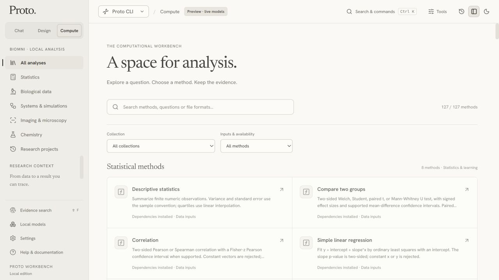
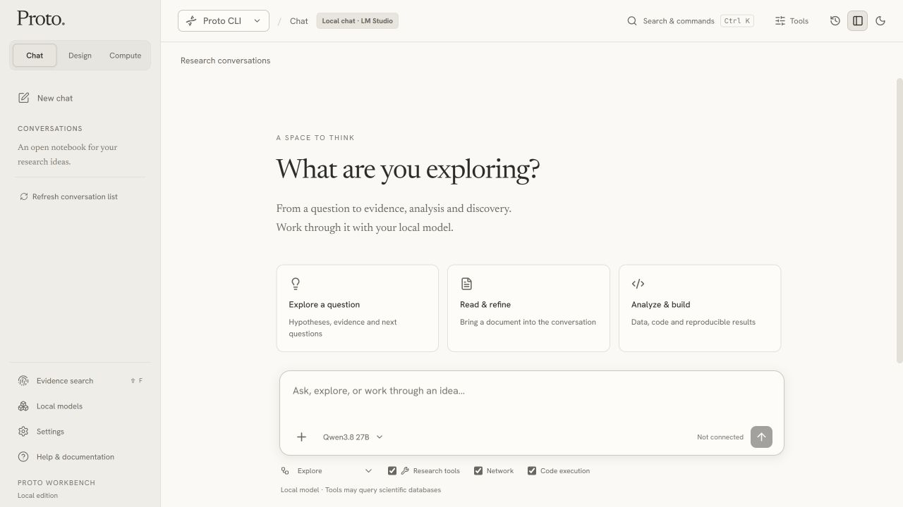
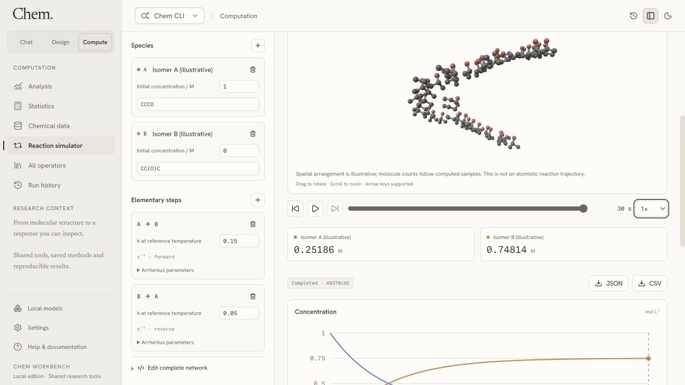
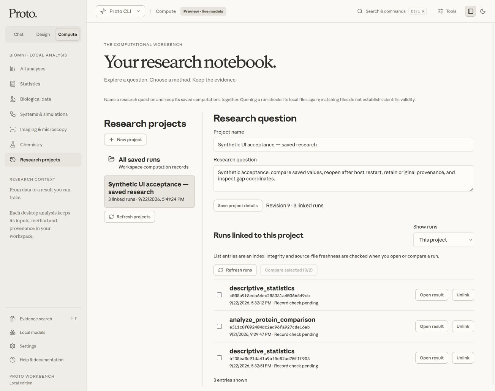
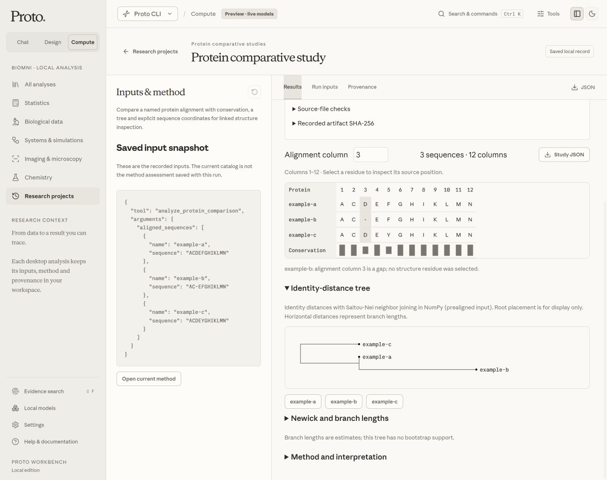

# September 2026 Workbench gallery

These are unchanged application captures, not generated mockups. See the
[project overview](../../../README.md), [source walkthrough](../../source-showcase-2026-09.md)
and [capture manifest](manifest.json).

## Current public typography

The current source uses Newsreader for serif reading and headings, Hanken Grotesk
for controls, and Commit Mono for code and scientific identifiers in its public
profile. Local self-use retains the supplied Anthropic families. See
[typography profiles and licenses](../../typography.md).

### Compute

Actual source-browser method catalog, with installed-method availability read
from the configured local Python environment. A catalog is an inventory, not a
claim that every method has passed scientific or clean-machine acceptance.

### Chat

An empty isolated session. The selected local model is visibly not connected;
no inference or synthetic conversation was inserted for the screenshot.

### Chemistry

The bundled reversible demonstration was calculated locally and saved. The
selected final sample is 30 seconds, from 121 requested samples at 298.15 K.
Its well-mixed, isothermal, constant-volume mass-action model uses supplied
steps and rate constants. The spatial view is a population schematic, not a
computed atomistic trajectory or experimentally verified reaction pathway.

## Retained research-study captures

These two September 22 source-browser captures retain their original local
font profile and synthetic study scope. They predate the public typography
profile above and are not images of the historical downloadable installer.

### Saved research project

A synthetic research project with retained run context, copied byte-for-byte
from the source-browser acceptance capture.

### Reopened protein study

A saved supplied-alignment study reopened during the same local acceptance.
These input fixtures are software examples, not experimentally validated
biological results.

## Capture and publication record

The manifest records each image's actual media type, dimensions, SHA-256,
capture scope and available source-report binding. The screenshot tool emitted
JPEG bytes; files use `.jpg` extensions without re-encoding or retouching.
Visible labels and metadata were inspected for host paths, account identifiers,
credentials and unrelated content. All five files have JFIF metadata and no EXIF.

Hashes bind retained bytes; they do not certify scientific correctness,
authorship or reproducible model behavior. Raw sessions, database files, local
font bytes and machine-specific execution records remain under ignored build
storage. [Publication boundaries](../../repository-publication.md) and
[historical native captures](../../upgrade-verification.md) have separate scope.
