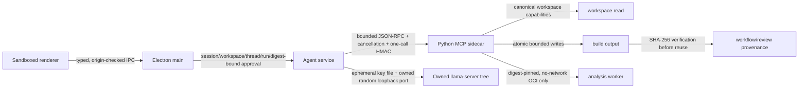

# Security architecture

Proto Agent treats model output, renderer input, MCP requests, workspace files,
connector responses, imported corpora, and executable runtimes as untrusted. The
architecture is fail-closed: discovering an adapter, executable, model, or OCI
provider is not equivalent to authorizing it.

## Boundary invariants

- The renderer has no Node integration and receives a narrow preload API. Main
  process handlers validate the expected top-level frame, window, origin, and a
  strict bounded schema. Packaged builds ignore environment-selected renderer
  URLs and block unexpected navigation/window creation.
- Workspace, build, cache, fixture, and CA paths are separate capabilities.
  Absolute, UNC/device, ADS, traversal, reserved-device, symlink, junction,
  reparse, non-regular, oversized, and unexpected-extension inputs are rejected.
  Writes use a same-directory temporary file, byte limit, flush/fsync, parent
  identity recheck, and atomic replacement.
- MCP frames, requests, strings, arrays, pending calls, responses, output, and
  deadlines are bounded. Cancellation is tied to one request. Execution workers
  receive cooperative cancellation and owned-tree termination; non-execution
  synchronous/network work can only time out and have late results discarded.
- MCP live network is not enabled by a sidecar-wide switch. Each approved call
  receives a main-process HMAC capability bound to the exact tool, canonical
  arguments, run, approval, expiry, and one-time nonce. Missing, expired,
  replayed, or argument-modified capabilities fail closed; standalone MCP
  remains offline/cache-only.
- Python, notebook, and R execution is disabled by default. The normal path
  requires a digest-pinned Docker/Podman image with a read-only root/workspace,
  separate writable run directory, no network, non-root identity, dropped
  capabilities, no-new-privileges, and CPU/memory/PID/time/output limits. The
  explicit CLI-only unsafe-host option is recorded as unsandboxed and is not
  available to MCP or the desktop.
- Model runtimes must match the release lock and recorded digest. The parent
  selects a high random loopback port without a reserve-close handoff; readiness
  accepts only the pinned runtime's post-bind, pre-metadata marker plus a bounded
  public health response. This ordering prevents untrusted model metadata from
  spoofing readiness. The random API key is delivered through a short-lived
  restricted file, never command-line arguments. Cleanup targets only the owned
  process group/tree.
- Approvals bind session, workspace, thread, run, immutable canonical arguments,
  executable/resource digest, and expiry. A changed call, recreated service,
  stale approval, or different workspace requires a new decision.

## Audit and test isolation

Workflow manifests and review packets expose workspace-relative paths. Each
workflow statement hashes the design, part library, workflow definition, run
manifest, and artifacts. Review refuses to consume a missing, mismatched, or
tampered workflow statement and then attests its own evidence/checklist/Markdown
outputs. Statements are unsigned: they detect content changes but do not prove
publisher identity.

The normal stress command is deliberately in-process and offline. It uses only
the pinned/checksummed BLNS and JSONTestSuite subsets, deterministic selection,
fresh temporary case roots, fixed budgets, environment restoration, and leak
sentinels. It starts no child process and makes no network request. This is a
regression harness, not an OS sandbox or machine-wide monitor, and it makes no
claim about any unrelated application or emulator.

## Verification levels

- `doctor --json` reports roots, required inputs, dependencies, and configured
  execution policy without launching workloads.
- `capabilities --json` distinguishes available, cache/fixture, sandbox-required,
  and configured OCI capabilities.
- `sandbox status --json` keeps `provider_visible` separate from
  `smoke_verified`; source-level argv construction does not count as a runtime
  smoke test.
- Dependency locks, CycloneDX SBOMs, audit output, unit tests, type checks, and
  build checks are evidence for this source tree. GUI/model/OCI/network claims
  require separate controlled integration runs.

## Residual limitations

- Windows standard library atomic replacement cannot completely exclude a
  malicious same-user parent-directory replacement race without a verified
  directory-handle/native implementation.
- Job Object, OCI daemon/image behavior, packaged renderer behavior, and real
  model generation need controlled integration verification on the target
  release environment.
- Digest provenance is not signed, and cooperative in-process stress timing is
  not hard preemption.
